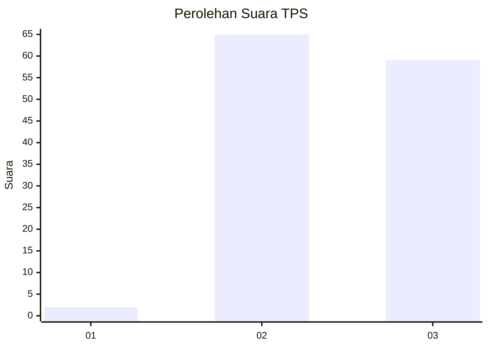
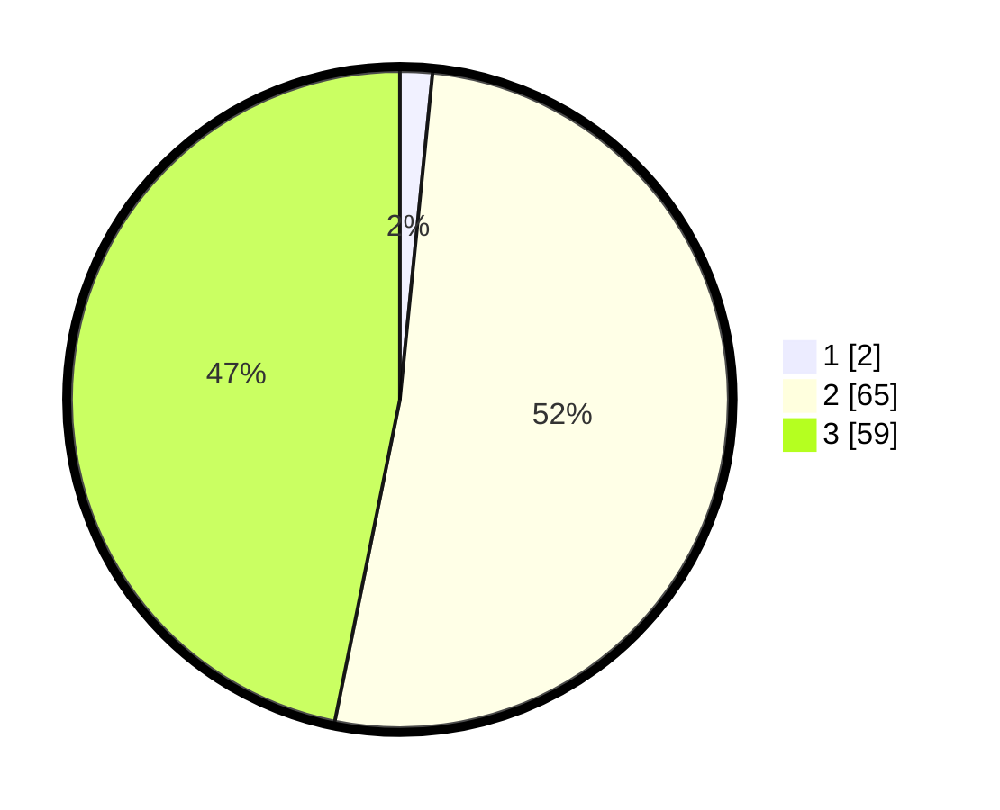

# Hasil

## Grafik

## Tabel

| No. | Nama Paslon    | Suara | Suara (raw) | Persentase |
|:--- |:-------------- | -----:| -----------:| ----------:|
| 1   | ANIES MUHAIMIN | 2     | [2][p-1]    | 1,59       |
| 2   | PRABOWO GIBRAN | 65    | [65][p-2]   | 51,59      |
| 3   | GANJAR MAHFUD  | 59    | [59][p-3]   | 46,83      |

[p-1]: https://github.com/gigit-pemilu/pemilu-2024-51-bali/blob/main/pilpres/hitung-suara/sub/51-bali/sub/04-gianyar/sub/01-sukawati/sub/2007-batuan/sub/031-tps/sub/paslon-1.txt
[p-2]: https://github.com/gigit-pemilu/pemilu-2024-51-bali/blob/main/pilpres/hitung-suara/sub/51-bali/sub/04-gianyar/sub/01-sukawati/sub/2007-batuan/sub/031-tps/sub/paslon-2.txt
[p-3]: https://github.com/gigit-pemilu/pemilu-2024-51-bali/blob/main/pilpres/hitung-suara/sub/51-bali/sub/04-gianyar/sub/01-sukawati/sub/2007-batuan/sub/031-tps/sub/paslon-3.txt

## Foto C Plano

https://sirekap-obj-formc.kpu.go.id/500e/pemilu/ppwp/51/04/01/20/07/5104012007031-20240214-131412--2367ed18-b933-491e-b6d9-b12aec3f78ee.jpg

https://sirekap-obj-formc.kpu.go.id/500e/pemilu/ppwp/51/04/01/20/07/5104012007031-20240214-131454--d62752e1-ec16-40e7-b75b-07091e7fe5b7.jpg

https://sirekap-obj-formc.kpu.go.id/500e/pemilu/ppwp/51/04/01/20/07/5104012007031-20240214-131557--f9b567f3-bd08-429a-9c63-361daa8bd75e.jpg

## Metadata

| Key        | Value               |
| ---------- | ------------------- |
| Time Stamp | 2024-02-15 12:00:28 |

## DATA PEMILIH TETAP

Jumlah pemilih dalam DPT: **131**.
 * L: **66**.
 * P: **65**.

## DATA PENGGUNA HAK PILIH

Jumlah pengguna hak pilih dalam DPT: **127**.
 * L: **64**.
 * P: **63**.

Jumlah pengguna hak pilih dalam DPTb: **0**.
 * L: **0**.
 * P: **0**.

Jumlah pengguna hak pilih dalam DPK: **0**.
 * L: **0**.
 * P: **0**.

Jumlah pengguna hak pilih: **127**.
 * L: **64**.
 * P: **63**.

## JUMLAH SUARA SAH DAN TIDAK SAH

JUMLAH SELURUH SUARA SAH: **126**.

JUMLAH SUARA TIDAK SAH: **1**.

JUMLAH SELURUH SUARA SAH DAN SUARA TIDAK SAH: **127**.

