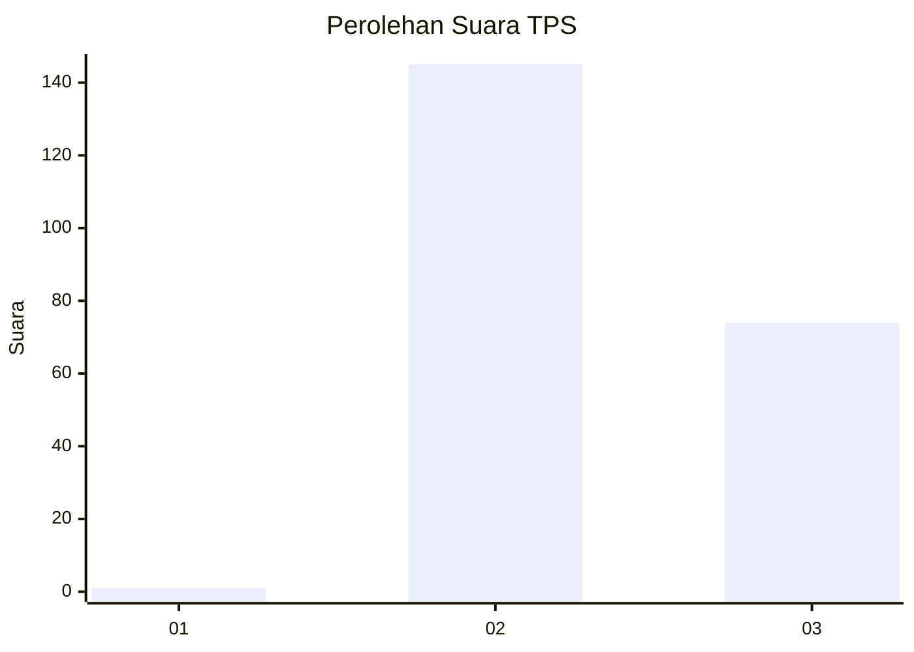
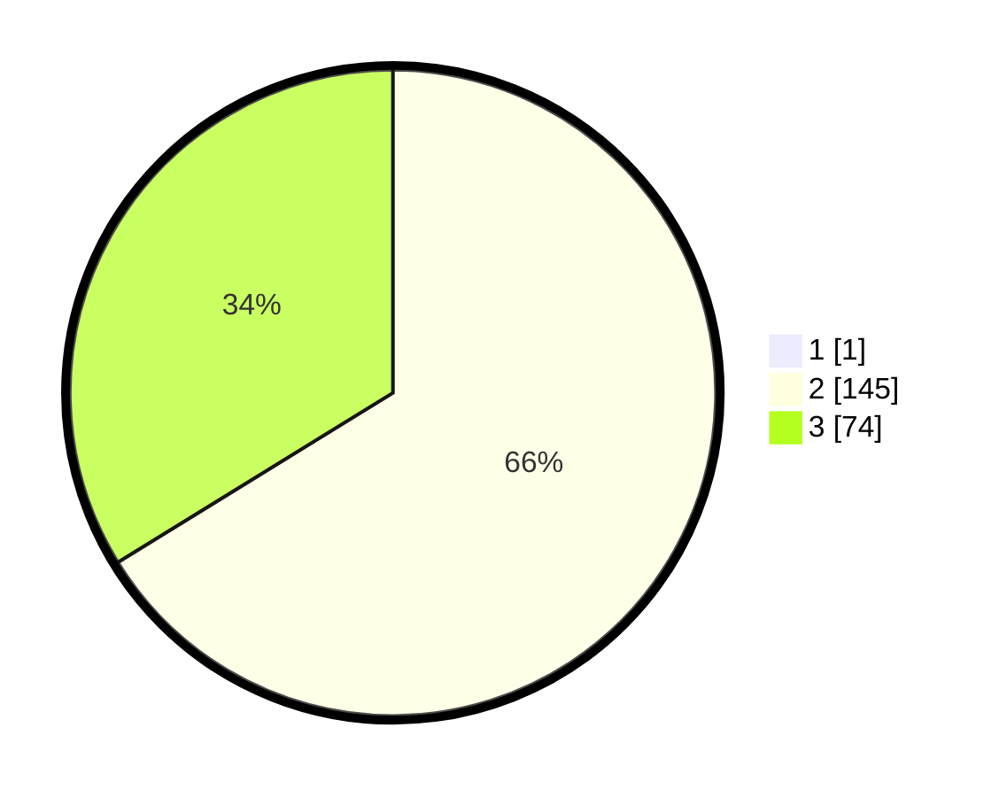

# Hasil

## Grafik

## Tabel

| No. | Nama Paslon    | Suara | Suara (raw) | Persentase |
|:--- |:-------------- | -----:| -----------:| ----------:|
| 1   | ANIES MUHAIMIN | 1     | [1][p-1]    | 0,45       |
| 2   | PRABOWO GIBRAN | 145   | [145][p-2]  | 65,91      |
| 3   | GANJAR MAHFUD  | 74    | [74][p-3]   | 33,64      |

[p-1]: https://github.com/gigit-pemilu/pemilu-2024-51-bali/blob/main/pilpres/hitung-suara/sub/51-bali/sub/04-gianyar/sub/01-sukawati/sub/2008-kemenuh/sub/005-tps/sub/paslon-1.txt
[p-2]: https://github.com/gigit-pemilu/pemilu-2024-51-bali/blob/main/pilpres/hitung-suara/sub/51-bali/sub/04-gianyar/sub/01-sukawati/sub/2008-kemenuh/sub/005-tps/sub/paslon-2.txt
[p-3]: https://github.com/gigit-pemilu/pemilu-2024-51-bali/blob/main/pilpres/hitung-suara/sub/51-bali/sub/04-gianyar/sub/01-sukawati/sub/2008-kemenuh/sub/005-tps/sub/paslon-3.txt

## Foto C Plano

https://sirekap-obj-formc.kpu.go.id/f574/pemilu/ppwp/51/04/01/20/08/5104012008005-20240214-222142--4d9af309-c92f-48fe-affa-02ac8342c6d2.jpg

https://sirekap-obj-formc.kpu.go.id/f574/pemilu/ppwp/51/04/01/20/08/5104012008005-20240214-222427--3bc8b411-247c-4b9f-8313-dde9e0249bfe.jpg

https://sirekap-obj-formc.kpu.go.id/f574/pemilu/ppwp/51/04/01/20/08/5104012008005-20240214-222744--9fb15178-0ebf-44f4-8586-d955b3fa09d9.jpg

## Metadata

| Key        | Value               |
| ---------- | ------------------- |
| Time Stamp | 2024-02-15 12:00:28 |

