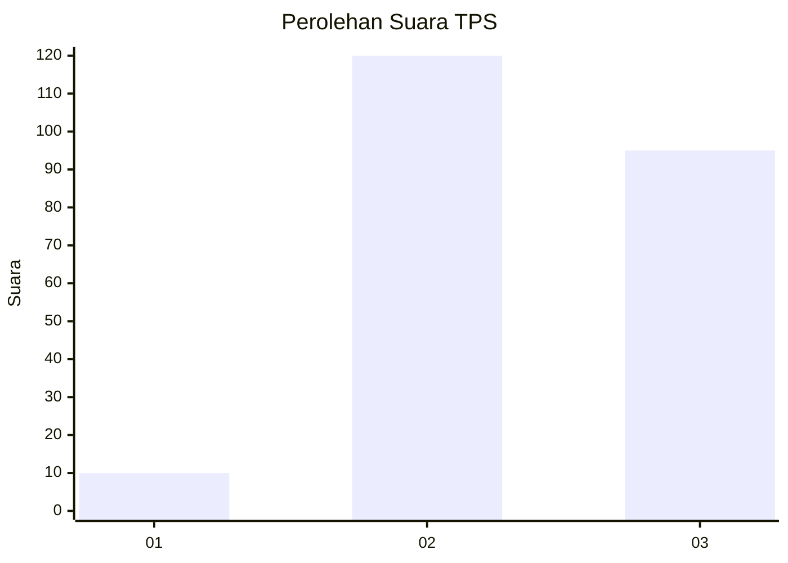
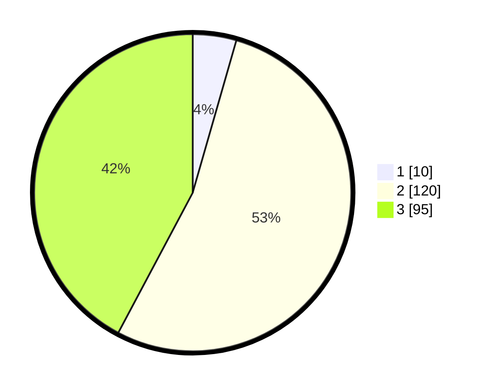

# Hasil

## Grafik

## Tabel

| No. | Nama Paslon    | Suara | Suara (raw) | Persentase |
|:--- |:-------------- | -----:| -----------:| ----------:|
| 1   | ANIES MUHAIMIN | 10    | [10][p-1]   | 4,44       |
| 2   | PRABOWO GIBRAN | 120   | [120][p-2]  | 53,33      |
| 3   | GANJAR MAHFUD  | 95    | [95][p-3]   | 42,22      |

[p-1]: https://github.com/gigit-pemilu/pemilu-2024-51-bali/blob/main/pilpres/hitung-suara/sub/51-bali/sub/04-gianyar/sub/01-sukawati/sub/2008-kemenuh/sub/006-tps/sub/paslon-1.txt
[p-2]: https://github.com/gigit-pemilu/pemilu-2024-51-bali/blob/main/pilpres/hitung-suara/sub/51-bali/sub/04-gianyar/sub/01-sukawati/sub/2008-kemenuh/sub/006-tps/sub/paslon-2.txt
[p-3]: https://github.com/gigit-pemilu/pemilu-2024-51-bali/blob/main/pilpres/hitung-suara/sub/51-bali/sub/04-gianyar/sub/01-sukawati/sub/2008-kemenuh/sub/006-tps/sub/paslon-3.txt

## Foto C Plano

https://sirekap-obj-formc.kpu.go.id/806e/pemilu/ppwp/51/04/01/20/08/5104012008006-20240214-225016--bcd57f16-758d-41fd-9317-4320fcd29f59.jpg

https://sirekap-obj-formc.kpu.go.id/806e/pemilu/ppwp/51/04/01/20/08/5104012008006-20240214-225124--688ca700-3972-413c-a6e3-70181c238afd.jpg

https://sirekap-obj-formc.kpu.go.id/806e/pemilu/ppwp/51/04/01/20/08/5104012008006-20240214-225243--ab50e784-1d30-408f-b703-5010bbf4fff6.jpg

## Metadata

| Key        | Value               |
| ---------- | ------------------- |
| Time Stamp | 2024-02-15 15:00:29 |

