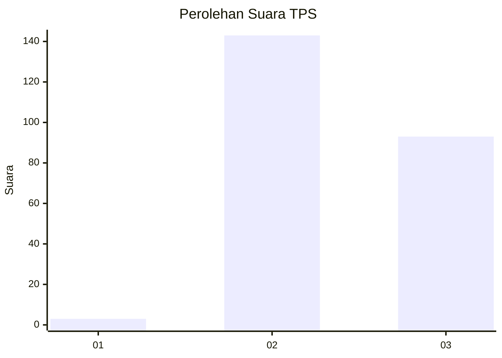
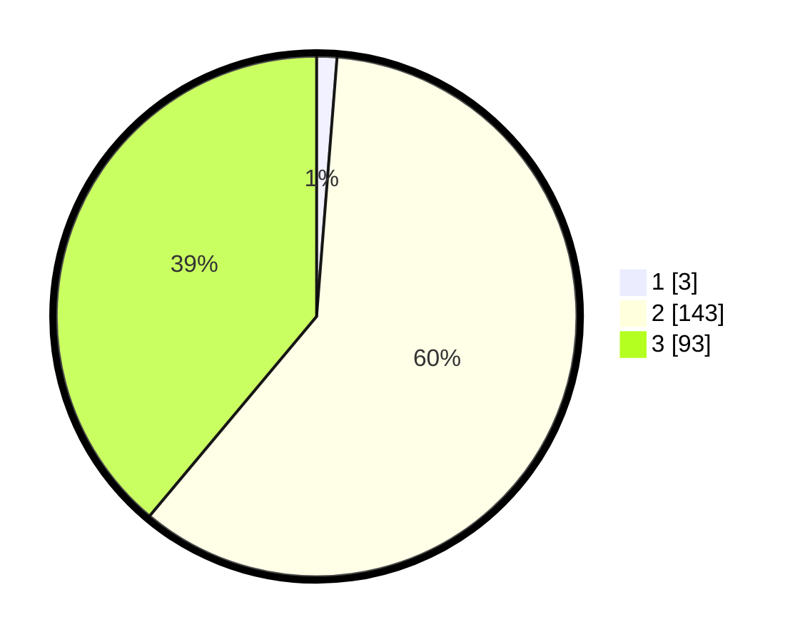

# Hasil

## Grafik

## Tabel

| No. | Nama Paslon    | Suara | Suara (raw) | Persentase |
|:--- |:-------------- | -----:| -----------:| ----------:|
| 1   | ANIES MUHAIMIN | 3     | [3][p-1]    | 1,26       |
| 2   | PRABOWO GIBRAN | 143   | [143][p-2]  | 59,83      |
| 3   | GANJAR MAHFUD  | 93    | [93][p-3]   | 38,91      |

[p-1]: https://github.com/gigit-pemilu/pemilu-2024-51-bali/blob/main/pilpres/hitung-suara/sub/51-bali/sub/04-gianyar/sub/01-sukawati/sub/2008-kemenuh/sub/008-tps/sub/paslon-1.txt
[p-2]: https://github.com/gigit-pemilu/pemilu-2024-51-bali/blob/main/pilpres/hitung-suara/sub/51-bali/sub/04-gianyar/sub/01-sukawati/sub/2008-kemenuh/sub/008-tps/sub/paslon-2.txt
[p-3]: https://github.com/gigit-pemilu/pemilu-2024-51-bali/blob/main/pilpres/hitung-suara/sub/51-bali/sub/04-gianyar/sub/01-sukawati/sub/2008-kemenuh/sub/008-tps/sub/paslon-3.txt

## Foto C Plano

https://sirekap-obj-formc.kpu.go.id/2e94/pemilu/ppwp/51/04/01/20/08/5104012008008-20240214-223653--a62583c0-7d36-4eb5-9601-043ddd999c9b.jpg

https://sirekap-obj-formc.kpu.go.id/2e94/pemilu/ppwp/51/04/01/20/08/5104012008008-20240214-223826--f65fc0d3-0db8-4e21-9000-4fb15075e4d0.jpg

https://sirekap-obj-formc.kpu.go.id/2e94/pemilu/ppwp/51/04/01/20/08/5104012008008-20240214-223950--92ff2478-0771-4d56-bbcc-c65971ee0131.jpg

## Metadata

| Key        | Value               |
| ---------- | ------------------- |
| Time Stamp | 2024-02-15 12:00:28 |

