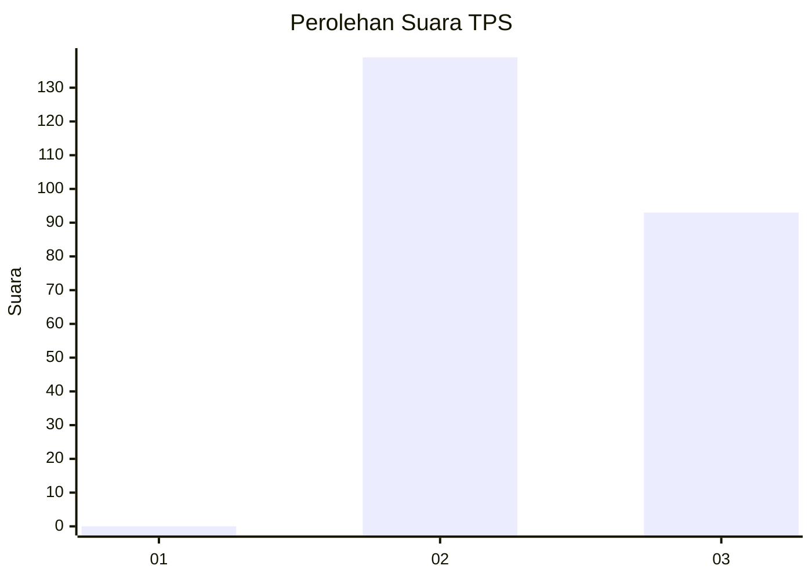
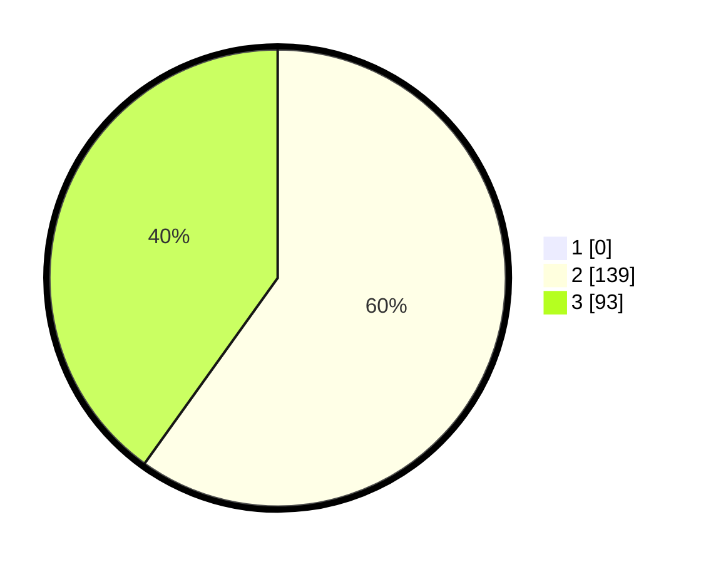

# Hasil

## Grafik

## Tabel

| No. | Nama Paslon    | Suara | Suara (raw) | Persentase |
|:--- |:-------------- | -----:| -----------:| ----------:|
| 1   | ANIES MUHAIMIN | 0     | [0][p-1]    | 0,00       |
| 2   | PRABOWO GIBRAN | 139   | [139][p-2]  | 59,91      |
| 3   | GANJAR MAHFUD  | 93    | [93][p-3]   | 40,09      |

[p-1]: https://github.com/gigit-pemilu/pemilu-2024-51-bali/blob/main/pilpres/hitung-suara/sub/51-bali/sub/04-gianyar/sub/01-sukawati/sub/2009-batubulan-kangin/sub/001-tps/sub/paslon-1.txt
[p-2]: https://github.com/gigit-pemilu/pemilu-2024-51-bali/blob/main/pilpres/hitung-suara/sub/51-bali/sub/04-gianyar/sub/01-sukawati/sub/2009-batubulan-kangin/sub/001-tps/sub/paslon-2.txt
[p-3]: https://github.com/gigit-pemilu/pemilu-2024-51-bali/blob/main/pilpres/hitung-suara/sub/51-bali/sub/04-gianyar/sub/01-sukawati/sub/2009-batubulan-kangin/sub/001-tps/sub/paslon-3.txt

## Foto C Plano

https://sirekap-obj-formc.kpu.go.id/75a0/pemilu/ppwp/51/04/01/20/09/5104012009001-20240214-200119--f21a7fae-53ee-4c9b-bed6-f77dc72fd28d.jpg

https://sirekap-obj-formc.kpu.go.id/75a0/pemilu/ppwp/51/04/01/20/09/5104012009001-20240214-200147--3f66662e-921f-4a96-9683-6b7d6de8d0a4.jpg

https://sirekap-obj-formc.kpu.go.id/75a0/pemilu/ppwp/51/04/01/20/09/5104012009001-20240214-200222--742f4350-eb0a-4b2c-b9b7-bb1649de42a9.jpg

## Metadata

| Key        | Value               |
| ---------- | ------------------- |
| Time Stamp | 2024-02-14 21:46:01 |

## DATA PEMILIH TETAP

Jumlah pemilih dalam DPT: **268**.
 * L: **137**.
 * P: **131**.

## DATA PENGGUNA HAK PILIH

Jumlah pengguna hak pilih dalam DPT: **225**.
 * L: **117**.
 * P: **108**.

Jumlah pengguna hak pilih dalam DPTb: **0**.
 * L: **0**.
 * P: **0**.

Jumlah pengguna hak pilih dalam DPK: **9**.
 * L: **3**.
 * P: **6**.

Jumlah pengguna hak pilih: **234**.
 * L: **120**.
 * P: **114**.

## JUMLAH SUARA SAH DAN TIDAK SAH

JUMLAH SELURUH SUARA SAH: **232**.

JUMLAH SUARA TIDAK SAH: **2**.

JUMLAH SELURUH SUARA SAH DAN SUARA TIDAK SAH: **234**.

