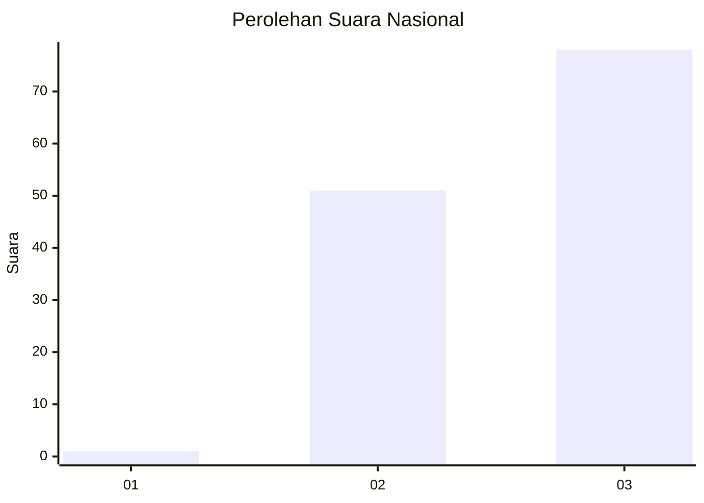
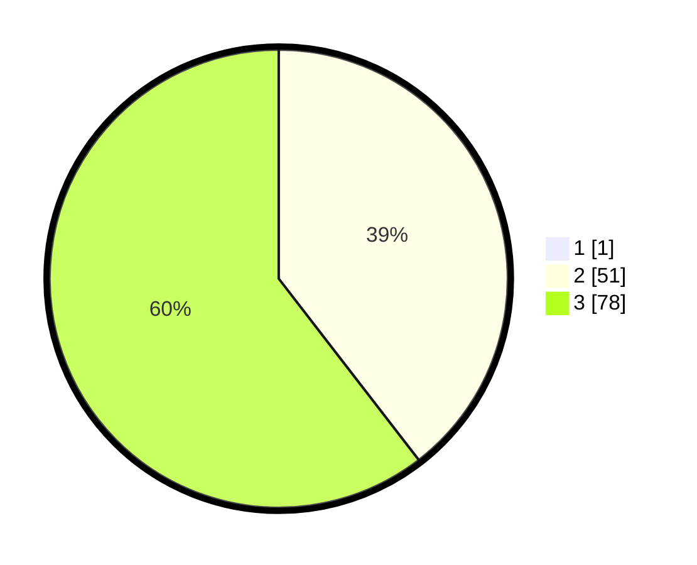

# Hasil

## Grafik

## Tabel

| No. | Nama Paslon    | Suara | Suara (raw) | Persentase |
|:--- |:-------------- | -----:| -----------:| ----------:|
| 1   | ANIES MUHAIMIN | 1     | [1][p-1]    | 0,77       |
| 2   | PRABOWO GIBRAN | 51    | [51][p-2]   | 39,23      |
| 3   | GANJAR MAHFUD  | 78    | [78][p-3]   | 60,00      |

[p-1]: https://github.com/gigit-pemilu/pemilu-2024/blob/main/pilpres/hitung-suara/sub/51-bali/sub/04-gianyar/sub/01-sukawati/sub/2012-batuan-kaler/sub/001-tps/sub/paslon-1.txt
[p-2]: https://github.com/gigit-pemilu/pemilu-2024/blob/main/pilpres/hitung-suara/sub/51-bali/sub/04-gianyar/sub/01-sukawati/sub/2012-batuan-kaler/sub/001-tps/sub/paslon-2.txt
[p-3]: https://github.com/gigit-pemilu/pemilu-2024/blob/main/pilpres/hitung-suara/sub/51-bali/sub/04-gianyar/sub/01-sukawati/sub/2012-batuan-kaler/sub/001-tps/sub/paslon-3.txt

## Foto C Plano

https://sirekap-obj-formc.kpu.go.id/0764/pemilu/ppwp/51/04/01/20/12/5104012012001-20240216-181329--536164d7-59fa-4f56-ae2c-b2233d66bafe.jpg

https://sirekap-obj-formc.kpu.go.id/0764/pemilu/ppwp/51/04/01/20/12/5104012012001-20240216-181330--b0fd182f-8fe4-4f8d-9ddd-575eea838c2b.jpg

https://sirekap-obj-formc.kpu.go.id/0764/pemilu/ppwp/51/04/01/20/12/5104012012001-20240216-181330--71f763a1-589e-4ad6-b8ae-de9097fd083b.jpg

## Metadata

| Key        | Value               |
| ---------- | ------------------- |
| Time Stamp | 2024-02-16 21:01:00 |

## DATA PEMILIH TETAP

Jumlah pemilih dalam DPT: **157**.
 * L: **76**.
 * P: **81**.

## DATA PENGGUNA HAK PILIH

Jumlah pengguna hak pilih dalam DPT: **130**.
 * L: **66**.
 * P: **64**.

Jumlah pengguna hak pilih dalam DPTb: **1**.
 * L: **0**.
 * P: **1**.

Jumlah pengguna hak pilih dalam DPK: **0**.
 * L: **0**.
 * P: **0**.

Jumlah pengguna hak pilih: **131**.
 * L: **66**.
 * P: **65**.

## JUMLAH SUARA SAH DAN TIDAK SAH

JUMLAH SELURUH SUARA SAH: **130**.

JUMLAH SUARA TIDAK SAH: **1**.

JUMLAH SELURUH SUARA SAH DAN SUARA TIDAK SAH: **131**.

