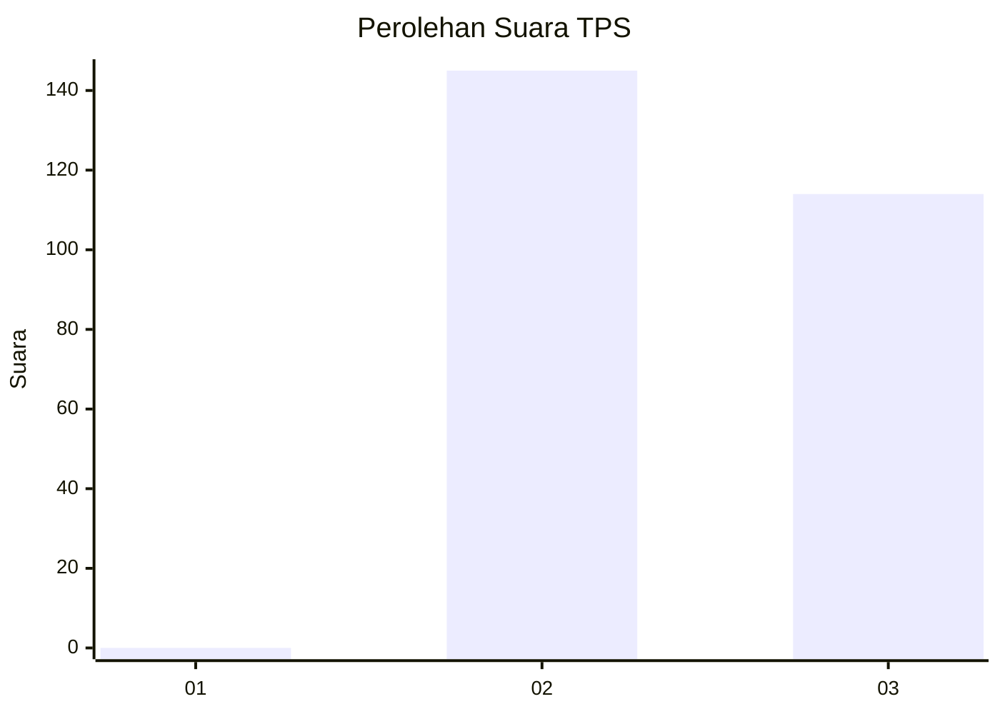
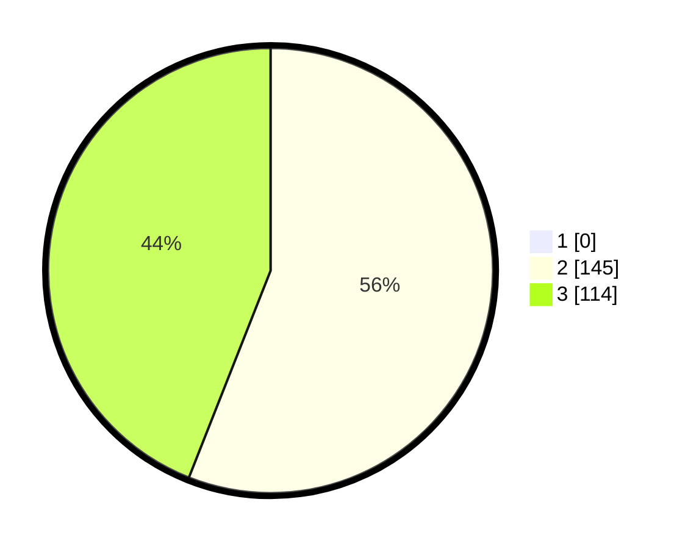

# Hasil

## Grafik

## Tabel

| No. | Nama Paslon    | Suara | Suara (raw) | Persentase |
|:--- |:-------------- | -----:| -----------:| ----------:|
| 1   | ANIES MUHAIMIN | 0     | [0][p-1]    | 0,00       |
| 2   | PRABOWO GIBRAN | 145   | [145][p-2]  | 55,98      |
| 3   | GANJAR MAHFUD  | 114   | [114][p-3]  | 44,02      |

[p-1]: https://github.com/gigit-pemilu/pemilu-2024-51-bali/blob/main/pilpres/hitung-suara/sub/51-bali/sub/04-gianyar/sub/02-blahbatuh/sub/2001-saba/sub/002-tps/sub/paslon-1.txt
[p-2]: https://github.com/gigit-pemilu/pemilu-2024-51-bali/blob/main/pilpres/hitung-suara/sub/51-bali/sub/04-gianyar/sub/02-blahbatuh/sub/2001-saba/sub/002-tps/sub/paslon-2.txt
[p-3]: https://github.com/gigit-pemilu/pemilu-2024-51-bali/blob/main/pilpres/hitung-suara/sub/51-bali/sub/04-gianyar/sub/02-blahbatuh/sub/2001-saba/sub/002-tps/sub/paslon-3.txt

## Foto C Plano

https://sirekap-obj-formc.kpu.go.id/1596/pemilu/ppwp/51/04/02/20/01/5104022001002-20240214-141914--db83fb49-9da9-4494-bfee-d973b132975e.jpg

https://sirekap-obj-formc.kpu.go.id/1596/pemilu/ppwp/51/04/02/20/01/5104022001002-20240215-213309--fd81b607-dfb9-4beb-9434-08b51eecc0b9.jpg

https://sirekap-obj-formc.kpu.go.id/1596/pemilu/ppwp/51/04/02/20/01/5104022001002-20240215-213308--0a6a722f-87ca-4483-a9b8-b116a8d84881.jpg

## Metadata

| Key        | Value               |
| ---------- | ------------------- |
| Time Stamp | 2024-02-15 23:29:50 |

## DATA PEMILIH TETAP

Jumlah pemilih dalam DPT: **282**.
 * L: **143**.
 * P: **139**.

## DATA PENGGUNA HAK PILIH

Jumlah pengguna hak pilih dalam DPT: **255**.
 * L: **128**.
 * P: **127**.

Jumlah pengguna hak pilih dalam DPTb: **0**.
 * L: **0**.
 * P: **0**.

Jumlah pengguna hak pilih dalam DPK: **6**.
 * L: **6**.
 * P: **0**.

Jumlah pengguna hak pilih: **261**.
 * L: **134**.
 * P: **127**.

## JUMLAH SUARA SAH DAN TIDAK SAH

JUMLAH SELURUH SUARA SAH: **259**.

JUMLAH SUARA TIDAK SAH: **2**.

JUMLAH SELURUH SUARA SAH DAN SUARA TIDAK SAH: **261**.

