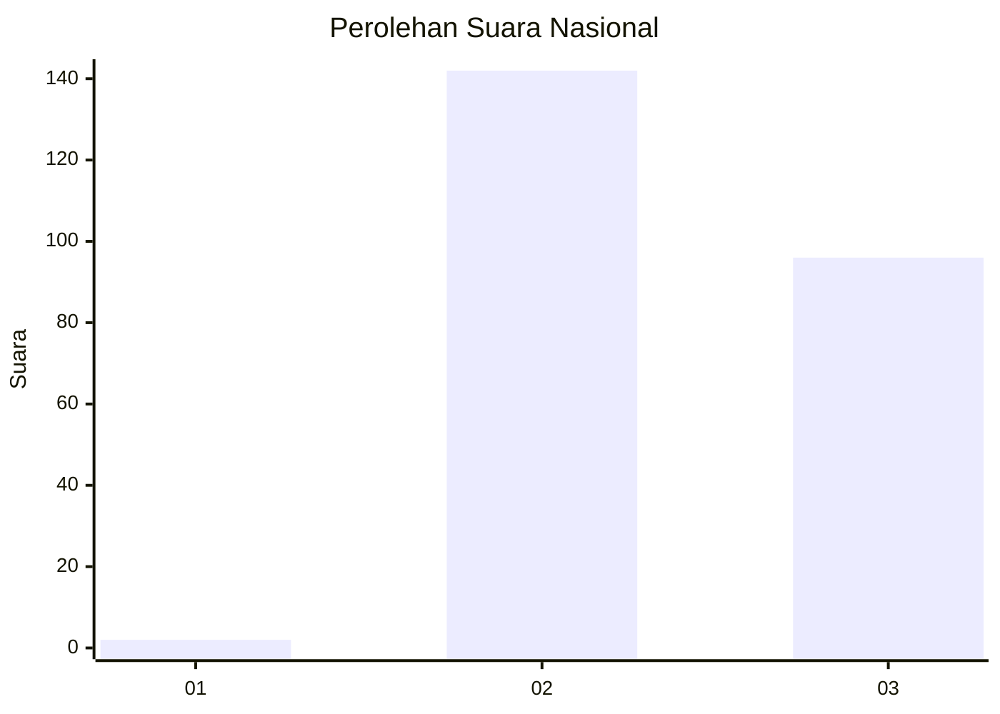
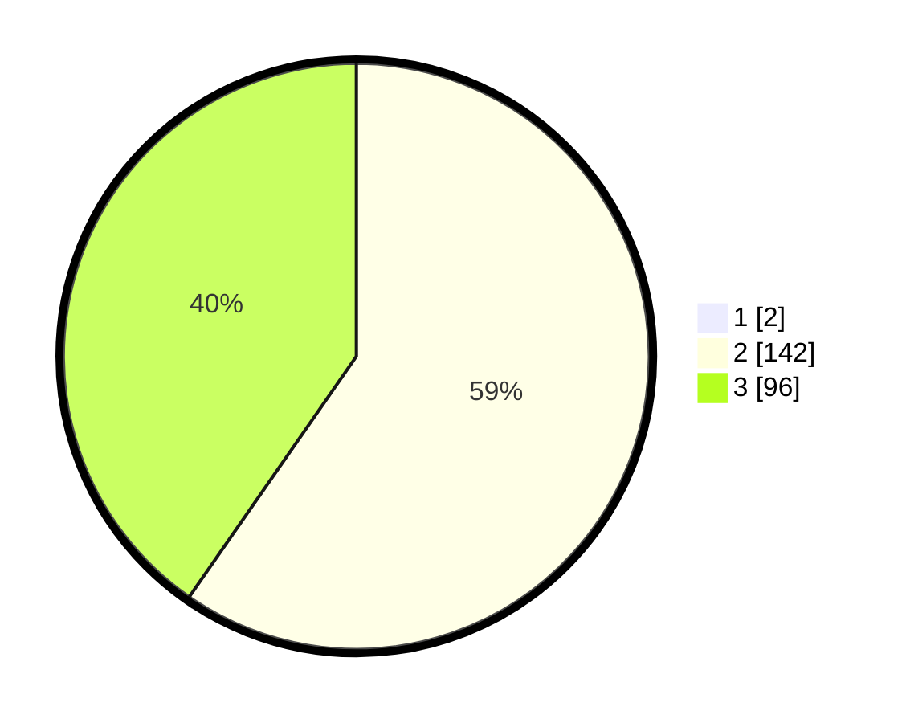

# Hasil

## Grafik

## Tabel

| No. | Nama Paslon    | Suara | Suara (raw) | Persentase |
|:--- |:-------------- | -----:| -----------:| ----------:|
| 1   | ANIES MUHAIMIN | 2     | [2][p-1]    | 0,83       |
| 2   | PRABOWO GIBRAN | 142   | [142][p-2]  | 59,17      |
| 3   | GANJAR MAHFUD  | 96    | [96][p-3]   | 40,00      |

[p-1]: https://github.com/gigit-pemilu/pemilu-2024/blob/main/pilpres/hitung-suara/sub/51-bali/sub/04-gianyar/sub/02-blahbatuh/sub/2001-saba/sub/004-tps/sub/paslon-1.txt
[p-2]: https://github.com/gigit-pemilu/pemilu-2024/blob/main/pilpres/hitung-suara/sub/51-bali/sub/04-gianyar/sub/02-blahbatuh/sub/2001-saba/sub/004-tps/sub/paslon-2.txt
[p-3]: https://github.com/gigit-pemilu/pemilu-2024/blob/main/pilpres/hitung-suara/sub/51-bali/sub/04-gianyar/sub/02-blahbatuh/sub/2001-saba/sub/004-tps/sub/paslon-3.txt

## Foto C Plano

https://sirekap-obj-formc.kpu.go.id/58ec/pemilu/ppwp/51/04/02/20/01/5104022001004-20240214-204330--10c5b701-cab7-4212-ac2c-23044ec158b7.jpg

https://sirekap-obj-formc.kpu.go.id/58ec/pemilu/ppwp/51/04/02/20/01/5104022001004-20240214-204622--2d35b63f-6ff3-4423-8384-34cdce39d2b0.jpg

https://sirekap-obj-formc.kpu.go.id/58ec/pemilu/ppwp/51/04/02/20/01/5104022001004-20240214-204728--58acf155-1688-4c6e-b82e-28ebfea739a2.jpg

## Metadata

| Key        | Value               |
| ---------- | ------------------- |
| Time Stamp | 2024-02-15 00:41:44 |

## DATA PEMILIH TETAP

Jumlah pemilih dalam DPT: **280**.
 * L: **145**.
 * P: **135**.

## DATA PENGGUNA HAK PILIH

Jumlah pengguna hak pilih dalam DPT: **239**.
 * L: **124**.
 * P: **115**.

Jumlah pengguna hak pilih dalam DPTb: **0**.
 * L: **0**.
 * P: **0**.

Jumlah pengguna hak pilih dalam DPK: **6**.
 * L: **3**.
 * P: **3**.

Jumlah pengguna hak pilih: **245**.
 * L: **127**.
 * P: **118**.

## JUMLAH SUARA SAH DAN TIDAK SAH

JUMLAH SELURUH SUARA SAH: **240**.

JUMLAH SUARA TIDAK SAH: **5**.

JUMLAH SELURUH SUARA SAH DAN SUARA TIDAK SAH: **245**.

