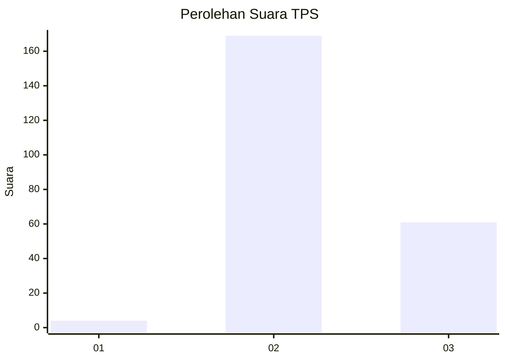
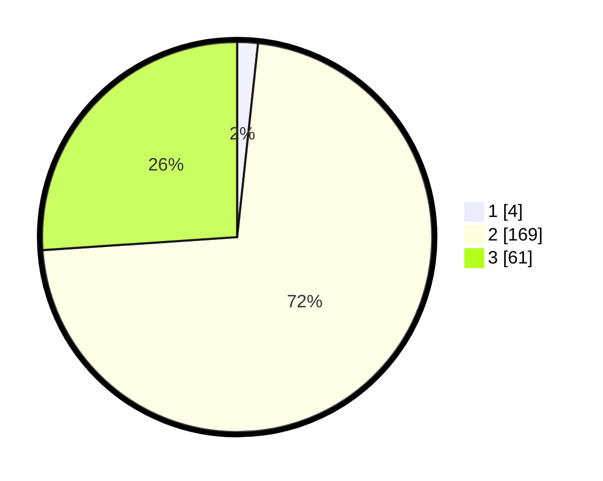

# Hasil

## Grafik

## Tabel

| No. | Nama Paslon    | Suara | Suara (raw) | Persentase |
|:--- |:-------------- | -----:| -----------:| ----------:|
| 1   | ANIES MUHAIMIN | 4     | [4][p-1]    | 1,71       |
| 2   | PRABOWO GIBRAN | 169   | [169][p-2]  | 72,22      |
| 3   | GANJAR MAHFUD  | 61    | [61][p-3]   | 26,07      |

[p-1]: https://github.com/gigit-pemilu/pemilu-2024-51-bali/blob/main/pilpres/hitung-suara/sub/51-bali/sub/04-gianyar/sub/02-blahbatuh/sub/2001-saba/sub/005-tps/sub/paslon-1.txt
[p-2]: https://github.com/gigit-pemilu/pemilu-2024-51-bali/blob/main/pilpres/hitung-suara/sub/51-bali/sub/04-gianyar/sub/02-blahbatuh/sub/2001-saba/sub/005-tps/sub/paslon-2.txt
[p-3]: https://github.com/gigit-pemilu/pemilu-2024-51-bali/blob/main/pilpres/hitung-suara/sub/51-bali/sub/04-gianyar/sub/02-blahbatuh/sub/2001-saba/sub/005-tps/sub/paslon-3.txt

## Foto C Plano

https://sirekap-obj-formc.kpu.go.id/0245/pemilu/ppwp/51/04/02/20/01/5104022001005-20240216-060939--21bffbb2-1598-4dc4-97b0-b05a9267ffb0.jpg

https://sirekap-obj-formc.kpu.go.id/0245/pemilu/ppwp/51/04/02/20/01/5104022001005-20240216-060940--a5a3cbe7-1a1d-466a-9635-7a6f53f2a158.jpg

https://sirekap-obj-formc.kpu.go.id/0245/pemilu/ppwp/51/04/02/20/01/5104022001005-20240214-141328--8cffbe0b-d089-448d-b86c-074ece16027b.jpg

## Metadata

| Key        | Value               |
| ---------- | ------------------- |
| Time Stamp | 2024-02-16 10:30:29 |

## DATA PEMILIH TETAP

Jumlah pemilih dalam DPT: **283**.
 * L: **141**.
 * P: **142**.

## DATA PENGGUNA HAK PILIH

Jumlah pengguna hak pilih dalam DPT: **245**.
 * L: **117**.
 * P: **128**.

Jumlah pengguna hak pilih dalam DPTb: **0**.
 * L: **0**.
 * P: **0**.

Jumlah pengguna hak pilih dalam DPK: **0**.
 * L: **0**.
 * P: **0**.

Jumlah pengguna hak pilih: **245**.
 * L: **117**.
 * P: **128**.

## JUMLAH SUARA SAH DAN TIDAK SAH

JUMLAH SELURUH SUARA SAH: **234**.

JUMLAH SUARA TIDAK SAH: **11**.

JUMLAH SELURUH SUARA SAH DAN SUARA TIDAK SAH: **245**.

