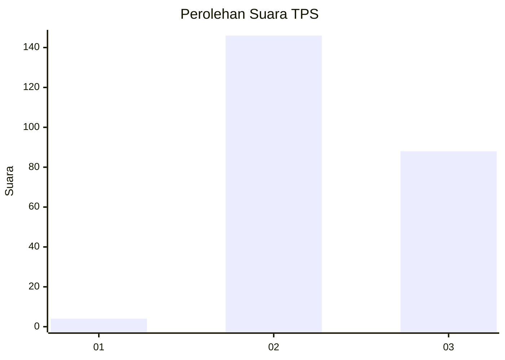
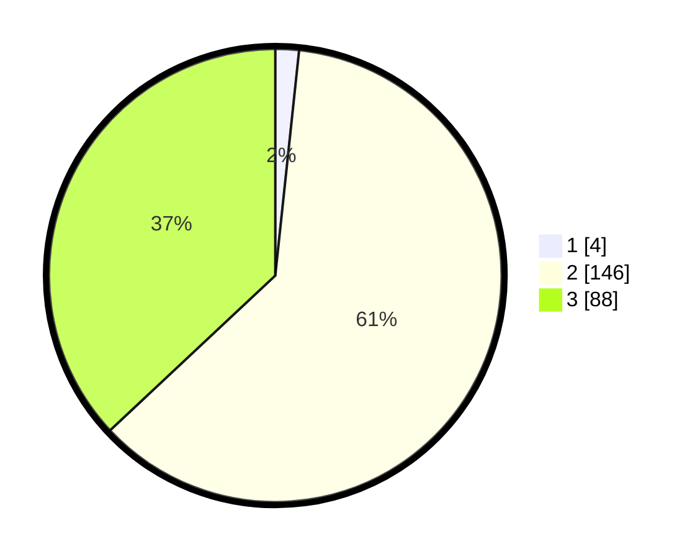

# Hasil

## Grafik

## Tabel

| No. | Nama Paslon    | Suara | Suara (raw) | Persentase |
|:--- |:-------------- | -----:| -----------:| ----------:|
| 1   | ANIES MUHAIMIN | 4     | [4][p-1]    | 1,68       |
| 2   | PRABOWO GIBRAN | 146   | [146][p-2]  | 61,34      |
| 3   | GANJAR MAHFUD  | 88    | [88][p-3]   | 36,97      |

[p-1]: https://github.com/gigit-pemilu/pemilu-2024-51-bali/blob/main/pilpres/hitung-suara/sub/51-bali/sub/04-gianyar/sub/02-blahbatuh/sub/2001-saba/sub/006-tps/sub/paslon-1.txt
[p-2]: https://github.com/gigit-pemilu/pemilu-2024-51-bali/blob/main/pilpres/hitung-suara/sub/51-bali/sub/04-gianyar/sub/02-blahbatuh/sub/2001-saba/sub/006-tps/sub/paslon-2.txt
[p-3]: https://github.com/gigit-pemilu/pemilu-2024-51-bali/blob/main/pilpres/hitung-suara/sub/51-bali/sub/04-gianyar/sub/02-blahbatuh/sub/2001-saba/sub/006-tps/sub/paslon-3.txt

## Foto C Plano

https://sirekap-obj-formc.kpu.go.id/58cf/pemilu/ppwp/51/04/02/20/01/5104022001006-20240216-120540--0ab67fef-acbd-4b0c-a7b7-a7fdb268067c.jpg

https://sirekap-obj-formc.kpu.go.id/58cf/pemilu/ppwp/51/04/02/20/01/5104022001006-20240216-120552--4bbd49cc-865a-4e64-bf4e-8f3f18d08286.jpg

https://sirekap-obj-formc.kpu.go.id/58cf/pemilu/ppwp/51/04/02/20/01/5104022001006-20240216-120542--b84993d4-9a4b-4052-b12d-b1483f1d821b.jpg

## Metadata

| Key        | Value               |
| ---------- | ------------------- |
| Time Stamp | 2024-02-16 13:30:32 |

## DATA PEMILIH TETAP

Jumlah pemilih dalam DPT: **274**.
 * L: **131**.
 * P: **143**.

## DATA PENGGUNA HAK PILIH

Jumlah pengguna hak pilih dalam DPT: **274**.
 * L: **131**.
 * P: **143**.

Jumlah pengguna hak pilih dalam DPTb: **0**.
 * L: **0**.
 * P: **0**.

Jumlah pengguna hak pilih dalam DPK: **0**.
 * L: **0**.
 * P: **0**.

Jumlah pengguna hak pilih: **274**.
 * L: **131**.
 * P: **143**.

## JUMLAH SUARA SAH DAN TIDAK SAH

JUMLAH SELURUH SUARA SAH: **238**.

JUMLAH SUARA TIDAK SAH: **2**.

JUMLAH SELURUH SUARA SAH DAN SUARA TIDAK SAH: **240**.

