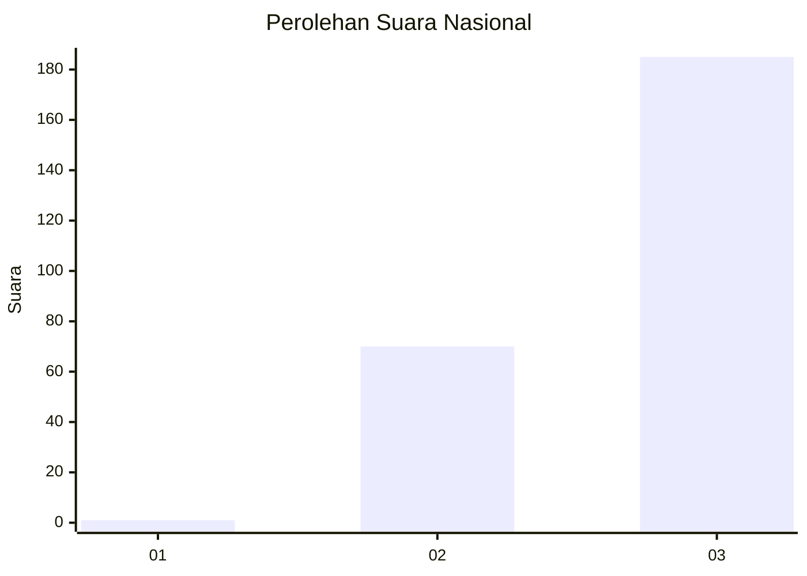
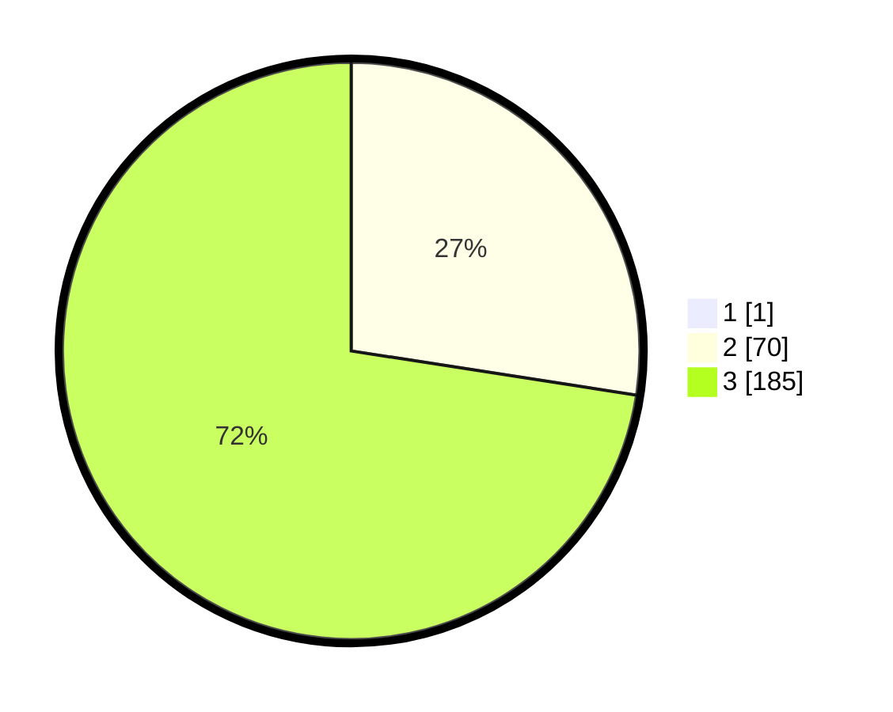

# Hasil

## Grafik

## Tabel

| No. | Nama Paslon    | Suara | Suara (raw) | Persentase |
|:--- |:-------------- | -----:| -----------:| ----------:|
| 1   | ANIES MUHAIMIN | 1     | [1][p-1]    | 0,39       |
| 2   | PRABOWO GIBRAN | 70    | [70][p-2]   | 27,34      |
| 3   | GANJAR MAHFUD  | 185   | [185][p-3]  | 72,27      |

[p-1]: https://github.com/gigit-pemilu/pemilu-2024/blob/main/pilpres/hitung-suara/sub/51-bali/sub/04-gianyar/sub/02-blahbatuh/sub/2001-saba/sub/009-tps/sub/paslon-1.txt
[p-2]: https://github.com/gigit-pemilu/pemilu-2024/blob/main/pilpres/hitung-suara/sub/51-bali/sub/04-gianyar/sub/02-blahbatuh/sub/2001-saba/sub/009-tps/sub/paslon-2.txt
[p-3]: https://github.com/gigit-pemilu/pemilu-2024/blob/main/pilpres/hitung-suara/sub/51-bali/sub/04-gianyar/sub/02-blahbatuh/sub/2001-saba/sub/009-tps/sub/paslon-3.txt

## Foto C Plano

https://sirekap-obj-formc.kpu.go.id/32ea/pemilu/ppwp/51/04/02/20/01/5104022001009-20240214-223708--7138a68a-c939-41ed-b034-6ac26e29516d.jpg

https://sirekap-obj-formc.kpu.go.id/32ea/pemilu/ppwp/51/04/02/20/01/5104022001009-20240214-223830--e7e2498d-a482-4ca7-bfd2-76189808ebe7.jpg

https://sirekap-obj-formc.kpu.go.id/32ea/pemilu/ppwp/51/04/02/20/01/5104022001009-20240214-224311--00fd5473-47bc-4479-a29d-cf727aa7b150.jpg

## Metadata

| Key        | Value               |
| ---------- | ------------------- |
| Time Stamp | 2024-02-15 23:29:50 |

