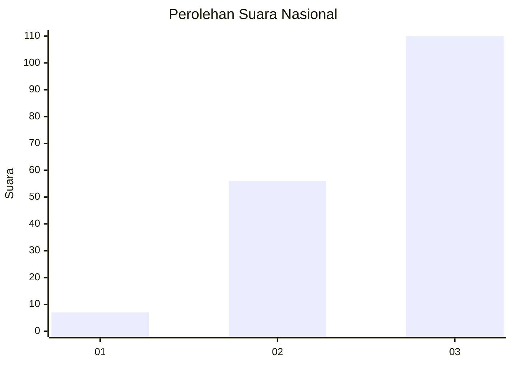
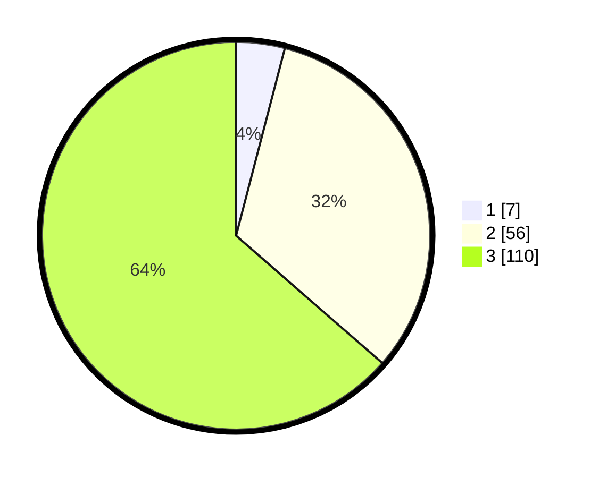

# Hasil

## Grafik

## Tabel

| No. | Nama Paslon    | Suara | Suara (raw) | Persentase |
|:--- |:-------------- | -----:| -----------:| ----------:|
| 1   | ANIES MUHAIMIN | 7     | [7][p-1]    | 4,05       |
| 2   | PRABOWO GIBRAN | 56    | [56][p-2]   | 32,37      |
| 3   | GANJAR MAHFUD  | 110   | [110][p-3]  | 63,58      |

[p-1]: https://github.com/gigit-pemilu/pemilu-2024/blob/main/pilpres/hitung-suara/sub/51-bali/sub/04-gianyar/sub/02-blahbatuh/sub/2001-saba/sub/012-tps/sub/paslon-1.txt
[p-2]: https://github.com/gigit-pemilu/pemilu-2024/blob/main/pilpres/hitung-suara/sub/51-bali/sub/04-gianyar/sub/02-blahbatuh/sub/2001-saba/sub/012-tps/sub/paslon-2.txt
[p-3]: https://github.com/gigit-pemilu/pemilu-2024/blob/main/pilpres/hitung-suara/sub/51-bali/sub/04-gianyar/sub/02-blahbatuh/sub/2001-saba/sub/012-tps/sub/paslon-3.txt

## Foto C Plano

https://sirekap-obj-formc.kpu.go.id/cd94/pemilu/ppwp/51/04/02/20/01/5104022001012-20240217-084115--4f079948-c595-4b93-a929-c617d292252b.jpg

https://sirekap-obj-formc.kpu.go.id/cd94/pemilu/ppwp/51/04/02/20/01/5104022001012-20240217-084117--0cdd0c8a-9234-4cdc-8719-9407a671edc2.jpg

https://sirekap-obj-formc.kpu.go.id/cd94/pemilu/ppwp/51/04/02/20/01/5104022001012-20240217-084116--9f00fcc5-9cec-42dd-9d0e-195e6aa46a23.jpg

## Metadata

| Key        | Value               |
| ---------- | ------------------- |
| Time Stamp | 2024-02-17 13:37:34 |

## DATA PEMILIH TETAP

Jumlah pemilih dalam DPT: **207**.
 * L: **97**.
 * P: **110**.

## DATA PENGGUNA HAK PILIH

Jumlah pengguna hak pilih dalam DPT: **180**.
 * L: **89**.
 * P: **91**.

Jumlah pengguna hak pilih dalam DPTb: **0**.
 * L: **0**.
 * P: **0**.

Jumlah pengguna hak pilih dalam DPK: **0**.
 * L: **0**.
 * P: **0**.

Jumlah pengguna hak pilih: **180**.
 * L: **89**.
 * P: **91**.

## JUMLAH SUARA SAH DAN TIDAK SAH

JUMLAH SELURUH SUARA SAH: **173**.

JUMLAH SUARA TIDAK SAH: **7**.

JUMLAH SELURUH SUARA SAH DAN SUARA TIDAK SAH: **180**.

