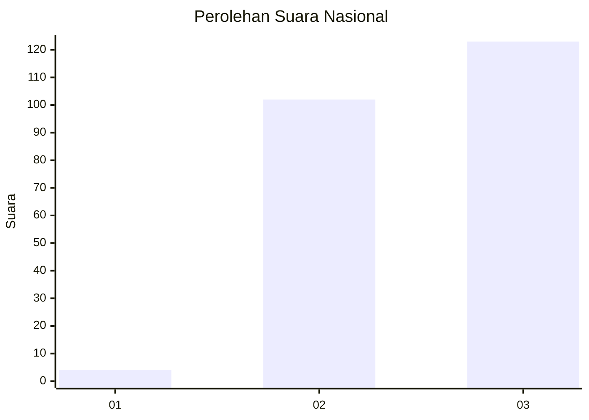
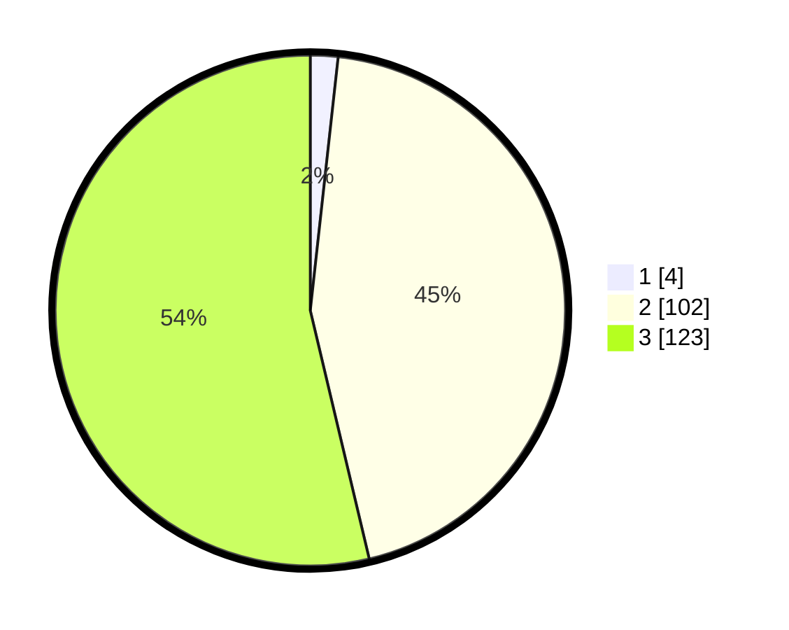

# Hasil

## Grafik

## Tabel

| No. | Nama Paslon    | Suara | Suara (raw) | Persentase |
|:--- |:-------------- | -----:| -----------:| ----------:|
| 1   | ANIES MUHAIMIN | 4     | [4][p-1]    | 1,75       |
| 2   | PRABOWO GIBRAN | 102   | [102][p-2]  | 44,54      |
| 3   | GANJAR MAHFUD  | 123   | [123][p-3]  | 53,71      |

[p-1]: https://github.com/gigit-pemilu/pemilu-2024/blob/main/pilpres/hitung-suara/sub/51-bali/sub/04-gianyar/sub/02-blahbatuh/sub/2001-saba/sub/026-tps/sub/paslon-1.txt
[p-2]: https://github.com/gigit-pemilu/pemilu-2024/blob/main/pilpres/hitung-suara/sub/51-bali/sub/04-gianyar/sub/02-blahbatuh/sub/2001-saba/sub/026-tps/sub/paslon-2.txt
[p-3]: https://github.com/gigit-pemilu/pemilu-2024/blob/main/pilpres/hitung-suara/sub/51-bali/sub/04-gianyar/sub/02-blahbatuh/sub/2001-saba/sub/026-tps/sub/paslon-3.txt

## Foto C Plano

https://sirekap-obj-formc.kpu.go.id/a7a1/pemilu/ppwp/51/04/02/20/01/5104022001026-20240214-141043--8028f32d-2003-40bb-92fa-37296965befc.jpg

https://sirekap-obj-formc.kpu.go.id/a7a1/pemilu/ppwp/51/04/02/20/01/5104022001026-20240214-141254--48cf0a3e-fa9b-4834-9963-1e1b922492b3.jpg

https://sirekap-obj-formc.kpu.go.id/a7a1/pemilu/ppwp/51/04/02/20/01/5104022001026-20240215-234314--c2d1e44d-e114-4038-b62a-0365870ed175.jpg

## Metadata

| Key        | Value               |
| ---------- | ------------------- |
| Time Stamp | 2024-02-16 00:00:26 |

## DATA PEMILIH TETAP

Jumlah pemilih dalam DPT: **249**.
 * L: **117**.
 * P: **132**.

## DATA PENGGUNA HAK PILIH

Jumlah pengguna hak pilih dalam DPT: **227**.
 * L: **108**.
 * P: **119**.

Jumlah pengguna hak pilih dalam DPTb: **1**.
 * L: **0**.
 * P: **1**.

Jumlah pengguna hak pilih dalam DPK: **5**.
 * L: **0**.
 * P: **5**.

Jumlah pengguna hak pilih: **233**.
 * L: **108**.
 * P: **125**.

## JUMLAH SUARA SAH DAN TIDAK SAH

JUMLAH SELURUH SUARA SAH: **229**.

JUMLAH SUARA TIDAK SAH: **4**.

JUMLAH SELURUH SUARA SAH DAN SUARA TIDAK SAH: **233**.

