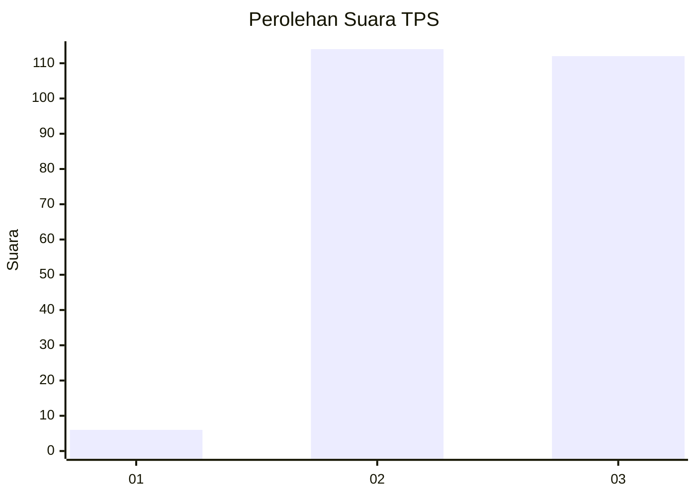
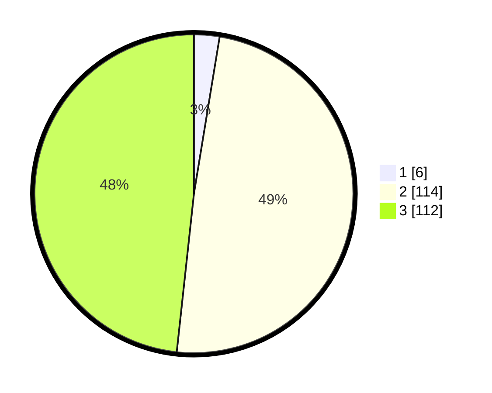

# Hasil

## Grafik

## Tabel

| No. | Nama Paslon    | Suara | Suara (raw) | Persentase |
|:--- |:-------------- | -----:| -----------:| ----------:|
| 1   | ANIES MUHAIMIN | 6     | [6][p-1]    | 2,59       |
| 2   | PRABOWO GIBRAN | 114   | [114][p-2]  | 49,14      |
| 3   | GANJAR MAHFUD  | 112   | [112][p-3]  | 48,28      |

[p-1]: https://github.com/gigit-pemilu/pemilu-2024-51-bali/blob/main/pilpres/hitung-suara/sub/51-bali/sub/04-gianyar/sub/02-blahbatuh/sub/2001-saba/sub/027-tps/sub/paslon-1.txt
[p-2]: https://github.com/gigit-pemilu/pemilu-2024-51-bali/blob/main/pilpres/hitung-suara/sub/51-bali/sub/04-gianyar/sub/02-blahbatuh/sub/2001-saba/sub/027-tps/sub/paslon-2.txt
[p-3]: https://github.com/gigit-pemilu/pemilu-2024-51-bali/blob/main/pilpres/hitung-suara/sub/51-bali/sub/04-gianyar/sub/02-blahbatuh/sub/2001-saba/sub/027-tps/sub/paslon-3.txt

## Foto C Plano

https://sirekap-obj-formc.kpu.go.id/9d9c/pemilu/ppwp/51/04/02/20/01/5104022001027-20240216-013205--999a0110-85a1-48c8-8ba1-ef740087aaa3.jpg

https://sirekap-obj-formc.kpu.go.id/9d9c/pemilu/ppwp/51/04/02/20/01/5104022001027-20240216-013214--8a5d9138-5327-4cde-a1d6-89ca805e185a.jpg

https://sirekap-obj-formc.kpu.go.id/9d9c/pemilu/ppwp/51/04/02/20/01/5104022001027-20240216-013211--b5972851-4db0-44fd-b4e7-156e66929558.jpg

## Metadata

| Key        | Value               |
| ---------- | ------------------- |
| Time Stamp | 2024-02-16 10:30:29 |

## DATA PEMILIH TETAP

Jumlah pemilih dalam DPT: **247**.
 * L: **115**.
 * P: **132**.

## DATA PENGGUNA HAK PILIH

Jumlah pengguna hak pilih dalam DPT: **221**.
 * L: **101**.
 * P: **120**.

Jumlah pengguna hak pilih dalam DPTb: **13**.
 * L: **6**.
 * P: **7**.

Jumlah pengguna hak pilih dalam DPK: **0**.
 * L: **0**.
 * P: **0**.

Jumlah pengguna hak pilih: **234**.
 * L: **107**.
 * P: **127**.

## JUMLAH SUARA SAH DAN TIDAK SAH

JUMLAH SELURUH SUARA SAH: **232**.

JUMLAH SUARA TIDAK SAH: **2**.

JUMLAH SELURUH SUARA SAH DAN SUARA TIDAK SAH: **234**.

