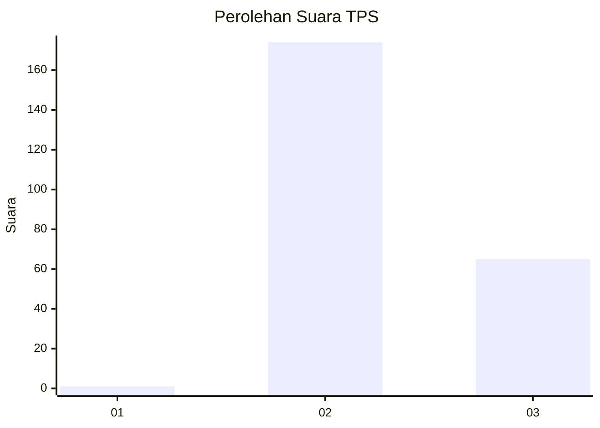
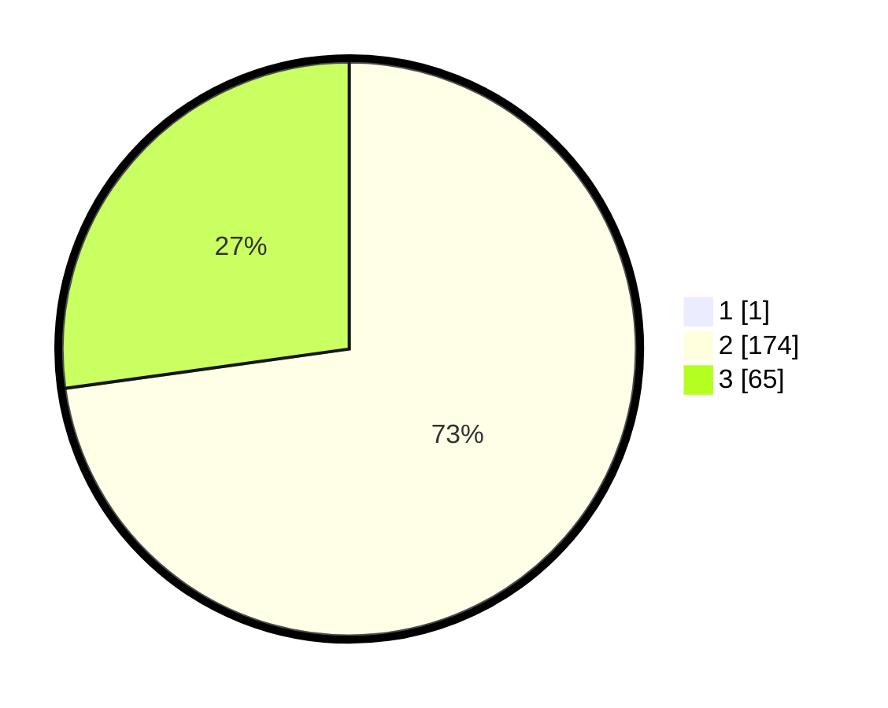

# Hasil

## Grafik

## Tabel

| No. | Nama Paslon    | Suara | Suara (raw) | Persentase |
|:--- |:-------------- | -----:| -----------:| ----------:|
| 1   | ANIES MUHAIMIN | 1     | [1][p-1]    | 0,42       |
| 2   | PRABOWO GIBRAN | 174   | [174][p-2]  | 72,50      |
| 3   | GANJAR MAHFUD  | 65    | [65][p-3]   | 27,08      |

[p-1]: https://github.com/gigit-pemilu/pemilu-2024-51-bali/blob/main/pilpres/hitung-suara/sub/51-bali/sub/04-gianyar/sub/02-blahbatuh/sub/2002-pering/sub/010-tps/sub/paslon-1.txt
[p-2]: https://github.com/gigit-pemilu/pemilu-2024-51-bali/blob/main/pilpres/hitung-suara/sub/51-bali/sub/04-gianyar/sub/02-blahbatuh/sub/2002-pering/sub/010-tps/sub/paslon-2.txt
[p-3]: https://github.com/gigit-pemilu/pemilu-2024-51-bali/blob/main/pilpres/hitung-suara/sub/51-bali/sub/04-gianyar/sub/02-blahbatuh/sub/2002-pering/sub/010-tps/sub/paslon-3.txt

## Foto C Plano

https://sirekap-obj-formc.kpu.go.id/34fb/pemilu/ppwp/51/04/02/20/02/5104022002010-20240214-221236--25bdbaa8-94cf-474e-a1b1-46964b4b7b0c.jpg

https://sirekap-obj-formc.kpu.go.id/34fb/pemilu/ppwp/51/04/02/20/02/5104022002010-20240214-221445--0ac6676d-01d4-4094-95f2-4701c5d0afe8.jpg

https://sirekap-obj-formc.kpu.go.id/34fb/pemilu/ppwp/51/04/02/20/02/5104022002010-20240214-221644--6ce3db4d-effa-4f56-8966-1747048fb174.jpg

## Metadata

| Key        | Value               |
| ---------- | ------------------- |
| Time Stamp | 2024-02-15 21:01:18 |

