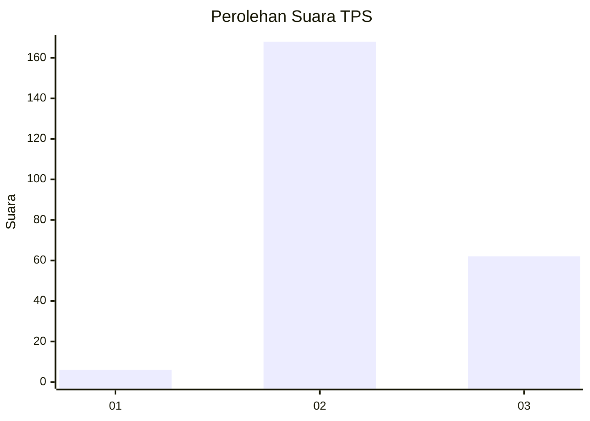
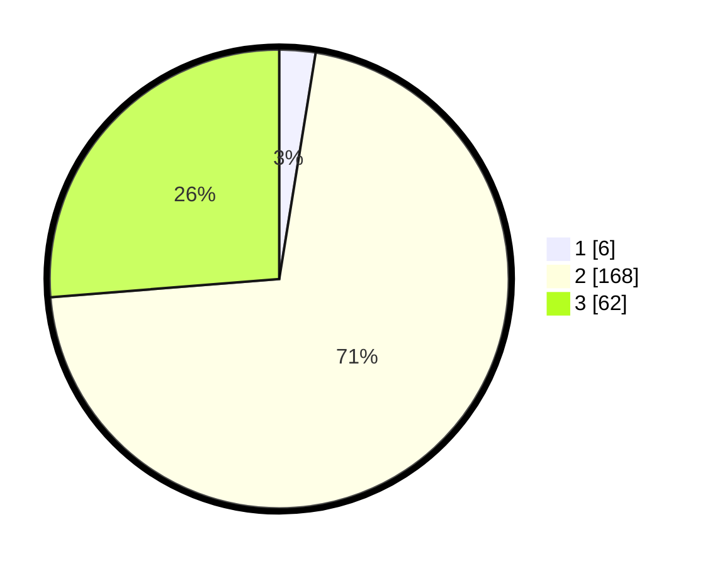

# Hasil

## Grafik

## Tabel

| No. | Nama Paslon    | Suara | Suara (raw) | Persentase |
|:--- |:-------------- | -----:| -----------:| ----------:|
| 1   | ANIES MUHAIMIN | 6     | [6][p-1]    | 2,54       |
| 2   | PRABOWO GIBRAN | 168   | [168][p-2]  | 71,19      |
| 3   | GANJAR MAHFUD  | 62    | [62][p-3]   | 26,27      |

[p-1]: https://github.com/gigit-pemilu/pemilu-2024-51-bali/blob/main/pilpres/hitung-suara/sub/51-bali/sub/04-gianyar/sub/02-blahbatuh/sub/2002-pering/sub/012-tps/sub/paslon-1.txt
[p-2]: https://github.com/gigit-pemilu/pemilu-2024-51-bali/blob/main/pilpres/hitung-suara/sub/51-bali/sub/04-gianyar/sub/02-blahbatuh/sub/2002-pering/sub/012-tps/sub/paslon-2.txt
[p-3]: https://github.com/gigit-pemilu/pemilu-2024-51-bali/blob/main/pilpres/hitung-suara/sub/51-bali/sub/04-gianyar/sub/02-blahbatuh/sub/2002-pering/sub/012-tps/sub/paslon-3.txt

## Foto C Plano

https://sirekap-obj-formc.kpu.go.id/e76e/pemilu/ppwp/51/04/02/20/02/5104022002012-20240216-003428--243be663-48a9-41d5-827e-fb63cd257eb3.jpg

https://sirekap-obj-formc.kpu.go.id/e76e/pemilu/ppwp/51/04/02/20/02/5104022002012-20240216-003429--bdefc9c9-3b9b-47ef-ba96-1f875a56b029.jpg

https://sirekap-obj-formc.kpu.go.id/e76e/pemilu/ppwp/51/04/02/20/02/5104022002012-20240214-191633--c8874101-0ed2-4d8b-9db2-fac174439bd2.jpg

## Metadata

| Key        | Value               |
| ---------- | ------------------- |
| Time Stamp | 2024-02-17 16:00:02 |

## DATA PEMILIH TETAP

Jumlah pemilih dalam DPT: **257**.
 * L: **118**.
 * P: **139**.

## DATA PENGGUNA HAK PILIH

Jumlah pengguna hak pilih dalam DPT: **240**.
 * L: **111**.
 * P: **129**.

Jumlah pengguna hak pilih dalam DPTb: **2**.
 * L: **1**.
 * P: **1**.

Jumlah pengguna hak pilih dalam DPK: **5**.
 * L: **2**.
 * P: **3**.

Jumlah pengguna hak pilih: **247**.
 * L: **114**.
 * P: **133**.

## JUMLAH SUARA SAH DAN TIDAK SAH

JUMLAH SELURUH SUARA SAH: **236**.

JUMLAH SUARA TIDAK SAH: **11**.

JUMLAH SELURUH SUARA SAH DAN SUARA TIDAK SAH: **247**.

