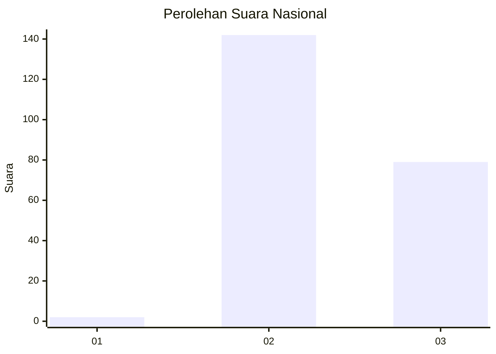
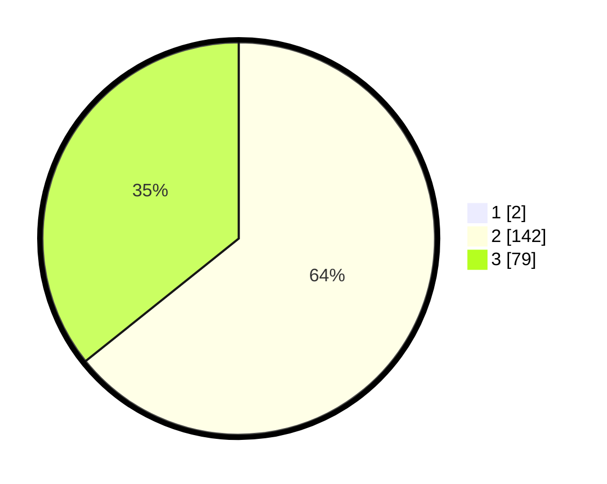

# Hasil

## Grafik

## Tabel

| No. | Nama Paslon    | Suara | Suara (raw) | Persentase |
|:--- |:-------------- | -----:| -----------:| ----------:|
| 1   | ANIES MUHAIMIN | 2     | [2][p-1]    | 0,90       |
| 2   | PRABOWO GIBRAN | 142   | [142][p-2]  | 63,68      |
| 3   | GANJAR MAHFUD  | 79    | [79][p-3]   | 35,43      |

[p-1]: https://github.com/gigit-pemilu/pemilu-2024/blob/main/pilpres/hitung-suara/sub/51-bali/sub/04-gianyar/sub/02-blahbatuh/sub/2002-pering/sub/018-tps/sub/paslon-1.txt
[p-2]: https://github.com/gigit-pemilu/pemilu-2024/blob/main/pilpres/hitung-suara/sub/51-bali/sub/04-gianyar/sub/02-blahbatuh/sub/2002-pering/sub/018-tps/sub/paslon-2.txt
[p-3]: https://github.com/gigit-pemilu/pemilu-2024/blob/main/pilpres/hitung-suara/sub/51-bali/sub/04-gianyar/sub/02-blahbatuh/sub/2002-pering/sub/018-tps/sub/paslon-3.txt

## Foto C Plano

https://sirekap-obj-formc.kpu.go.id/ca22/pemilu/ppwp/51/04/02/20/02/5104022002018-20240214-195638--84ac3b1e-8f87-4016-ba53-e807828bc261.jpg

https://sirekap-obj-formc.kpu.go.id/ca22/pemilu/ppwp/51/04/02/20/02/5104022002018-20240214-195745--473dbb78-3a1b-4626-8afd-13f92c5e26e1.jpg

https://sirekap-obj-formc.kpu.go.id/ca22/pemilu/ppwp/51/04/02/20/02/5104022002018-20240214-195904--dd5dd36c-594d-498c-bd3c-0ba92bcd21a0.jpg

## Metadata

| Key        | Value               |
| ---------- | ------------------- |
| Time Stamp | 2024-02-15 12:00:28 |

