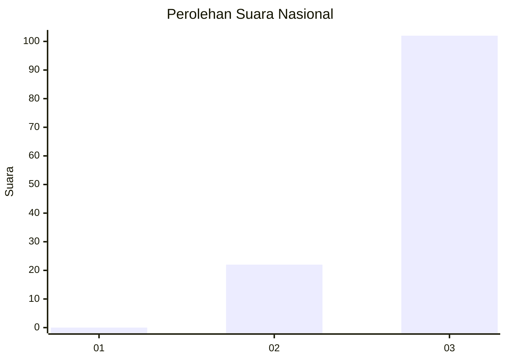
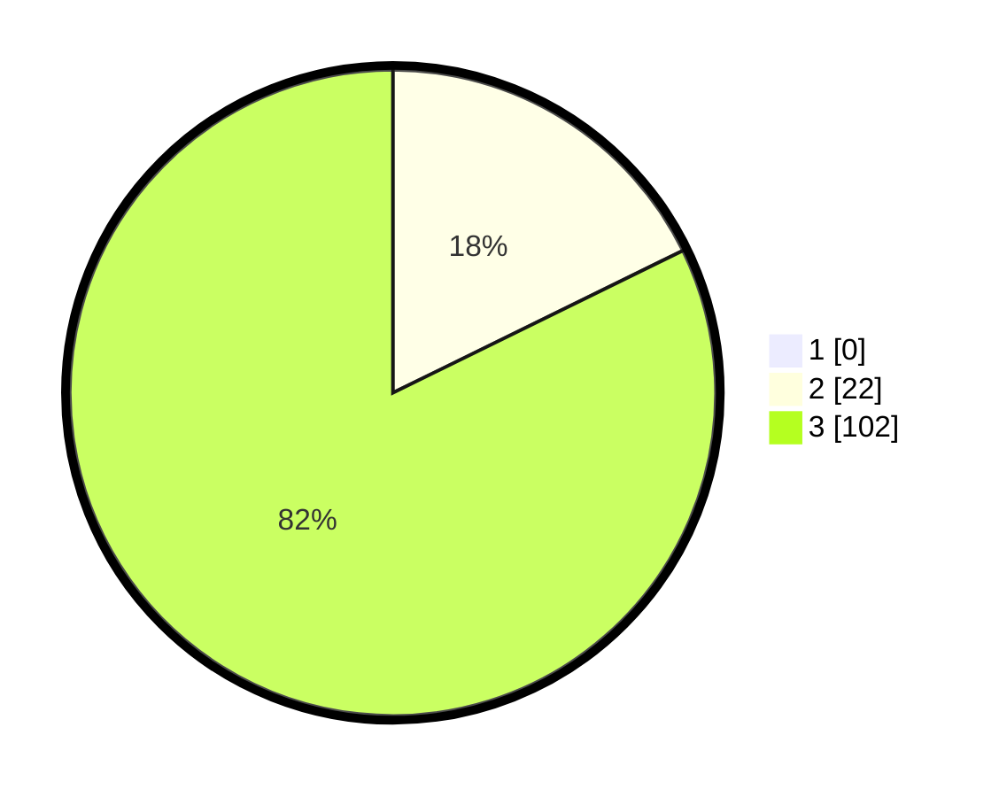

# Hasil

## Grafik

## Tabel

| No. | Nama Paslon    | Suara | Suara (raw) | Persentase |
|:--- |:-------------- | -----:| -----------:| ----------:|
| 1   | ANIES MUHAIMIN | 0     | [0][p-1]    | 0,00       |
| 2   | PRABOWO GIBRAN | 22    | [22][p-2]   | 17,74      |
| 3   | GANJAR MAHFUD  | 102   | [102][p-3]  | 82,26      |

[p-1]: https://github.com/gigit-pemilu/pemilu-2024/blob/main/pilpres/hitung-suara/sub/51-bali/sub/04-gianyar/sub/02-blahbatuh/sub/2004-belega/sub/001-tps/sub/paslon-1.txt
[p-2]: https://github.com/gigit-pemilu/pemilu-2024/blob/main/pilpres/hitung-suara/sub/51-bali/sub/04-gianyar/sub/02-blahbatuh/sub/2004-belega/sub/001-tps/sub/paslon-2.txt
[p-3]: https://github.com/gigit-pemilu/pemilu-2024/blob/main/pilpres/hitung-suara/sub/51-bali/sub/04-gianyar/sub/02-blahbatuh/sub/2004-belega/sub/001-tps/sub/paslon-3.txt

## Foto C Plano

https://sirekap-obj-formc.kpu.go.id/2110/pemilu/ppwp/51/04/02/20/04/5104022004001-20240216-053012--bfc89239-91d8-444d-9f5d-27ac9daab882.jpg

https://sirekap-obj-formc.kpu.go.id/2110/pemilu/ppwp/51/04/02/20/04/5104022004001-20240216-053013--fb0aaf62-5e23-44ca-ae9f-d03e35487357.jpg

https://sirekap-obj-formc.kpu.go.id/2110/pemilu/ppwp/51/04/02/20/04/5104022004001-20240216-053013--a2b23e87-d14a-4f3d-b300-9fbb5911945b.jpg

## Metadata

| Key        | Value               |
| ---------- | ------------------- |
| Time Stamp | 2024-02-16 11:00:29 |

## DATA PEMILIH TETAP

Jumlah pemilih dalam DPT: **147**.
 * L: **69**.
 * P: **78**.

## DATA PENGGUNA HAK PILIH

Jumlah pengguna hak pilih dalam DPT: **126**.
 * L: **60**.
 * P: **66**.

Jumlah pengguna hak pilih dalam DPTb: **0**.
 * L: **0**.
 * P: **0**.

Jumlah pengguna hak pilih dalam DPK: **0**.
 * L: **0**.
 * P: **0**.

Jumlah pengguna hak pilih: **126**.
 * L: **60**.
 * P: **66**.

## JUMLAH SUARA SAH DAN TIDAK SAH

JUMLAH SELURUH SUARA SAH: **124**.

JUMLAH SUARA TIDAK SAH: **2**.

JUMLAH SELURUH SUARA SAH DAN SUARA TIDAK SAH: **126**.

