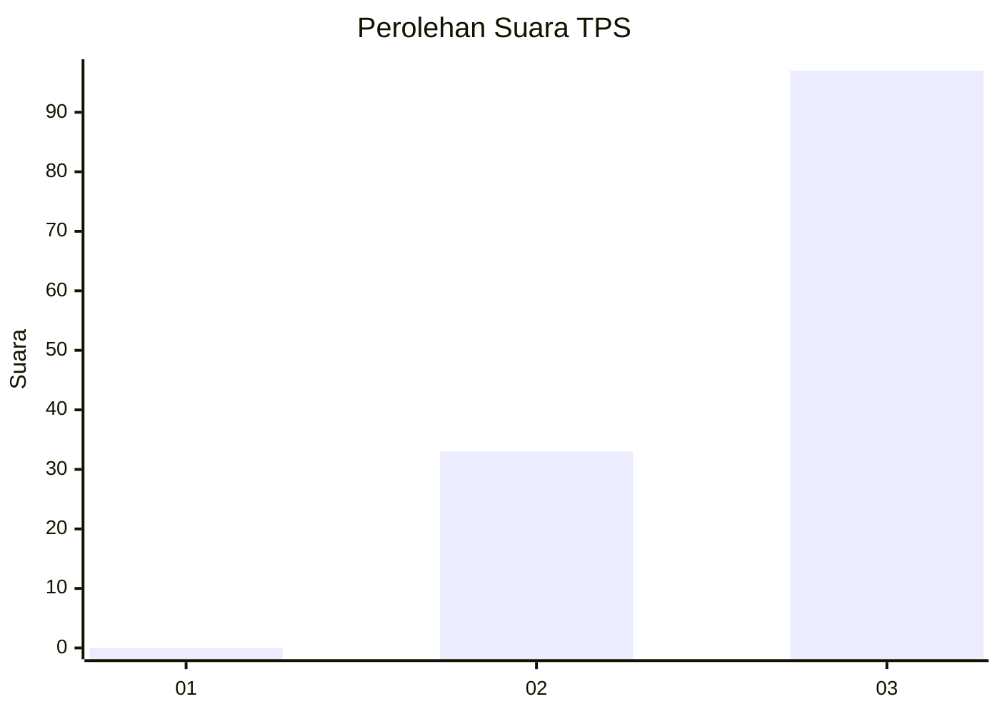
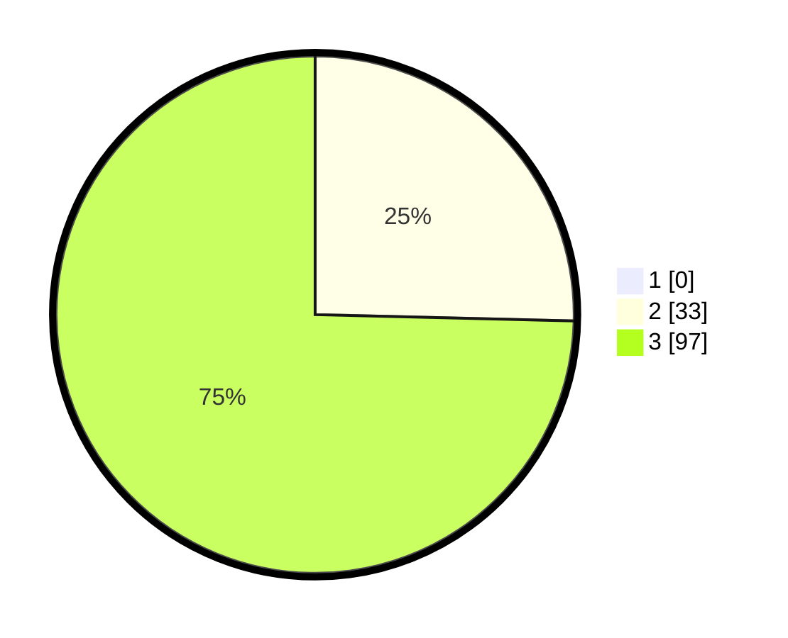

# Hasil

## Grafik

## Tabel

| No. | Nama Paslon    | Suara | Suara (raw) | Persentase |
|:--- |:-------------- | -----:| -----------:| ----------:|
| 1   | ANIES MUHAIMIN | 0     | [0][p-1]    | 0,00       |
| 2   | PRABOWO GIBRAN | 33    | [33][p-2]   | 25,38      |
| 3   | GANJAR MAHFUD  | 97    | [97][p-3]   | 74,62      |

[p-1]: https://github.com/gigit-pemilu/pemilu-2024-51-bali/blob/main/pilpres/hitung-suara/sub/51-bali/sub/04-gianyar/sub/02-blahbatuh/sub/2004-belega/sub/002-tps/sub/paslon-1.txt
[p-2]: https://github.com/gigit-pemilu/pemilu-2024-51-bali/blob/main/pilpres/hitung-suara/sub/51-bali/sub/04-gianyar/sub/02-blahbatuh/sub/2004-belega/sub/002-tps/sub/paslon-2.txt
[p-3]: https://github.com/gigit-pemilu/pemilu-2024-51-bali/blob/main/pilpres/hitung-suara/sub/51-bali/sub/04-gianyar/sub/02-blahbatuh/sub/2004-belega/sub/002-tps/sub/paslon-3.txt

## Foto C Plano

https://sirekap-obj-formc.kpu.go.id/d984/pemilu/ppwp/51/04/02/20/04/5104022004002-20240216-013822--798e0e77-fddf-4cff-a80c-8797b6f66210.jpg

https://sirekap-obj-formc.kpu.go.id/d984/pemilu/ppwp/51/04/02/20/04/5104022004002-20240216-013247--f6084e0f-db5a-4610-ba59-108025b2cbd2.jpg

https://sirekap-obj-formc.kpu.go.id/d984/pemilu/ppwp/51/04/02/20/04/5104022004002-20240216-013242--8b37c7d1-cd86-423b-89c6-94fbadabc6ca.jpg

## Metadata

| Key        | Value               |
| ---------- | ------------------- |
| Time Stamp | 2024-02-16 12:51:22 |

## DATA PEMILIH TETAP

Jumlah pemilih dalam DPT: **146**.
 * L: **68**.
 * P: **78**.

## DATA PENGGUNA HAK PILIH

Jumlah pengguna hak pilih dalam DPT: **130**.
 * L: **63**.
 * P: **67**.

Jumlah pengguna hak pilih dalam DPTb: **0**.
 * L: **0**.
 * P: **0**.

Jumlah pengguna hak pilih dalam DPK: **0**.
 * L: **0**.
 * P: **0**.

Jumlah pengguna hak pilih: **130**.
 * L: **63**.
 * P: **67**.

## JUMLAH SUARA SAH DAN TIDAK SAH

JUMLAH SELURUH SUARA SAH: **130**.

JUMLAH SUARA TIDAK SAH: **0**.

JUMLAH SELURUH SUARA SAH DAN SUARA TIDAK SAH: **130**.

