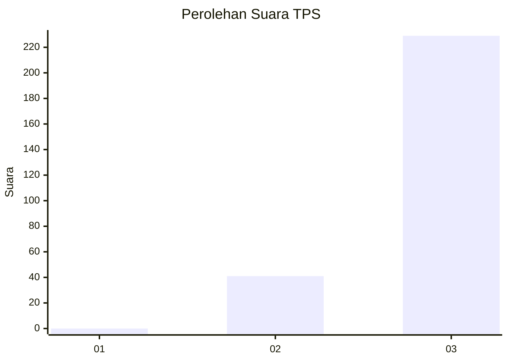
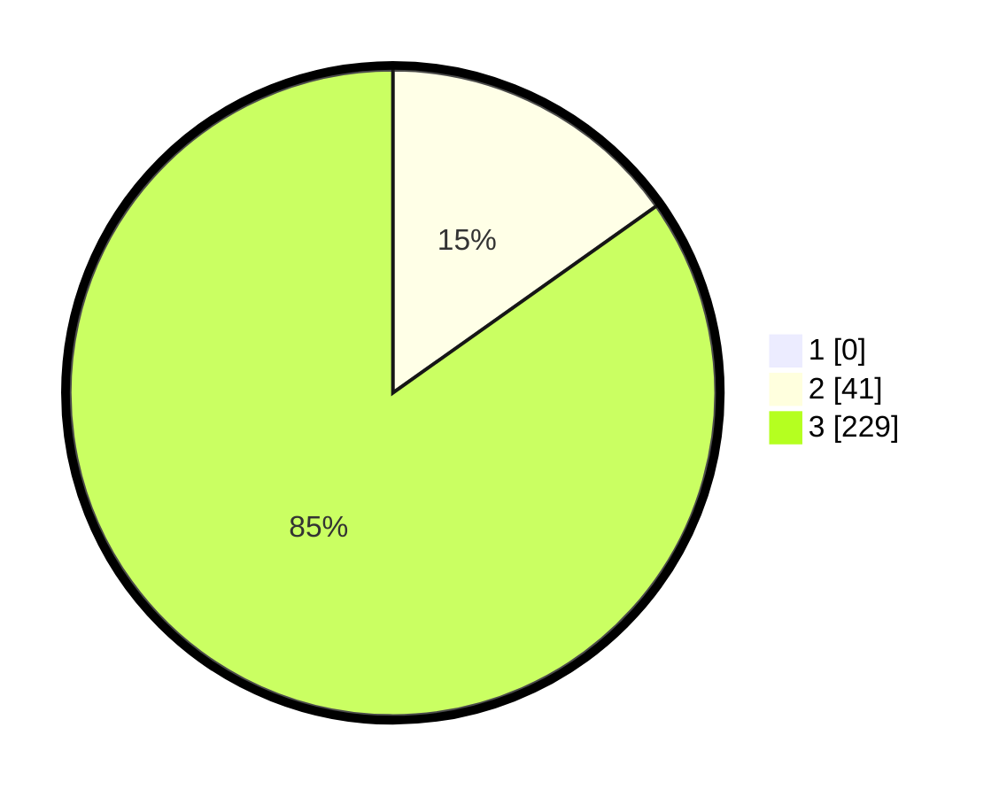

# Hasil

## Grafik

## Tabel

| No. | Nama Paslon    | Suara | Suara (raw) | Persentase |
|:--- |:-------------- | -----:| -----------:| ----------:|
| 1   | ANIES MUHAIMIN | 0     | [0][p-1]    | 0,00       |
| 2   | PRABOWO GIBRAN | 41    | [41][p-2]   | 15,19      |
| 3   | GANJAR MAHFUD  | 229   | [229][p-3]  | 84,81      |

[p-1]: https://github.com/gigit-pemilu/pemilu-2024-51-bali/blob/main/pilpres/hitung-suara/sub/51-bali/sub/04-gianyar/sub/02-blahbatuh/sub/2004-belega/sub/004-tps/sub/paslon-1.txt
[p-2]: https://github.com/gigit-pemilu/pemilu-2024-51-bali/blob/main/pilpres/hitung-suara/sub/51-bali/sub/04-gianyar/sub/02-blahbatuh/sub/2004-belega/sub/004-tps/sub/paslon-2.txt
[p-3]: https://github.com/gigit-pemilu/pemilu-2024-51-bali/blob/main/pilpres/hitung-suara/sub/51-bali/sub/04-gianyar/sub/02-blahbatuh/sub/2004-belega/sub/004-tps/sub/paslon-3.txt

## Foto C Plano

https://sirekap-obj-formc.kpu.go.id/9dd2/pemilu/ppwp/51/04/02/20/04/5104022004004-20240215-003248--451a7430-8a31-4fa6-b010-43f94770f092.jpg

https://sirekap-obj-formc.kpu.go.id/9dd2/pemilu/ppwp/51/04/02/20/04/5104022004004-20240215-003329--2ebd0dbe-6034-4376-bc08-e6baf2d8c93a.jpg

https://sirekap-obj-formc.kpu.go.id/9dd2/pemilu/ppwp/51/04/02/20/04/5104022004004-20240215-003353--8063d031-d99a-4d29-a870-88a83d042453.jpg

## Metadata

| Key        | Value               |
| ---------- | ------------------- |
| Time Stamp | 2024-02-15 12:00:28 |

