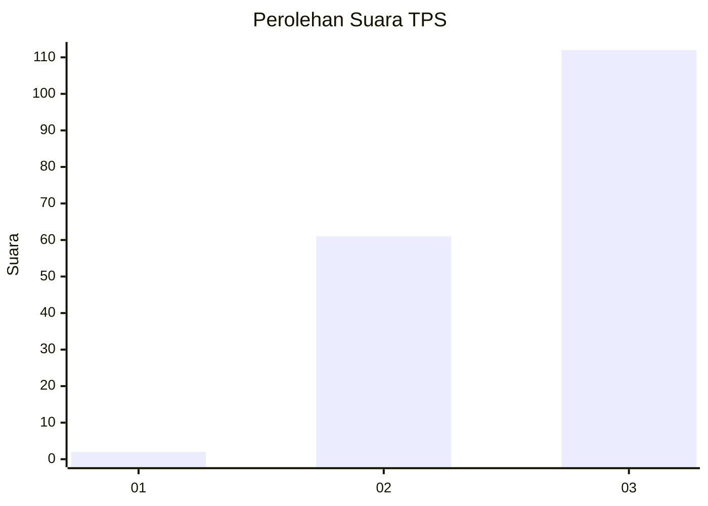
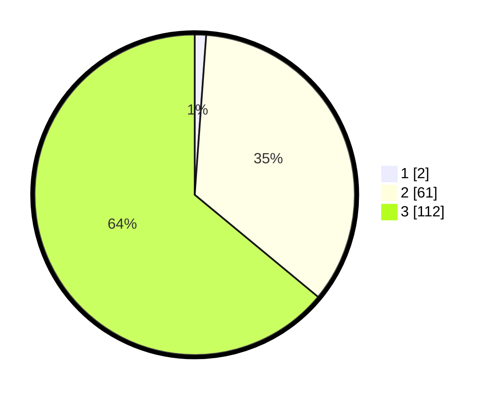

# Hasil

## Grafik

## Tabel

| No. | Nama Paslon    | Suara | Suara (raw) | Persentase |
|:--- |:-------------- | -----:| -----------:| ----------:|
| 1   | ANIES MUHAIMIN | 2     | [2][p-1]    | 1,14       |
| 2   | PRABOWO GIBRAN | 61    | [61][p-2]   | 34,86      |
| 3   | GANJAR MAHFUD  | 112   | [112][p-3]  | 64,00      |

[p-1]: https://github.com/gigit-pemilu/pemilu-2024-51-bali/blob/main/pilpres/hitung-suara/sub/51-bali/sub/04-gianyar/sub/02-blahbatuh/sub/2004-belega/sub/010-tps/sub/paslon-1.txt
[p-2]: https://github.com/gigit-pemilu/pemilu-2024-51-bali/blob/main/pilpres/hitung-suara/sub/51-bali/sub/04-gianyar/sub/02-blahbatuh/sub/2004-belega/sub/010-tps/sub/paslon-2.txt
[p-3]: https://github.com/gigit-pemilu/pemilu-2024-51-bali/blob/main/pilpres/hitung-suara/sub/51-bali/sub/04-gianyar/sub/02-blahbatuh/sub/2004-belega/sub/010-tps/sub/paslon-3.txt

## Foto C Plano

https://sirekap-obj-formc.kpu.go.id/c862/pemilu/ppwp/51/04/02/20/04/5104022004010-20240214-141421--10710b0c-d88f-4668-92d7-bccae0a912bd.jpg

https://sirekap-obj-formc.kpu.go.id/c862/pemilu/ppwp/51/04/02/20/04/5104022004010-20240214-141136--bd0e7bce-e93b-453e-a060-28ca8d1effa5.jpg

https://sirekap-obj-formc.kpu.go.id/c862/pemilu/ppwp/51/04/02/20/04/5104022004010-20240216-012528--53559c90-ffcf-4e13-9e8f-5c2ee4a5c3b6.jpg

## Metadata

| Key        | Value               |
| ---------- | ------------------- |
| Time Stamp | 2024-02-16 01:30:27 |

## DATA PEMILIH TETAP

Jumlah pemilih dalam DPT: **202**.
 * L: **102**.
 * P: **100**.

## DATA PENGGUNA HAK PILIH

Jumlah pengguna hak pilih dalam DPT: **177**.
 * L: **89**.
 * P: **88**.

Jumlah pengguna hak pilih dalam DPTb: **0**.
 * L: **0**.
 * P: **0**.

Jumlah pengguna hak pilih dalam DPK: **1**.
 * L: **0**.
 * P: **1**.

Jumlah pengguna hak pilih: **178**.
 * L: **89**.
 * P: **89**.

## JUMLAH SUARA SAH DAN TIDAK SAH

JUMLAH SELURUH SUARA SAH: **175**.

JUMLAH SUARA TIDAK SAH: **3**.

JUMLAH SELURUH SUARA SAH DAN SUARA TIDAK SAH: **178**.

