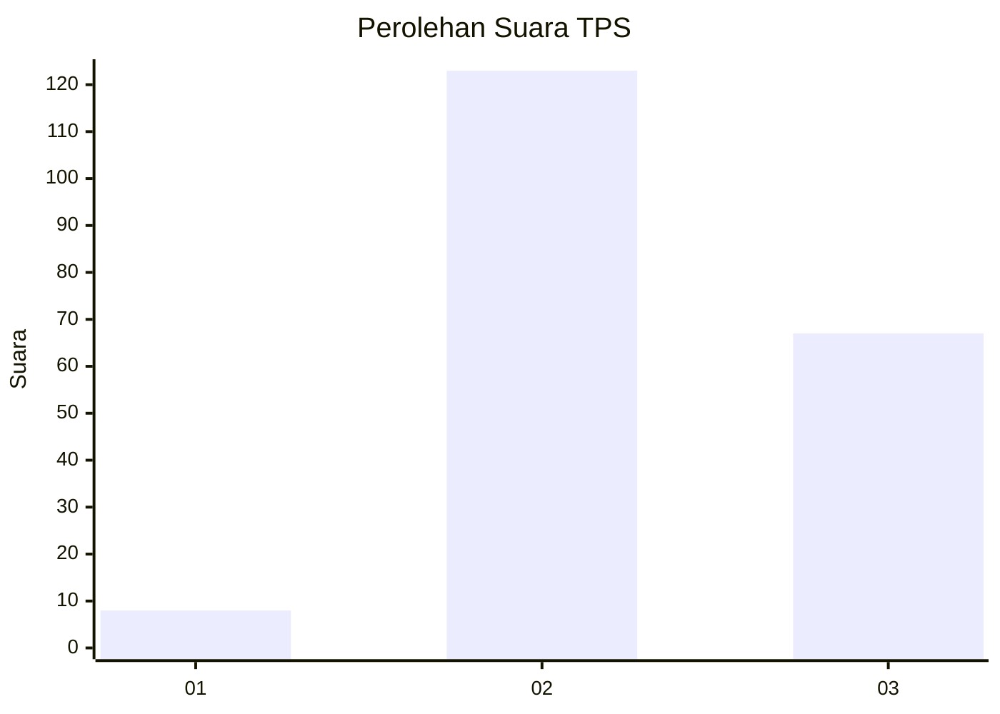
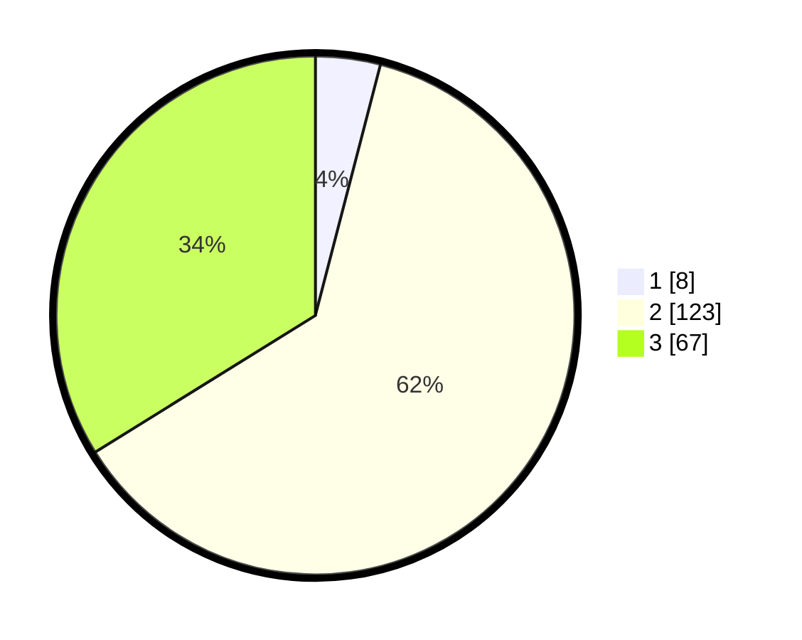

# Hasil

## Grafik

## Tabel

| No. | Nama Paslon    | Suara | Suara (raw) | Persentase |
|:--- |:-------------- | -----:| -----------:| ----------:|
| 1   | ANIES MUHAIMIN | 8     | [8][p-1]    | 4,04       |
| 2   | PRABOWO GIBRAN | 123   | [123][p-2]  | 62,12      |
| 3   | GANJAR MAHFUD  | 67    | [67][p-3]   | 33,84      |

[p-1]: https://github.com/gigit-pemilu/pemilu-2024-51-bali/blob/main/pilpres/hitung-suara/sub/51-bali/sub/04-gianyar/sub/02-blahbatuh/sub/2005-blahbatuh/sub/009-tps/sub/paslon-1.txt
[p-2]: https://github.com/gigit-pemilu/pemilu-2024-51-bali/blob/main/pilpres/hitung-suara/sub/51-bali/sub/04-gianyar/sub/02-blahbatuh/sub/2005-blahbatuh/sub/009-tps/sub/paslon-2.txt
[p-3]: https://github.com/gigit-pemilu/pemilu-2024-51-bali/blob/main/pilpres/hitung-suara/sub/51-bali/sub/04-gianyar/sub/02-blahbatuh/sub/2005-blahbatuh/sub/009-tps/sub/paslon-3.txt

## Foto C Plano

https://sirekap-obj-formc.kpu.go.id/acb2/pemilu/ppwp/51/04/02/20/05/5104022005009-20240214-193108--e4fc46c7-31b1-4280-9e34-68f7b009c86a.jpg

https://sirekap-obj-formc.kpu.go.id/acb2/pemilu/ppwp/51/04/02/20/05/5104022005009-20240214-193518--2f4ec156-9bd4-4e7d-937e-b70967209977.jpg

https://sirekap-obj-formc.kpu.go.id/acb2/pemilu/ppwp/51/04/02/20/05/5104022005009-20240214-193625--a9d4284d-4fbc-4e9c-a800-95336efe7dd4.jpg

## Metadata

| Key        | Value               |
| ---------- | ------------------- |
| Time Stamp | 2024-02-15 15:00:29 |

