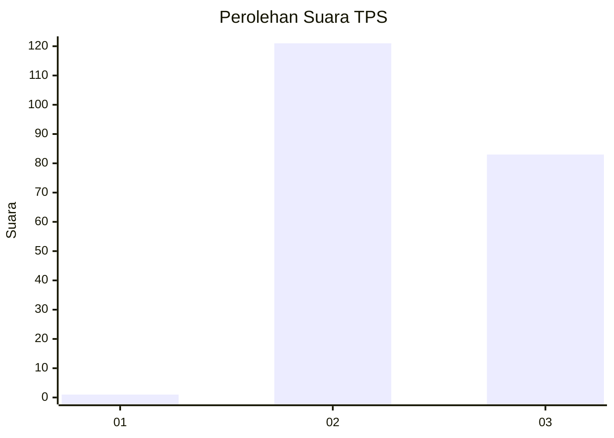
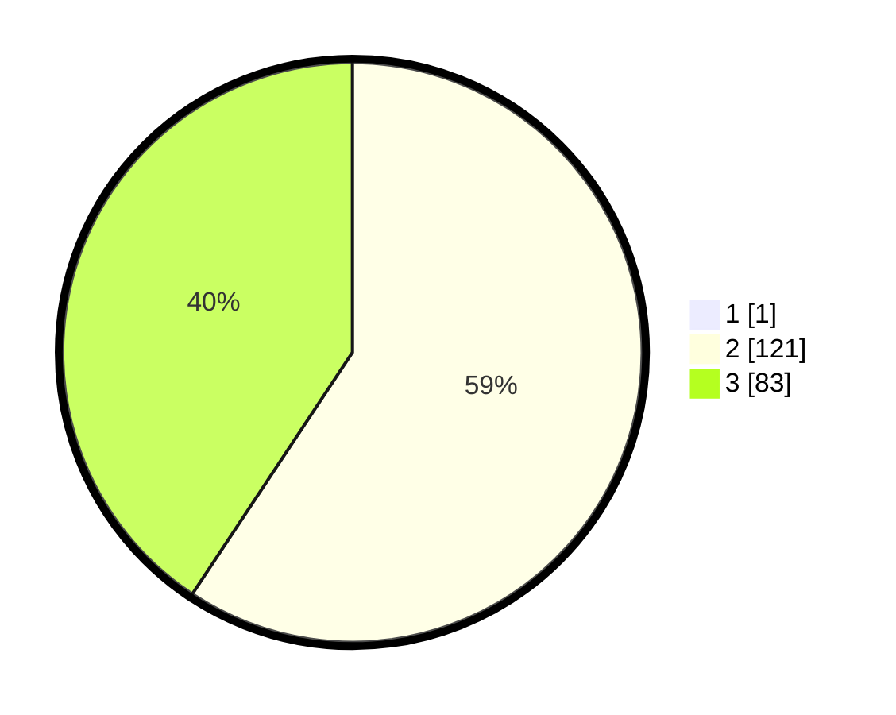

# Hasil

## Grafik

## Tabel

| No. | Nama Paslon    | Suara | Suara (raw) | Persentase |
|:--- |:-------------- | -----:| -----------:| ----------:|
| 1   | ANIES MUHAIMIN | 1     | [1][p-1]    | 0,49       |
| 2   | PRABOWO GIBRAN | 121   | [121][p-2]  | 59,02      |
| 3   | GANJAR MAHFUD  | 83    | [83][p-3]   | 40,49      |

[p-1]: https://github.com/gigit-pemilu/pemilu-2024-51-bali/blob/main/pilpres/hitung-suara/sub/51-bali/sub/04-gianyar/sub/02-blahbatuh/sub/2005-blahbatuh/sub/010-tps/sub/paslon-1.txt
[p-2]: https://github.com/gigit-pemilu/pemilu-2024-51-bali/blob/main/pilpres/hitung-suara/sub/51-bali/sub/04-gianyar/sub/02-blahbatuh/sub/2005-blahbatuh/sub/010-tps/sub/paslon-2.txt
[p-3]: https://github.com/gigit-pemilu/pemilu-2024-51-bali/blob/main/pilpres/hitung-suara/sub/51-bali/sub/04-gianyar/sub/02-blahbatuh/sub/2005-blahbatuh/sub/010-tps/sub/paslon-3.txt

## Foto C Plano

https://sirekap-obj-formc.kpu.go.id/d13c/pemilu/ppwp/51/04/02/20/05/5104022005010-20240214-195324--d96c0b2d-3763-4510-a91b-9d457df1078c.jpg

https://sirekap-obj-formc.kpu.go.id/d13c/pemilu/ppwp/51/04/02/20/05/5104022005010-20240214-194804--928ff29b-5867-4299-afc0-95dbaba1d63b.jpg

https://sirekap-obj-formc.kpu.go.id/d13c/pemilu/ppwp/51/04/02/20/05/5104022005010-20240214-194918--3d9967ec-c6e3-4ebd-a0c2-f8cf53aeeb24.jpg

## Metadata

| Key        | Value               |
| ---------- | ------------------- |
| Time Stamp | 2024-02-15 12:00:28 |

