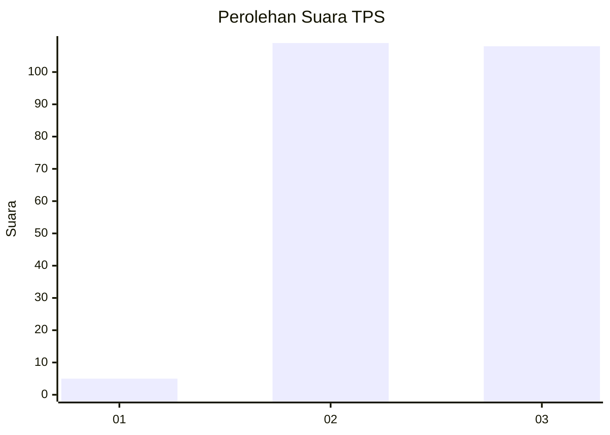
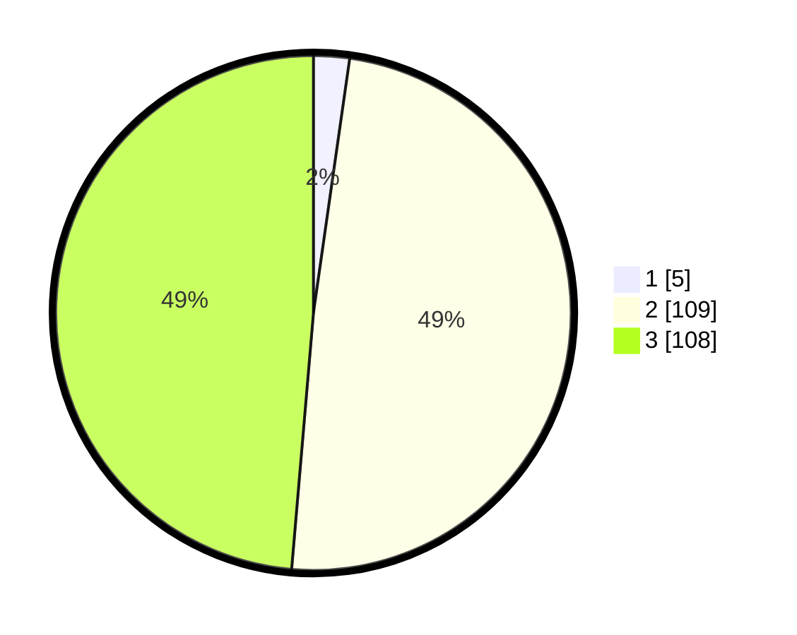

# Hasil

## Grafik

## Tabel

| No. | Nama Paslon    | Suara | Suara (raw) | Persentase |
|:--- |:-------------- | -----:| -----------:| ----------:|
| 1   | ANIES MUHAIMIN | 5     | [5][p-1]    | 2,25       |
| 2   | PRABOWO GIBRAN | 109   | [109][p-2]  | 49,10      |
| 3   | GANJAR MAHFUD  | 108   | [108][p-3]  | 48,65      |

[p-1]: https://github.com/gigit-pemilu/pemilu-2024-51-bali/blob/main/pilpres/hitung-suara/sub/51-bali/sub/04-gianyar/sub/02-blahbatuh/sub/2005-blahbatuh/sub/011-tps/sub/paslon-1.txt
[p-2]: https://github.com/gigit-pemilu/pemilu-2024-51-bali/blob/main/pilpres/hitung-suara/sub/51-bali/sub/04-gianyar/sub/02-blahbatuh/sub/2005-blahbatuh/sub/011-tps/sub/paslon-2.txt
[p-3]: https://github.com/gigit-pemilu/pemilu-2024-51-bali/blob/main/pilpres/hitung-suara/sub/51-bali/sub/04-gianyar/sub/02-blahbatuh/sub/2005-blahbatuh/sub/011-tps/sub/paslon-3.txt

## Foto C Plano

https://sirekap-obj-formc.kpu.go.id/1b13/pemilu/ppwp/51/04/02/20/05/5104022005011-20240214-215514--deadbb87-4617-4acc-8435-631d10ba7418.jpg

https://sirekap-obj-formc.kpu.go.id/1b13/pemilu/ppwp/51/04/02/20/05/5104022005011-20240214-193301--ce1bfab1-21a6-4c10-bb31-acb146a88fa3.jpg

https://sirekap-obj-formc.kpu.go.id/1b13/pemilu/ppwp/51/04/02/20/05/5104022005011-20240214-193511--580052e8-51a9-4d1e-b160-519c5a67ffd4.jpg

## Metadata

| Key        | Value               |
| ---------- | ------------------- |
| Time Stamp | 2024-02-15 15:30:25 |

