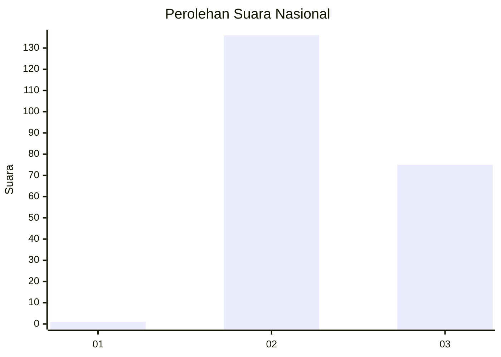
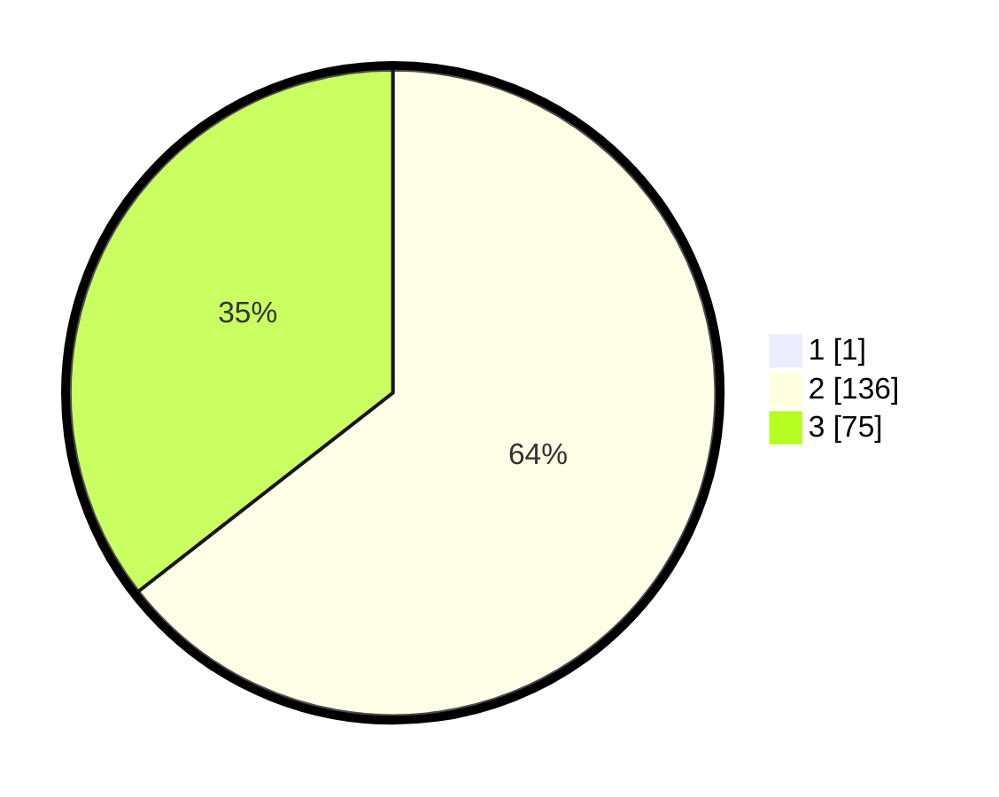

# Hasil

## Grafik

## Tabel

| No. | Nama Paslon    | Suara | Suara (raw) | Persentase |
|:--- |:-------------- | -----:| -----------:| ----------:|
| 1   | ANIES MUHAIMIN | 1     | [1][p-1]    | 0,47       |
| 2   | PRABOWO GIBRAN | 136   | [136][p-2]  | 64,15      |
| 3   | GANJAR MAHFUD  | 75    | [75][p-3]   | 35,38      |

[p-1]: https://github.com/gigit-pemilu/pemilu-2024/blob/main/pilpres/hitung-suara/sub/51-bali/sub/04-gianyar/sub/02-blahbatuh/sub/2005-blahbatuh/sub/015-tps/sub/paslon-1.txt
[p-2]: https://github.com/gigit-pemilu/pemilu-2024/blob/main/pilpres/hitung-suara/sub/51-bali/sub/04-gianyar/sub/02-blahbatuh/sub/2005-blahbatuh/sub/015-tps/sub/paslon-2.txt
[p-3]: https://github.com/gigit-pemilu/pemilu-2024/blob/main/pilpres/hitung-suara/sub/51-bali/sub/04-gianyar/sub/02-blahbatuh/sub/2005-blahbatuh/sub/015-tps/sub/paslon-3.txt

## Foto C Plano

https://sirekap-obj-formc.kpu.go.id/d2c3/pemilu/ppwp/51/04/02/20/05/5104022005015-20240214-230657--329fc1db-8370-4a48-81a5-9832c419e9f7.jpg

https://sirekap-obj-formc.kpu.go.id/d2c3/pemilu/ppwp/51/04/02/20/05/5104022005015-20240214-230908--24a8d180-9fb0-4950-9612-af49991be944.jpg

https://sirekap-obj-formc.kpu.go.id/d2c3/pemilu/ppwp/51/04/02/20/05/5104022005015-20240214-231116--1507e361-c817-4997-8cc8-f0fcd89de519.jpg

## Metadata

| Key        | Value               |
| ---------- | ------------------- |
| Time Stamp | 2024-02-15 15:30:25 |

