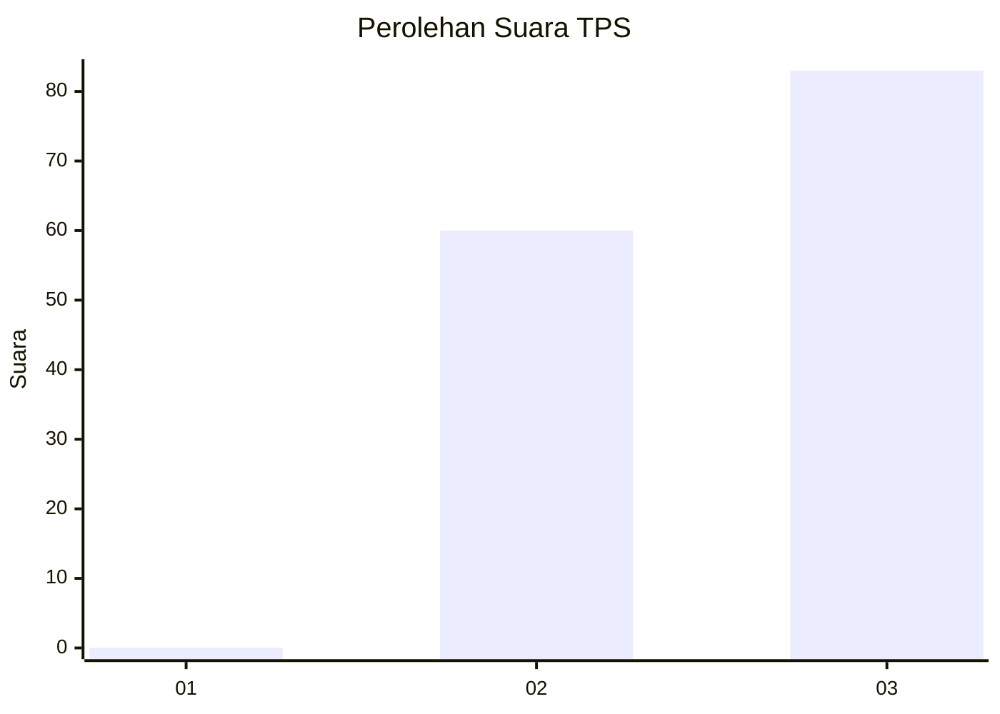
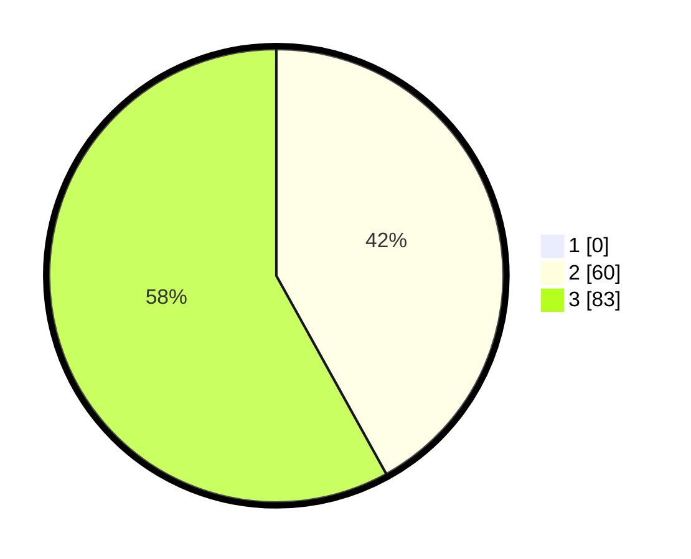

# Hasil

## Grafik

## Tabel

| No. | Nama Paslon    | Suara | Suara (raw) | Persentase |
|:--- |:-------------- | -----:| -----------:| ----------:|
| 1   | ANIES MUHAIMIN | 0     | [0][p-1]    | 0,00       |
| 2   | PRABOWO GIBRAN | 60    | [60][p-2]   | 41,96      |
| 3   | GANJAR MAHFUD  | 83    | [83][p-3]   | 58,04      |

[p-1]: https://github.com/gigit-pemilu/pemilu-2024-51-bali/blob/main/pilpres/hitung-suara/sub/51-bali/sub/04-gianyar/sub/02-blahbatuh/sub/2005-blahbatuh/sub/033-tps/sub/paslon-1.txt
[p-2]: https://github.com/gigit-pemilu/pemilu-2024-51-bali/blob/main/pilpres/hitung-suara/sub/51-bali/sub/04-gianyar/sub/02-blahbatuh/sub/2005-blahbatuh/sub/033-tps/sub/paslon-2.txt
[p-3]: https://github.com/gigit-pemilu/pemilu-2024-51-bali/blob/main/pilpres/hitung-suara/sub/51-bali/sub/04-gianyar/sub/02-blahbatuh/sub/2005-blahbatuh/sub/033-tps/sub/paslon-3.txt

## Foto C Plano

https://sirekap-obj-formc.kpu.go.id/ca51/pemilu/ppwp/51/04/02/20/05/5104022005033-20240214-130056--929ff97b-c787-48c6-a822-47036b1f57d4.jpg

https://sirekap-obj-formc.kpu.go.id/ca51/pemilu/ppwp/51/04/02/20/05/5104022005033-20240214-130200--525b758f-9f97-448d-8c81-8e11f6f2b96e.jpg

https://sirekap-obj-formc.kpu.go.id/ca51/pemilu/ppwp/51/04/02/20/05/5104022005033-20240214-130252--447d1f91-8bb9-4083-9498-fdec86618c74.jpg

## Metadata

| Key        | Value               |
| ---------- | ------------------- |
| Time Stamp | 2024-02-14 21:46:01 |

## DATA PEMILIH TETAP

Jumlah pemilih dalam DPT: **172**.
 * L: **78**.
 * P: **94**.

## DATA PENGGUNA HAK PILIH

Jumlah pengguna hak pilih dalam DPT: **144**.
 * L: **71**.
 * P: **73**.

Jumlah pengguna hak pilih dalam DPTb: **0**.
 * L: **0**.
 * P: **0**.

Jumlah pengguna hak pilih dalam DPK: **2**.
 * L: **1**.
 * P: **1**.

Jumlah pengguna hak pilih: **146**.
 * L: **72**.
 * P: **74**.

## JUMLAH SUARA SAH DAN TIDAK SAH

JUMLAH SELURUH SUARA SAH: **143**.

JUMLAH SUARA TIDAK SAH: **3**.

JUMLAH SELURUH SUARA SAH DAN SUARA TIDAK SAH: **146**.

