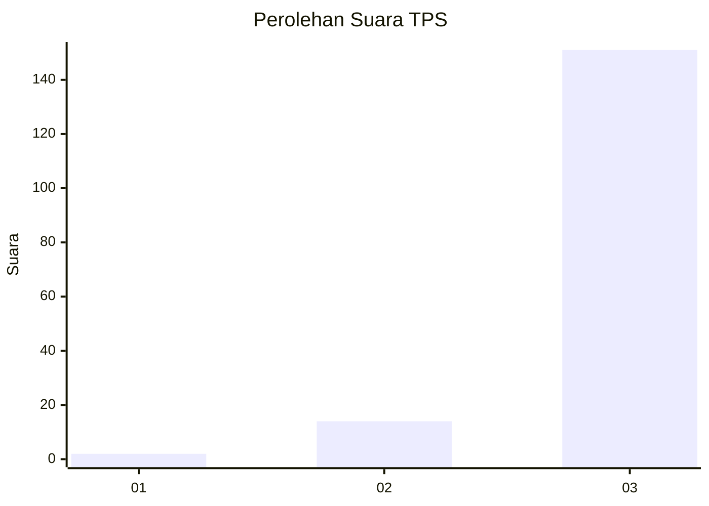
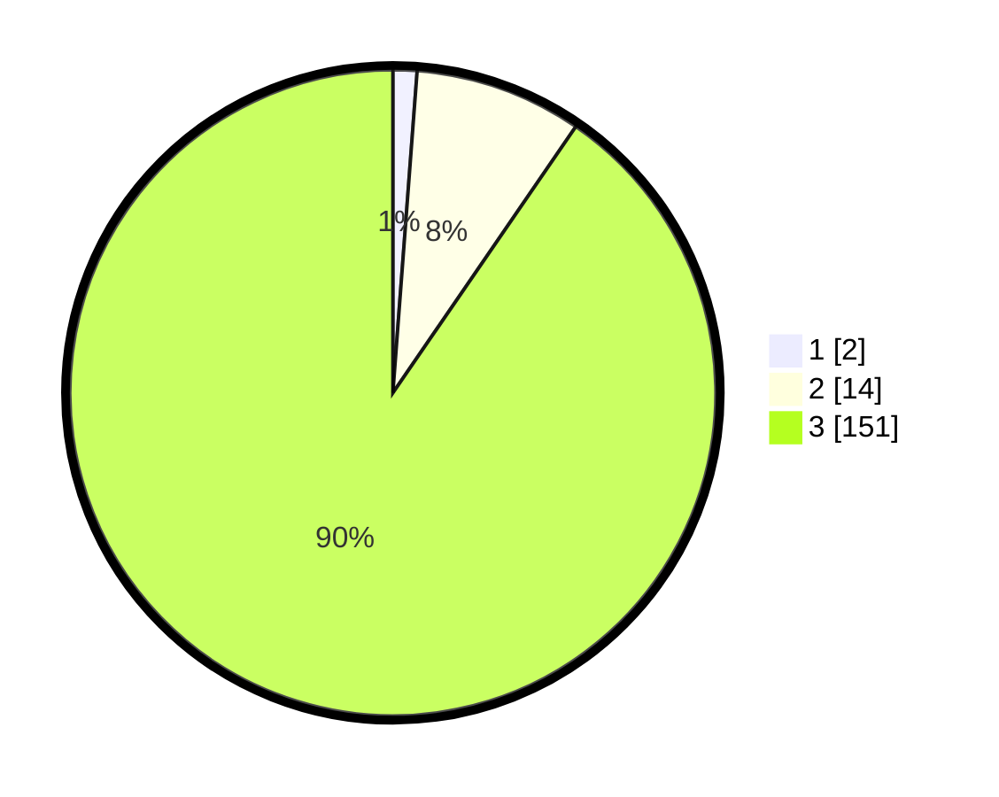

# Hasil

## Grafik

## Tabel

| No. | Nama Paslon    | Suara | Suara (raw) | Persentase |
|:--- |:-------------- | -----:| -----------:| ----------:|
| 1   | ANIES MUHAIMIN | 2     | [2][p-1]    | 1,20       |
| 2   | PRABOWO GIBRAN | 14    | [14][p-2]   | 8,38       |
| 3   | GANJAR MAHFUD  | 151   | [151][p-3]  | 90,42      |

[p-1]: https://github.com/gigit-pemilu/pemilu-2024-51-bali/blob/main/pilpres/hitung-suara/sub/51-bali/sub/04-gianyar/sub/02-blahbatuh/sub/2006-buruan/sub/002-tps/sub/paslon-1.txt
[p-2]: https://github.com/gigit-pemilu/pemilu-2024-51-bali/blob/main/pilpres/hitung-suara/sub/51-bali/sub/04-gianyar/sub/02-blahbatuh/sub/2006-buruan/sub/002-tps/sub/paslon-2.txt
[p-3]: https://github.com/gigit-pemilu/pemilu-2024-51-bali/blob/main/pilpres/hitung-suara/sub/51-bali/sub/04-gianyar/sub/02-blahbatuh/sub/2006-buruan/sub/002-tps/sub/paslon-3.txt

## Foto C Plano

https://sirekap-obj-formc.kpu.go.id/30df/pemilu/ppwp/51/04/02/20/06/5104022006002-20240215-191318--cc31eda4-0691-45b8-b5e8-019b46dceb96.jpg

https://sirekap-obj-formc.kpu.go.id/30df/pemilu/ppwp/51/04/02/20/06/5104022006002-20240215-191339--0538dffe-1c9d-4a02-b139-6112d085b096.jpg

https://sirekap-obj-formc.kpu.go.id/30df/pemilu/ppwp/51/04/02/20/06/5104022006002-20240215-191328--0bd9feaf-fe9e-4264-b9d8-9457ca80528b.jpg

## Metadata

| Key        | Value               |
| ---------- | ------------------- |
| Time Stamp | 2024-02-15 20:30:46 |

## DATA PEMILIH TETAP

Jumlah pemilih dalam DPT: **168**.
 * L: **83**.
 * P: **85**.

## DATA PENGGUNA HAK PILIH

Jumlah pengguna hak pilih dalam DPT: **165**.
 * L: **80**.
 * P: **85**.

Jumlah pengguna hak pilih dalam DPTb: **0**.
 * L: **0**.
 * P: **0**.

Jumlah pengguna hak pilih dalam DPK: **2**.
 * L: **1**.
 * P: **1**.

Jumlah pengguna hak pilih: **167**.
 * L: **81**.
 * P: **86**.

## JUMLAH SUARA SAH DAN TIDAK SAH

JUMLAH SELURUH SUARA SAH: **167**.

JUMLAH SUARA TIDAK SAH: **0**.

JUMLAH SELURUH SUARA SAH DAN SUARA TIDAK SAH: **167**.

