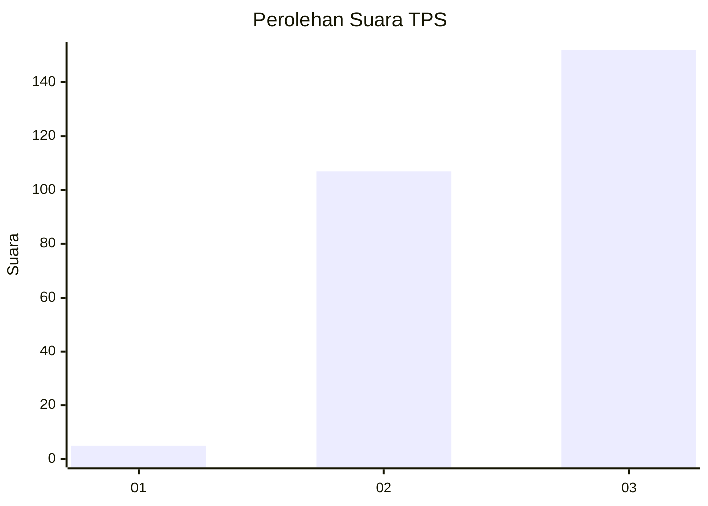
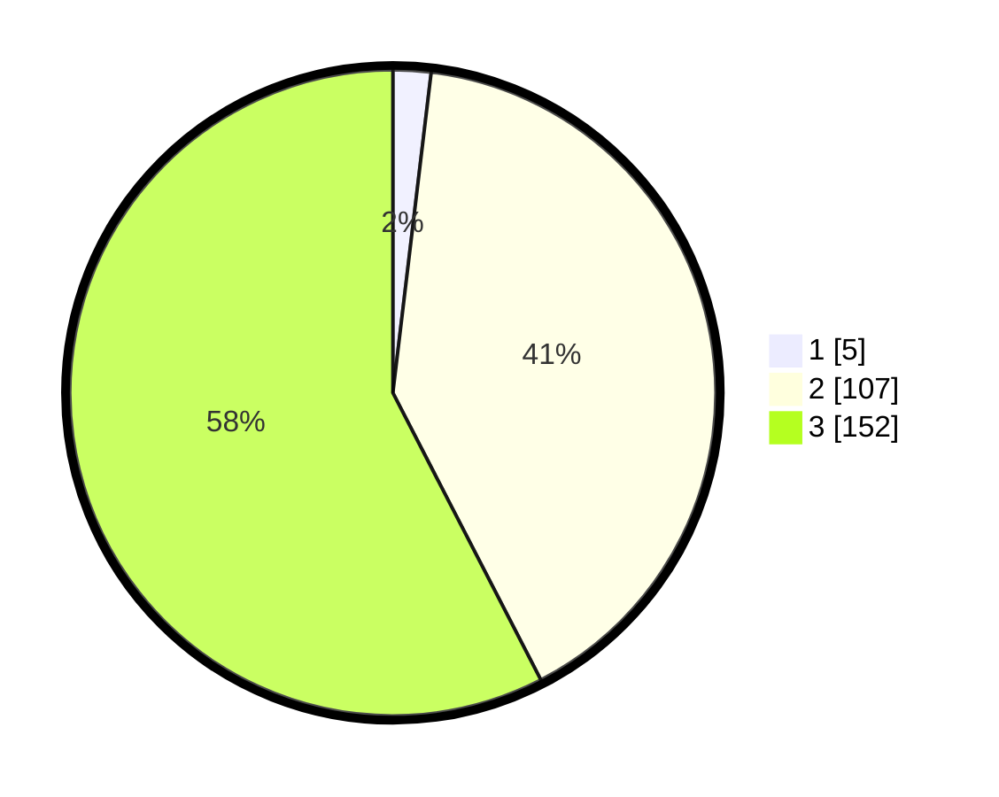

# Hasil

## Grafik

## Tabel

| No. | Nama Paslon    | Suara | Suara (raw) | Persentase |
|:--- |:-------------- | -----:| -----------:| ----------:|
| 1   | ANIES MUHAIMIN | 5     | [5][p-1]    | 1,89       |
| 2   | PRABOWO GIBRAN | 107   | [107][p-2]  | 40,53      |
| 3   | GANJAR MAHFUD  | 152   | [152][p-3]  | 57,58      |

[p-1]: https://github.com/gigit-pemilu/pemilu-2024-51-bali/blob/main/pilpres/hitung-suara/sub/51-bali/sub/04-gianyar/sub/02-blahbatuh/sub/2006-buruan/sub/007-tps/sub/paslon-1.txt
[p-2]: https://github.com/gigit-pemilu/pemilu-2024-51-bali/blob/main/pilpres/hitung-suara/sub/51-bali/sub/04-gianyar/sub/02-blahbatuh/sub/2006-buruan/sub/007-tps/sub/paslon-2.txt
[p-3]: https://github.com/gigit-pemilu/pemilu-2024-51-bali/blob/main/pilpres/hitung-suara/sub/51-bali/sub/04-gianyar/sub/02-blahbatuh/sub/2006-buruan/sub/007-tps/sub/paslon-3.txt

## Foto C Plano

https://sirekap-obj-formc.kpu.go.id/bac6/pemilu/ppwp/51/04/02/20/06/5104022006007-20240214-221423--48f5a2bb-2c4c-40ba-a9f2-df2650215f68.jpg

https://sirekap-obj-formc.kpu.go.id/bac6/pemilu/ppwp/51/04/02/20/06/5104022006007-20240214-211601--da6bee88-0ea2-4a04-bd31-58644ab61c74.jpg

https://sirekap-obj-formc.kpu.go.id/bac6/pemilu/ppwp/51/04/02/20/06/5104022006007-20240214-223207--4ffe2d7d-76e7-4207-bfed-3e94f28fe67a.jpg

## Metadata

| Key        | Value               |
| ---------- | ------------------- |
| Time Stamp | 2024-02-15 07:00:44 |

## DATA PEMILIH TETAP

Jumlah pemilih dalam DPT: **270**.
 * L: **125**.
 * P: **145**.

## DATA PENGGUNA HAK PILIH

Jumlah pengguna hak pilih dalam DPT: **264**.
 * L: **123**.
 * P: **141**.

Jumlah pengguna hak pilih dalam DPTb: **4**.
 * L: **1**.
 * P: **3**.

Jumlah pengguna hak pilih dalam DPK: **8**.
 * L: **4**.
 * P: **4**.

Jumlah pengguna hak pilih: **276**.
 * L: **128**.
 * P: **148**.

## JUMLAH SUARA SAH DAN TIDAK SAH

JUMLAH SELURUH SUARA SAH: **264**.

JUMLAH SUARA TIDAK SAH: **12**.

JUMLAH SELURUH SUARA SAH DAN SUARA TIDAK SAH: **276**.

