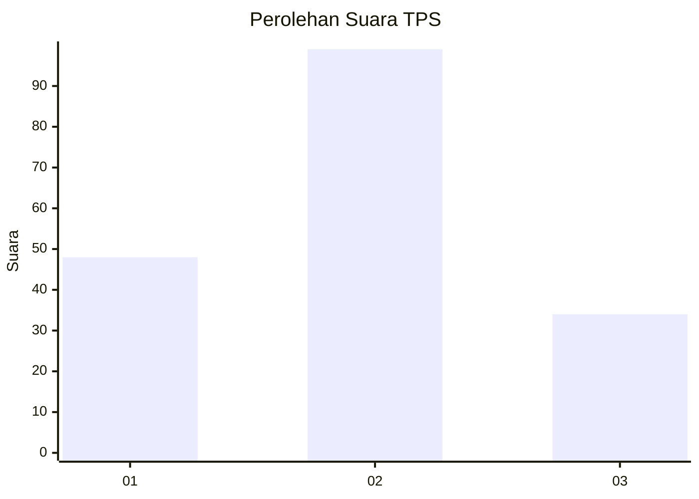
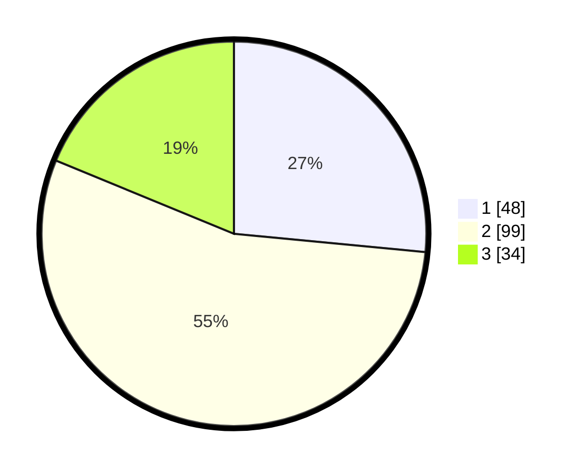

# Hasil

## Grafik

## Tabel

| No. | Nama Paslon    | Suara | Suara (raw) | Persentase |
|:--- |:-------------- | -----:| -----------:| ----------:|
| 1   | ANIES MUHAIMIN | 48    | [48][p-1]   | 26,52      |
| 2   | PRABOWO GIBRAN | 99    | [99][p-2]   | 54,70      |
| 3   | GANJAR MAHFUD  | 34    | [34][p-3]   | 18,78      |

[p-1]: https://github.com/gigit-pemilu/pemilu-2024-51-bali/blob/main/pilpres/hitung-suara/sub/51-bali/sub/04-gianyar/sub/02-blahbatuh/sub/2007-bedulu/sub/001-tps/sub/paslon-1.txt
[p-2]: https://github.com/gigit-pemilu/pemilu-2024-51-bali/blob/main/pilpres/hitung-suara/sub/51-bali/sub/04-gianyar/sub/02-blahbatuh/sub/2007-bedulu/sub/001-tps/sub/paslon-2.txt
[p-3]: https://github.com/gigit-pemilu/pemilu-2024-51-bali/blob/main/pilpres/hitung-suara/sub/51-bali/sub/04-gianyar/sub/02-blahbatuh/sub/2007-bedulu/sub/001-tps/sub/paslon-3.txt

## Foto C Plano

https://sirekap-obj-formc.kpu.go.id/7805/pemilu/ppwp/51/04/02/20/07/5104022007001-20240216-144142--aef60cba-c3f3-4dd7-b706-3afa21a7aa84.jpg

https://sirekap-obj-formc.kpu.go.id/7805/pemilu/ppwp/51/04/02/20/07/5104022007001-20240216-144144--d58bf669-c8d9-4ba2-a741-effce87072ea.jpg

https://sirekap-obj-formc.kpu.go.id/7805/pemilu/ppwp/51/04/02/20/07/5104022007001-20240216-144143--da7b53ae-51b8-47f1-8e94-4802756575ed.jpg

## Metadata

| Key        | Value               |
| ---------- | ------------------- |
| Time Stamp | 2024-02-16 16:25:10 |

## DATA PEMILIH TETAP

Jumlah pemilih dalam DPT: **220**.
 * L: **111**.
 * P: **109**.

## DATA PENGGUNA HAK PILIH

Jumlah pengguna hak pilih dalam DPT: **183**.
 * L: **94**.
 * P: **89**.

Jumlah pengguna hak pilih dalam DPTb: **0**.
 * L: **0**.
 * P: **0**.

Jumlah pengguna hak pilih dalam DPK: **7**.
 * L: **2**.
 * P: **5**.

Jumlah pengguna hak pilih: **190**.
 * L: **96**.
 * P: **94**.

## JUMLAH SUARA SAH DAN TIDAK SAH

JUMLAH SELURUH SUARA SAH: **181**.

JUMLAH SUARA TIDAK SAH: **9**.

JUMLAH SELURUH SUARA SAH DAN SUARA TIDAK SAH: **190**.

