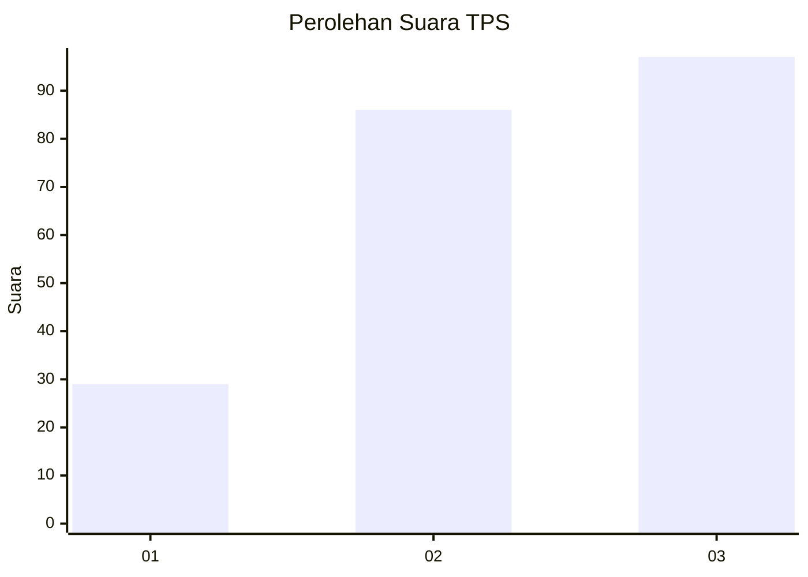
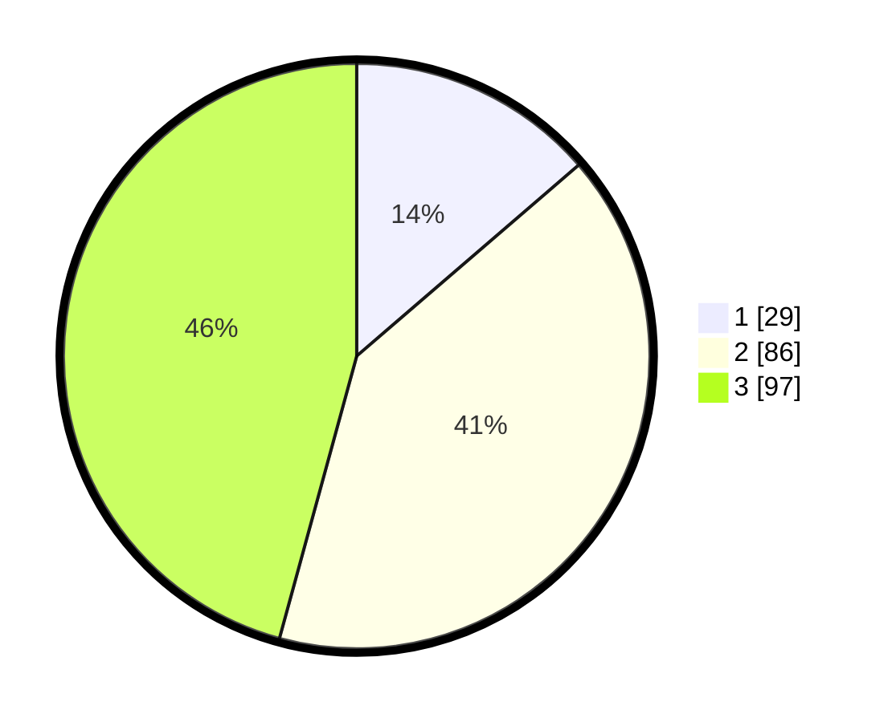

# Hasil

## Grafik

## Tabel

| No. | Nama Paslon    | Suara | Suara (raw) | Persentase |
|:--- |:-------------- | -----:| -----------:| ----------:|
| 1   | ANIES MUHAIMIN | 29    | [29][p-1]   | 13,68      |
| 2   | PRABOWO GIBRAN | 86    | [86][p-2]   | 40,57      |
| 3   | GANJAR MAHFUD  | 97    | [97][p-3]   | 45,75      |

[p-1]: https://github.com/gigit-pemilu/pemilu-2024-51-bali/blob/main/pilpres/hitung-suara/sub/51-bali/sub/04-gianyar/sub/02-blahbatuh/sub/2007-bedulu/sub/002-tps/sub/paslon-1.txt
[p-2]: https://github.com/gigit-pemilu/pemilu-2024-51-bali/blob/main/pilpres/hitung-suara/sub/51-bali/sub/04-gianyar/sub/02-blahbatuh/sub/2007-bedulu/sub/002-tps/sub/paslon-2.txt
[p-3]: https://github.com/gigit-pemilu/pemilu-2024-51-bali/blob/main/pilpres/hitung-suara/sub/51-bali/sub/04-gianyar/sub/02-blahbatuh/sub/2007-bedulu/sub/002-tps/sub/paslon-3.txt

## Foto C Plano

https://sirekap-obj-formc.kpu.go.id/8120/pemilu/ppwp/51/04/02/20/07/5104022007002-20240216-025731--034f1924-6ff3-4f76-8d2d-a2610c25d4ee.jpg

https://sirekap-obj-formc.kpu.go.id/8120/pemilu/ppwp/51/04/02/20/07/5104022007002-20240216-025738--51fba83e-78ec-4c7f-b568-57f07c20e703.jpg

https://sirekap-obj-formc.kpu.go.id/8120/pemilu/ppwp/51/04/02/20/07/5104022007002-20240216-025735--7fb1abec-8d06-48a0-b07b-efaa1d182f87.jpg

## Metadata

| Key        | Value               |
| ---------- | ------------------- |
| Time Stamp | 2024-02-16 10:30:29 |

## DATA PEMILIH TETAP

Jumlah pemilih dalam DPT: **243**.
 * L: **130**.
 * P: **113**.

## DATA PENGGUNA HAK PILIH

Jumlah pengguna hak pilih dalam DPT: **210**.
 * L: **109**.
 * P: **101**.

Jumlah pengguna hak pilih dalam DPTb: **0**.
 * L: **0**.
 * P: **0**.

Jumlah pengguna hak pilih dalam DPK: **2**.
 * L: **2**.
 * P: **0**.

Jumlah pengguna hak pilih: **212**.
 * L: **111**.
 * P: **101**.

## JUMLAH SUARA SAH DAN TIDAK SAH

JUMLAH SELURUH SUARA SAH: **212**.

JUMLAH SUARA TIDAK SAH: **0**.

JUMLAH SELURUH SUARA SAH DAN SUARA TIDAK SAH: **212**.

