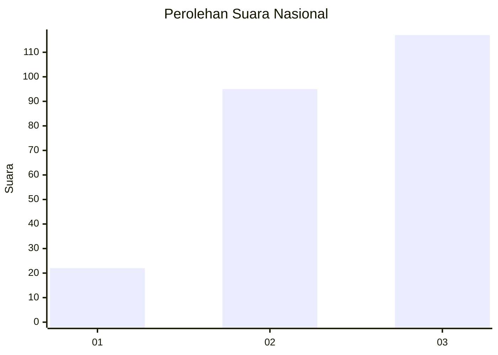
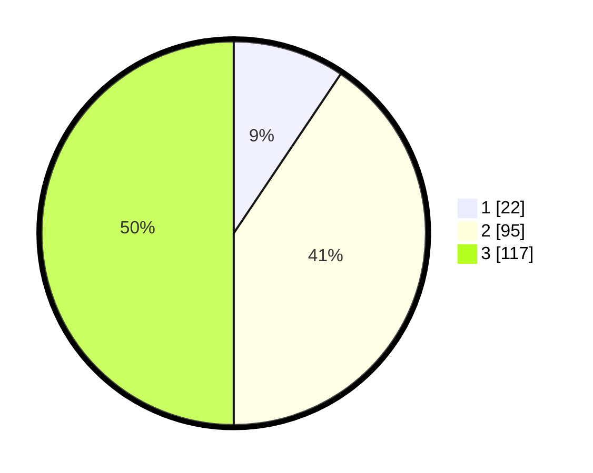

# Hasil

## Grafik

## Tabel

| No. | Nama Paslon    | Suara | Suara (raw) | Persentase |
|:--- |:-------------- | -----:| -----------:| ----------:|
| 1   | ANIES MUHAIMIN | 22    | [22][p-1]   | 9,40       |
| 2   | PRABOWO GIBRAN | 95    | [95][p-2]   | 40,60      |
| 3   | GANJAR MAHFUD  | 117   | [117][p-3]  | 50,00      |

[p-1]: https://github.com/gigit-pemilu/pemilu-2024/blob/main/pilpres/hitung-suara/sub/51-bali/sub/04-gianyar/sub/02-blahbatuh/sub/2007-bedulu/sub/003-tps/sub/paslon-1.txt
[p-2]: https://github.com/gigit-pemilu/pemilu-2024/blob/main/pilpres/hitung-suara/sub/51-bali/sub/04-gianyar/sub/02-blahbatuh/sub/2007-bedulu/sub/003-tps/sub/paslon-2.txt
[p-3]: https://github.com/gigit-pemilu/pemilu-2024/blob/main/pilpres/hitung-suara/sub/51-bali/sub/04-gianyar/sub/02-blahbatuh/sub/2007-bedulu/sub/003-tps/sub/paslon-3.txt

## Foto C Plano

https://sirekap-obj-formc.kpu.go.id/e547/pemilu/ppwp/51/04/02/20/07/5104022007003-20240214-214522--16932092-2eac-4b0e-b33c-77d05dc05591.jpg

https://sirekap-obj-formc.kpu.go.id/e547/pemilu/ppwp/51/04/02/20/07/5104022007003-20240214-214833--8019a2af-04fb-41bf-899c-0dbae5aa8e95.jpg

https://sirekap-obj-formc.kpu.go.id/e547/pemilu/ppwp/51/04/02/20/07/5104022007003-20240214-215009--2c0ed7d7-d107-4168-a5aa-820624a3f04a.jpg

## Metadata

| Key        | Value               |
| ---------- | ------------------- |
| Time Stamp | 2024-02-25 11:00:00 |

