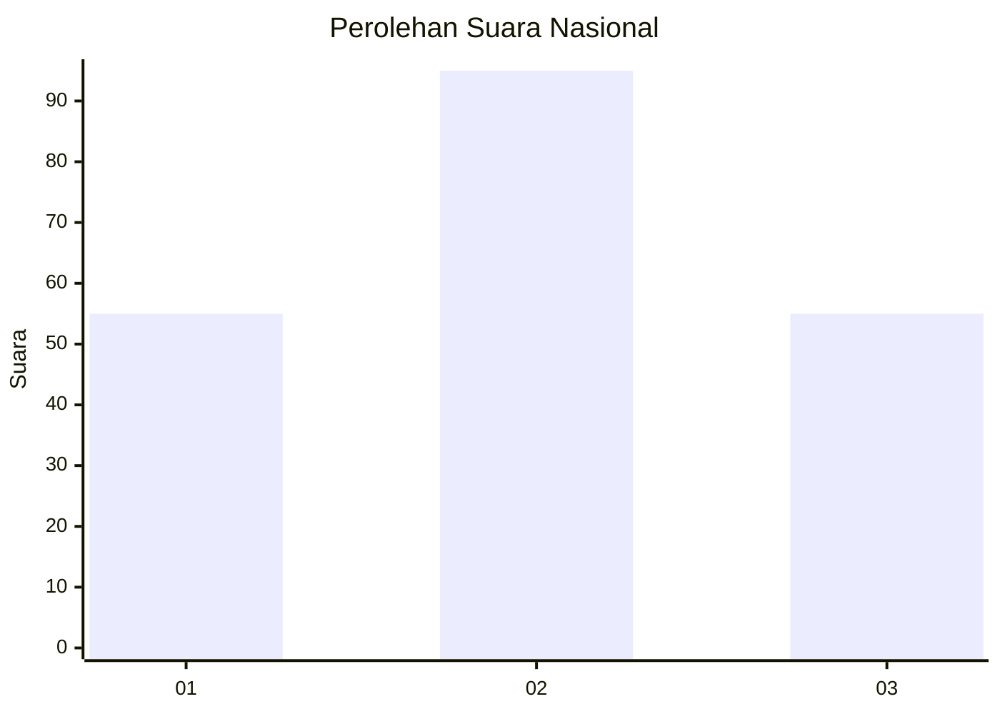
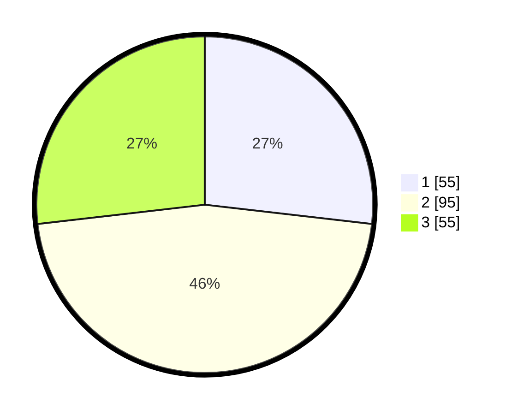

# Hasil

## Grafik

## Tabel

| No. | Nama Paslon    | Suara | Suara (raw) | Persentase |
|:--- |:-------------- | -----:| -----------:| ----------:|
| 1   | ANIES MUHAIMIN | 55    | [55][p-1]   | 26,83      |
| 2   | PRABOWO GIBRAN | 95    | [95][p-2]   | 46,34      |
| 3   | GANJAR MAHFUD  | 55    | [55][p-3]   | 26,83      |

[p-1]: https://github.com/gigit-pemilu/pemilu-2024/blob/main/pilpres/hitung-suara/sub/51-bali/sub/04-gianyar/sub/02-blahbatuh/sub/2007-bedulu/sub/004-tps/sub/paslon-1.txt
[p-2]: https://github.com/gigit-pemilu/pemilu-2024/blob/main/pilpres/hitung-suara/sub/51-bali/sub/04-gianyar/sub/02-blahbatuh/sub/2007-bedulu/sub/004-tps/sub/paslon-2.txt
[p-3]: https://github.com/gigit-pemilu/pemilu-2024/blob/main/pilpres/hitung-suara/sub/51-bali/sub/04-gianyar/sub/02-blahbatuh/sub/2007-bedulu/sub/004-tps/sub/paslon-3.txt

## Foto C Plano

https://sirekap-obj-formc.kpu.go.id/18e0/pemilu/ppwp/51/04/02/20/07/5104022007004-20240215-234000--dd0e651c-79fd-4fcc-b1e0-f2eb4f57a7cd.jpg

https://sirekap-obj-formc.kpu.go.id/18e0/pemilu/ppwp/51/04/02/20/07/5104022007004-20240215-234003--ce59bc13-7820-4b6a-bf96-81990c0e5840.jpg

https://sirekap-obj-formc.kpu.go.id/18e0/pemilu/ppwp/51/04/02/20/07/5104022007004-20240215-234002--562a7db3-ceb1-4286-812d-0535289c4e10.jpg

## Metadata

| Key        | Value               |
| ---------- | ------------------- |
| Time Stamp | 2024-02-16 12:51:22 |

## DATA PEMILIH TETAP

Jumlah pemilih dalam DPT: **267**.
 * L: **141**.
 * P: **126**.

## DATA PENGGUNA HAK PILIH

Jumlah pengguna hak pilih dalam DPT: **195**.
 * L: **94**.
 * P: **101**.

Jumlah pengguna hak pilih dalam DPTb: **0**.
 * L: **0**.
 * P: **0**.

Jumlah pengguna hak pilih dalam DPK: **11**.
 * L: **5**.
 * P: **6**.

Jumlah pengguna hak pilih: **206**.
 * L: **99**.
 * P: **107**.

## JUMLAH SUARA SAH DAN TIDAK SAH

JUMLAH SELURUH SUARA SAH: **205**.

JUMLAH SUARA TIDAK SAH: **1**.

JUMLAH SELURUH SUARA SAH DAN SUARA TIDAK SAH: **206**.

