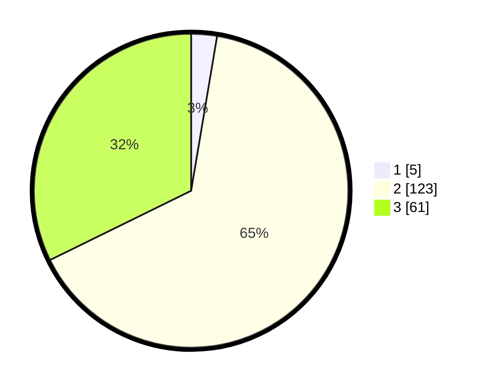

# Hasil

## Grafik

## Tabel

| No. | Nama Paslon    | Suara | Suara (raw) | Persentase |
|:--- |:-------------- | -----:| -----------:| ----------:|
| 1   | ANIES MUHAIMIN | 5     | [5][p-1]    | 2,65       |
| 2   | PRABOWO GIBRAN | 123   | [123][p-2]  | 65,08      |
| 3   | GANJAR MAHFUD  | 61    | [61][p-3]   | 32,28      |

[p-1]: https://github.com/gigit-pemilu/pemilu-2024-51-bali/blob/main/pilpres/hitung-suara/sub/51-bali/sub/04-gianyar/sub/02-blahbatuh/sub/2007-bedulu/sub/033-tps/sub/paslon-1.txt
[p-2]: https://github.com/gigit-pemilu/pemilu-2024-51-bali/blob/main/pilpres/hitung-suara/sub/51-bali/sub/04-gianyar/sub/02-blahbatuh/sub/2007-bedulu/sub/033-tps/sub/paslon-2.txt
[p-3]: https://github.com/gigit-pemilu/pemilu-2024-51-bali/blob/main/pilpres/hitung-suara/sub/51-bali/sub/04-gianyar/sub/02-blahbatuh/sub/2007-bedulu/sub/033-tps/sub/paslon-3.txt

## Foto C Plano

https://sirekap-obj-formc.kpu.go.id/8086/pemilu/ppwp/51/04/02/20/07/5104022007033-20240214-140958--54411a99-c90a-4f96-b1ec-ab118222c8dd.jpg

https://sirekap-obj-formc.kpu.go.id/8086/pemilu/ppwp/51/04/02/20/07/5104022007033-20240214-141353--83d7b20c-97ef-448b-9d96-804d359ef5df.jpg

https://sirekap-obj-formc.kpu.go.id/8086/pemilu/ppwp/51/04/02/20/07/5104022007033-20240216-004319--8e3a095a-36d7-40f6-a964-160a0a96e70c.jpg

## Metadata

| Key        | Value               |
| ---------- | ------------------- |
| Time Stamp | 2024-02-16 01:00:27 |

## DATA PEMILIH TETAP

Jumlah pemilih dalam DPT: **218**.
 * L: **103**.
 * P: **115**.

## DATA PENGGUNA HAK PILIH

Jumlah pengguna hak pilih dalam DPT: **192**.
 * L: **92**.
 * P: **100**.

Jumlah pengguna hak pilih dalam DPTb: **0**.
 * L: **0**.
 * P: **0**.

Jumlah pengguna hak pilih dalam DPK: **1**.
 * L: **0**.
 * P: **1**.

Jumlah pengguna hak pilih: **193**.
 * L: **92**.
 * P: **101**.

## JUMLAH SUARA SAH DAN TIDAK SAH

JUMLAH SELURUH SUARA SAH: **189**.

JUMLAH SUARA TIDAK SAH: **4**.

JUMLAH SELURUH SUARA SAH DAN SUARA TIDAK SAH: **193**.

