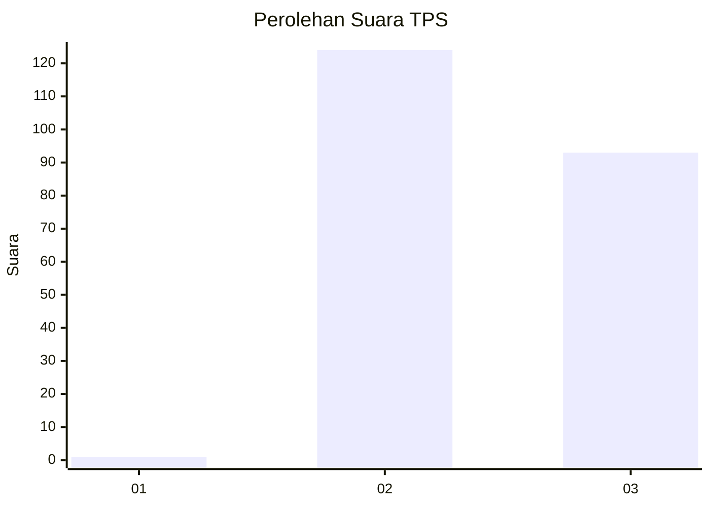
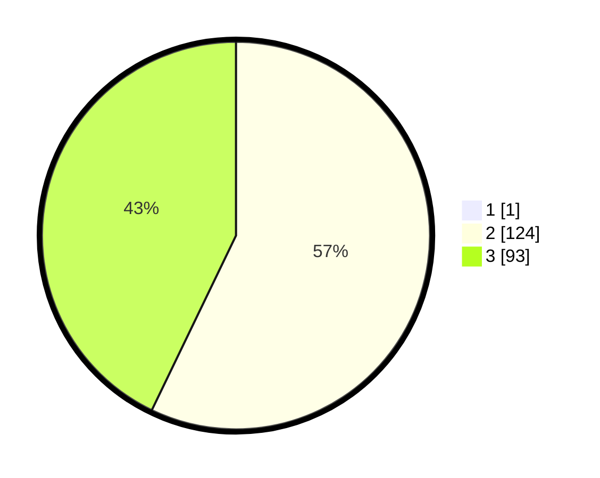

# Hasil

## Grafik

## Tabel

| No. | Nama Paslon    | Suara | Suara (raw) | Persentase |
|:--- |:-------------- | -----:| -----------:| ----------:|
| 1   | ANIES MUHAIMIN | 1     | [1][p-1]    | 0,46       |
| 2   | PRABOWO GIBRAN | 124   | [124][p-2]  | 56,88      |
| 3   | GANJAR MAHFUD  | 93    | [93][p-3]   | 42,66      |

[p-1]: https://github.com/gigit-pemilu/pemilu-2024-51-bali/blob/main/pilpres/hitung-suara/sub/51-bali/sub/04-gianyar/sub/02-blahbatuh/sub/2008-medahan/sub/003-tps/sub/paslon-1.txt
[p-2]: https://github.com/gigit-pemilu/pemilu-2024-51-bali/blob/main/pilpres/hitung-suara/sub/51-bali/sub/04-gianyar/sub/02-blahbatuh/sub/2008-medahan/sub/003-tps/sub/paslon-2.txt
[p-3]: https://github.com/gigit-pemilu/pemilu-2024-51-bali/blob/main/pilpres/hitung-suara/sub/51-bali/sub/04-gianyar/sub/02-blahbatuh/sub/2008-medahan/sub/003-tps/sub/paslon-3.txt

## Foto C Plano

https://sirekap-obj-formc.kpu.go.id/c38f/pemilu/ppwp/51/04/02/20/08/5104022008003-20240214-222911--e2eb0637-df14-4736-8a00-e683c407576a.jpg

https://sirekap-obj-formc.kpu.go.id/c38f/pemilu/ppwp/51/04/02/20/08/5104022008003-20240214-222951--0d58201c-772f-4c91-a770-2420cf087c20.jpg

https://sirekap-obj-formc.kpu.go.id/c38f/pemilu/ppwp/51/04/02/20/08/5104022008003-20240214-223037--2427fe9e-1a4f-4498-a058-749add61942d.jpg

## Metadata

| Key        | Value               |
| ---------- | ------------------- |
| Time Stamp | 2024-02-15 15:30:25 |

