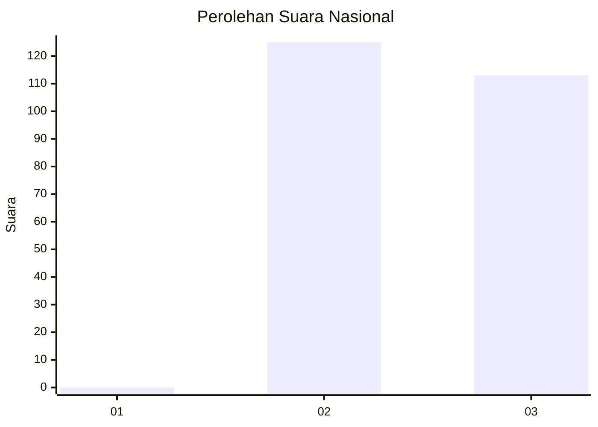
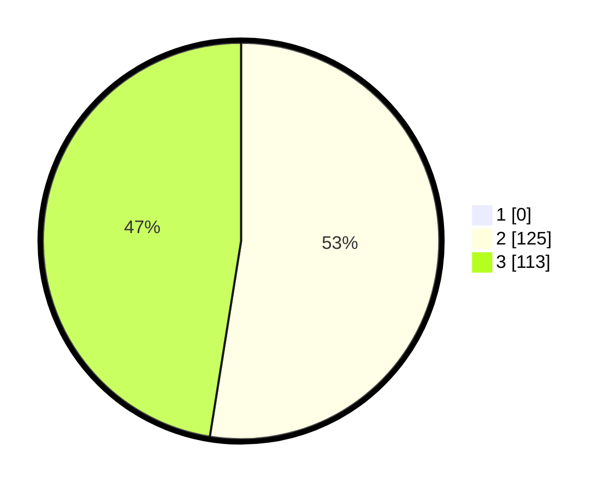

# Hasil

## Grafik

## Tabel

| No. | Nama Paslon    | Suara | Suara (raw) | Persentase |
|:--- |:-------------- | -----:| -----------:| ----------:|
| 1   | ANIES MUHAIMIN | 0     | [0][p-1]    | 0,00       |
| 2   | PRABOWO GIBRAN | 125   | [125][p-2]  | 52,52      |
| 3   | GANJAR MAHFUD  | 113   | [113][p-3]  | 47,48      |

[p-1]: https://github.com/gigit-pemilu/pemilu-2024/blob/main/pilpres/hitung-suara/sub/51-bali/sub/04-gianyar/sub/02-blahbatuh/sub/2008-medahan/sub/004-tps/sub/paslon-1.txt
[p-2]: https://github.com/gigit-pemilu/pemilu-2024/blob/main/pilpres/hitung-suara/sub/51-bali/sub/04-gianyar/sub/02-blahbatuh/sub/2008-medahan/sub/004-tps/sub/paslon-2.txt
[p-3]: https://github.com/gigit-pemilu/pemilu-2024/blob/main/pilpres/hitung-suara/sub/51-bali/sub/04-gianyar/sub/02-blahbatuh/sub/2008-medahan/sub/004-tps/sub/paslon-3.txt

## Foto C Plano

https://sirekap-obj-formc.kpu.go.id/8514/pemilu/ppwp/51/04/02/20/08/5104022008004-20240216-132012--6817b3da-a40e-4b76-ad47-c9c4b1f3e080.jpg

https://sirekap-obj-formc.kpu.go.id/8514/pemilu/ppwp/51/04/02/20/08/5104022008004-20240216-132013--d0b9ed58-9a8f-48fb-af3b-c182d47cd1ff.jpg

https://sirekap-obj-formc.kpu.go.id/8514/pemilu/ppwp/51/04/02/20/08/5104022008004-20240216-132013--2962078f-77bb-4a27-85dc-72575db44dda.jpg

## Metadata

| Key        | Value               |
| ---------- | ------------------- |
| Time Stamp | 2024-02-16 14:00:34 |

## DATA PEMILIH TETAP

Jumlah pemilih dalam DPT: **287**.
 * L: **141**.
 * P: **146**.

## DATA PENGGUNA HAK PILIH

Jumlah pengguna hak pilih dalam DPT: **238**.
 * L: **122**.
 * P: **116**.

Jumlah pengguna hak pilih dalam DPTb: **4**.
 * L: **0**.
 * P: **4**.

Jumlah pengguna hak pilih dalam DPK: **0**.
 * L: **0**.
 * P: **0**.

Jumlah pengguna hak pilih: **242**.
 * L: **122**.
 * P: **116**.

## JUMLAH SUARA SAH DAN TIDAK SAH

JUMLAH SELURUH SUARA SAH: **238**.

JUMLAH SUARA TIDAK SAH: **4**.

JUMLAH SELURUH SUARA SAH DAN SUARA TIDAK SAH: **242**.

