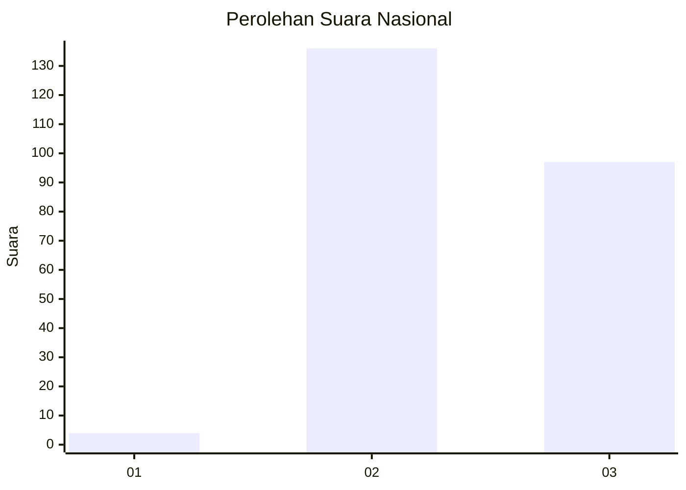
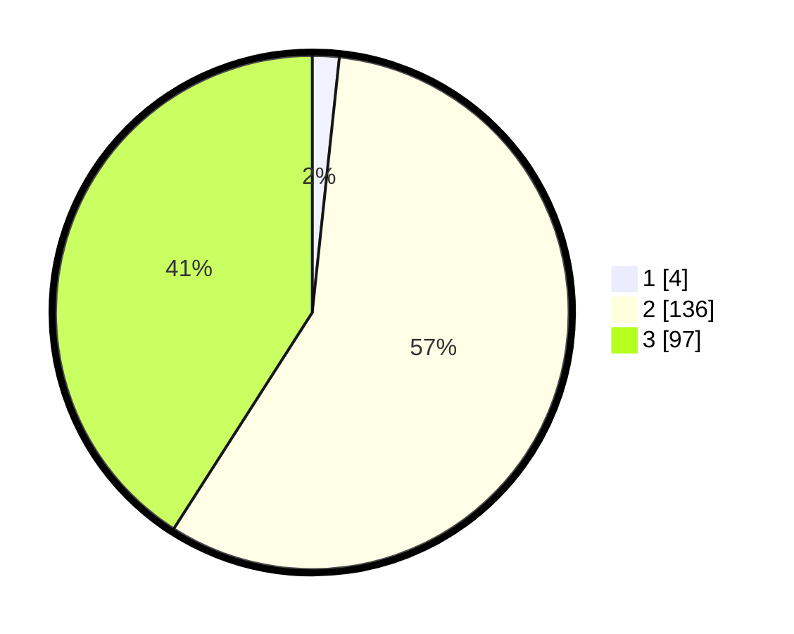

# Hasil

## Grafik

## Tabel

| No. | Nama Paslon    | Suara | Suara (raw) | Persentase |
|:--- |:-------------- | -----:| -----------:| ----------:|
| 1   | ANIES MUHAIMIN | 4     | [4][p-1]    | 1,69       |
| 2   | PRABOWO GIBRAN | 136   | [136][p-2]  | 57,38      |
| 3   | GANJAR MAHFUD  | 97    | [97][p-3]   | 40,93      |

[p-1]: https://github.com/gigit-pemilu/pemilu-2024/blob/main/pilpres/hitung-suara/sub/51-bali/sub/04-gianyar/sub/02-blahbatuh/sub/2008-medahan/sub/006-tps/sub/paslon-1.txt
[p-2]: https://github.com/gigit-pemilu/pemilu-2024/blob/main/pilpres/hitung-suara/sub/51-bali/sub/04-gianyar/sub/02-blahbatuh/sub/2008-medahan/sub/006-tps/sub/paslon-2.txt
[p-3]: https://github.com/gigit-pemilu/pemilu-2024/blob/main/pilpres/hitung-suara/sub/51-bali/sub/04-gianyar/sub/02-blahbatuh/sub/2008-medahan/sub/006-tps/sub/paslon-3.txt

## Foto C Plano

https://sirekap-obj-formc.kpu.go.id/e940/pemilu/ppwp/51/04/02/20/08/5104022008006-20240214-220240--5ec7af3f-8509-4f15-a7e8-f9db0b156914.jpg

https://sirekap-obj-formc.kpu.go.id/e940/pemilu/ppwp/51/04/02/20/08/5104022008006-20240214-214938--17fb32d8-99ca-4ef4-8c77-14d1f64ba6ad.jpg

https://sirekap-obj-formc.kpu.go.id/e940/pemilu/ppwp/51/04/02/20/08/5104022008006-20240214-220447--a0dc58f8-7b41-4db6-bb9a-92c8a2c06c26.jpg

## Metadata

| Key        | Value               |
| ---------- | ------------------- |
| Time Stamp | 2024-02-16 11:00:29 |

## DATA PEMILIH TETAP

Jumlah pemilih dalam DPT: **288**.
 * L: **144**.
 * P: **144**.

## DATA PENGGUNA HAK PILIH

Jumlah pengguna hak pilih dalam DPT: **235**.
 * L: **117**.
 * P: **118**.

Jumlah pengguna hak pilih dalam DPTb: **4**.
 * L: **0**.
 * P: **4**.

Jumlah pengguna hak pilih dalam DPK: **1**.
 * L: **0**.
 * P: **1**.

Jumlah pengguna hak pilih: **240**.
 * L: **117**.
 * P: **123**.

## JUMLAH SUARA SAH DAN TIDAK SAH

JUMLAH SELURUH SUARA SAH: **237**.

JUMLAH SUARA TIDAK SAH: **3**.

JUMLAH SELURUH SUARA SAH DAN SUARA TIDAK SAH: **240**.

