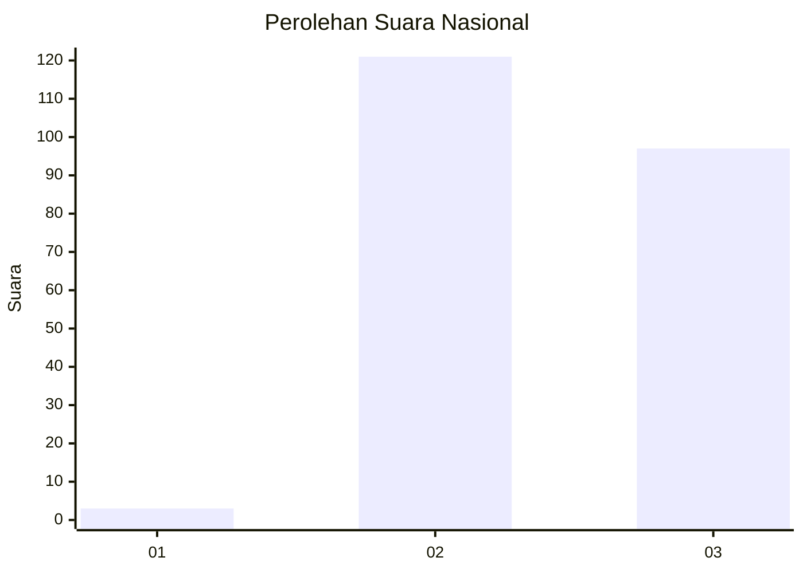
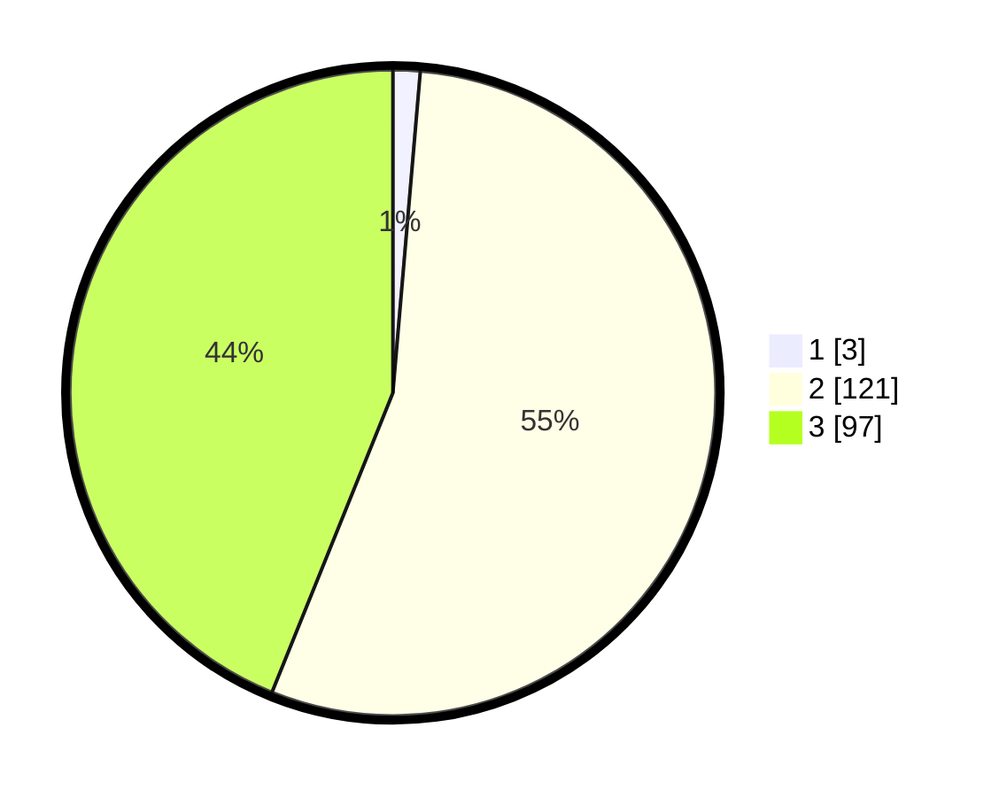

# Hasil

## Grafik

## Tabel

| No. | Nama Paslon    | Suara | Suara (raw) | Persentase |
|:--- |:-------------- | -----:| -----------:| ----------:|
| 1   | ANIES MUHAIMIN | 3     | [3][p-1]    | 1,36       |
| 2   | PRABOWO GIBRAN | 121   | [121][p-2]  | 54,75      |
| 3   | GANJAR MAHFUD  | 97    | [97][p-3]   | 43,89      |

[p-1]: https://github.com/gigit-pemilu/pemilu-2024/blob/main/pilpres/hitung-suara/sub/51-bali/sub/04-gianyar/sub/02-blahbatuh/sub/2008-medahan/sub/008-tps/sub/paslon-1.txt
[p-2]: https://github.com/gigit-pemilu/pemilu-2024/blob/main/pilpres/hitung-suara/sub/51-bali/sub/04-gianyar/sub/02-blahbatuh/sub/2008-medahan/sub/008-tps/sub/paslon-2.txt
[p-3]: https://github.com/gigit-pemilu/pemilu-2024/blob/main/pilpres/hitung-suara/sub/51-bali/sub/04-gianyar/sub/02-blahbatuh/sub/2008-medahan/sub/008-tps/sub/paslon-3.txt

## Foto C Plano

https://sirekap-obj-formc.kpu.go.id/b313/pemilu/ppwp/51/04/02/20/08/5104022008008-20240214-222935--7f142c2e-14da-4da0-97e7-19275464824f.jpg

https://sirekap-obj-formc.kpu.go.id/b313/pemilu/ppwp/51/04/02/20/08/5104022008008-20240214-223150--66b1fc1d-e984-467d-80f7-a0a93eba27e0.jpg

https://sirekap-obj-formc.kpu.go.id/b313/pemilu/ppwp/51/04/02/20/08/5104022008008-20240214-223905--bebccf52-eeba-436b-9361-ceaf5e00b2e7.jpg

## Metadata

| Key        | Value               |
| ---------- | ------------------- |
| Time Stamp | 2024-02-15 15:30:25 |

