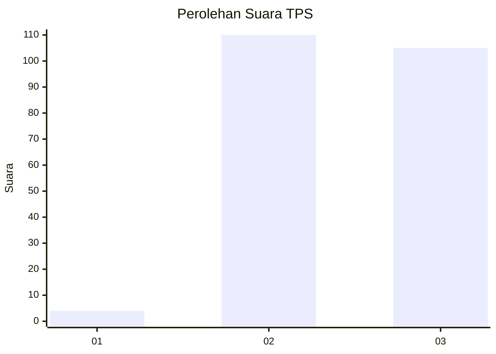
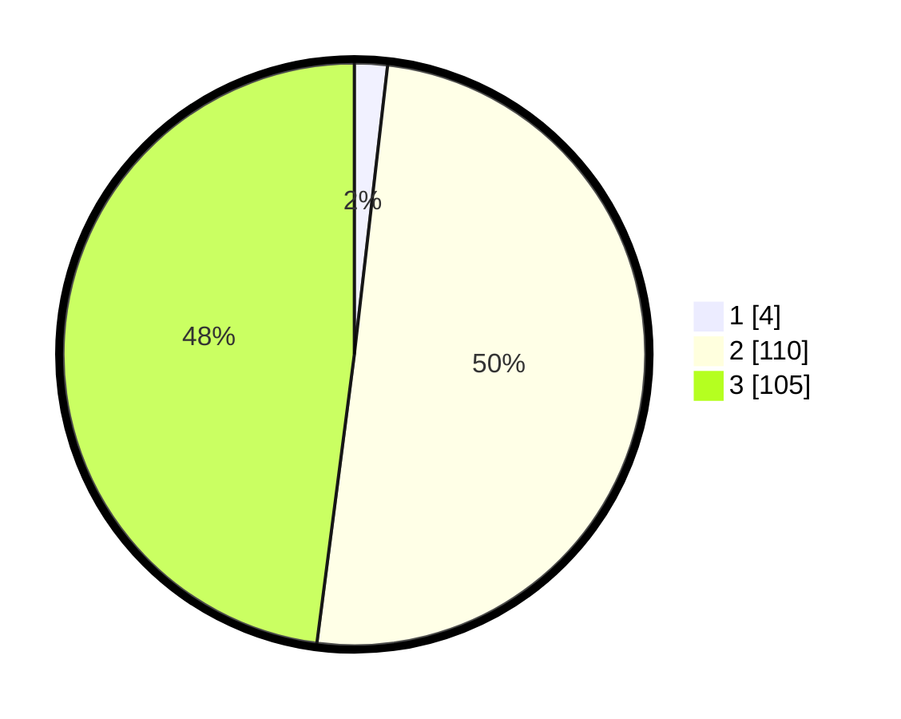

# Hasil

## Grafik

## Tabel

| No. | Nama Paslon    | Suara | Suara (raw) | Persentase |
|:--- |:-------------- | -----:| -----------:| ----------:|
| 1   | ANIES MUHAIMIN | 4     | [4][p-1]    | 1,83       |
| 2   | PRABOWO GIBRAN | 110   | [110][p-2]  | 50,23      |
| 3   | GANJAR MAHFUD  | 105   | [105][p-3]  | 47,95      |

[p-1]: https://github.com/gigit-pemilu/pemilu-2024-51-bali/blob/main/pilpres/hitung-suara/sub/51-bali/sub/04-gianyar/sub/02-blahbatuh/sub/2008-medahan/sub/009-tps/sub/paslon-1.txt
[p-2]: https://github.com/gigit-pemilu/pemilu-2024-51-bali/blob/main/pilpres/hitung-suara/sub/51-bali/sub/04-gianyar/sub/02-blahbatuh/sub/2008-medahan/sub/009-tps/sub/paslon-2.txt
[p-3]: https://github.com/gigit-pemilu/pemilu-2024-51-bali/blob/main/pilpres/hitung-suara/sub/51-bali/sub/04-gianyar/sub/02-blahbatuh/sub/2008-medahan/sub/009-tps/sub/paslon-3.txt

## Foto C Plano

https://sirekap-obj-formc.kpu.go.id/0d50/pemilu/ppwp/51/04/02/20/08/5104022008009-20240214-201831--3141c8c6-8bfc-4453-ab35-1ec36c383f97.jpg

https://sirekap-obj-formc.kpu.go.id/0d50/pemilu/ppwp/51/04/02/20/08/5104022008009-20240214-201924--cb97314c-b784-46f8-ba57-d4123f4afe44.jpg

https://sirekap-obj-formc.kpu.go.id/0d50/pemilu/ppwp/51/04/02/20/08/5104022008009-20240214-202042--840542a6-472a-4b61-b6e0-cc7c27644d54.jpg

## Metadata

| Key        | Value               |
| ---------- | ------------------- |
| Time Stamp | 2024-02-15 15:30:25 |

