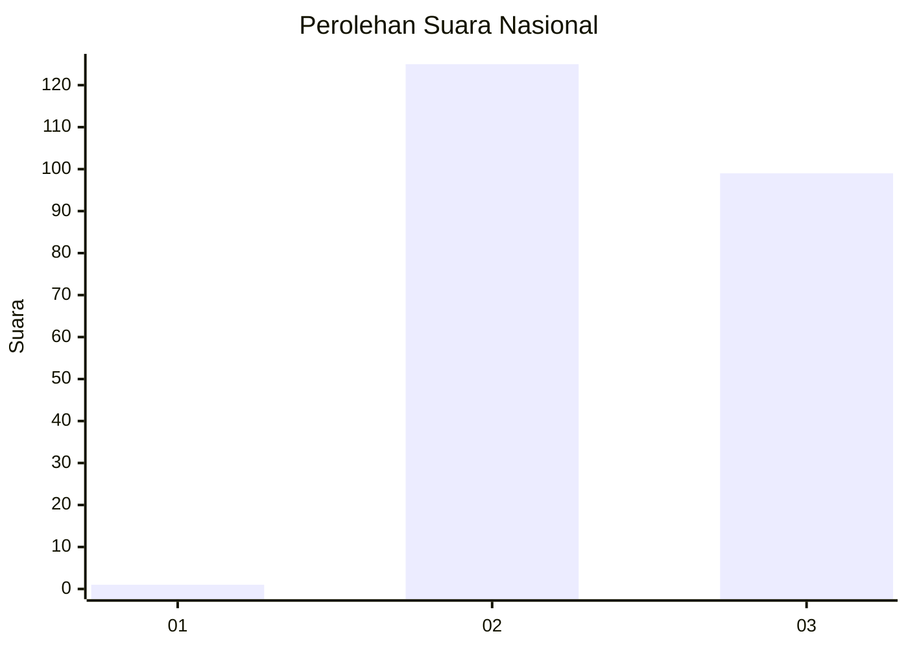
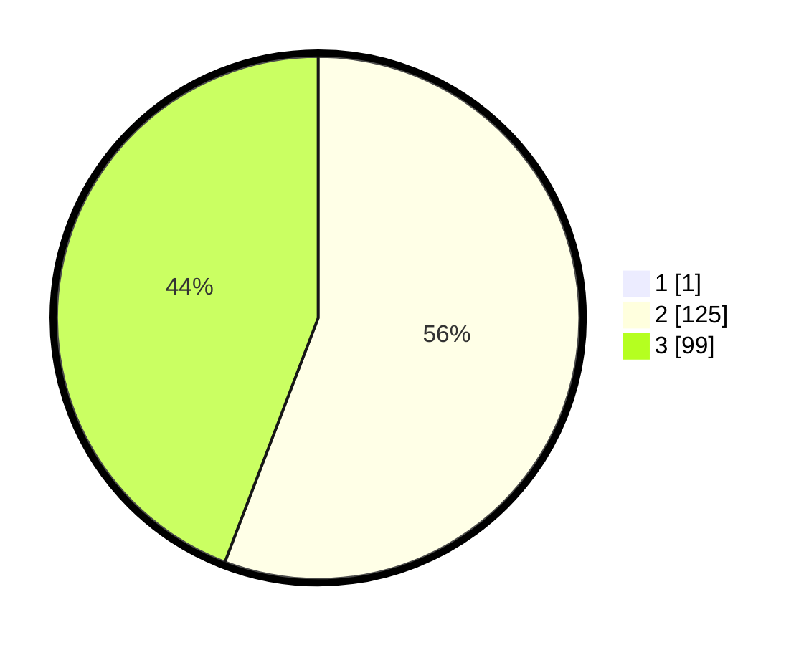

# Hasil

## Grafik

## Tabel

| No. | Nama Paslon    | Suara | Suara (raw) | Persentase |
|:--- |:-------------- | -----:| -----------:| ----------:|
| 1   | ANIES MUHAIMIN | 1     | [1][p-1]    | 0,44       |
| 2   | PRABOWO GIBRAN | 125   | [125][p-2]  | 55,56      |
| 3   | GANJAR MAHFUD  | 99    | [99][p-3]   | 44,00      |

[p-1]: https://github.com/gigit-pemilu/pemilu-2024/blob/main/pilpres/hitung-suara/sub/51-bali/sub/04-gianyar/sub/02-blahbatuh/sub/2008-medahan/sub/016-tps/sub/paslon-1.txt
[p-2]: https://github.com/gigit-pemilu/pemilu-2024/blob/main/pilpres/hitung-suara/sub/51-bali/sub/04-gianyar/sub/02-blahbatuh/sub/2008-medahan/sub/016-tps/sub/paslon-2.txt
[p-3]: https://github.com/gigit-pemilu/pemilu-2024/blob/main/pilpres/hitung-suara/sub/51-bali/sub/04-gianyar/sub/02-blahbatuh/sub/2008-medahan/sub/016-tps/sub/paslon-3.txt

## Foto C Plano

https://sirekap-obj-formc.kpu.go.id/8e6c/pemilu/ppwp/51/04/02/20/08/5104022008016-20240214-214328--74c2dab1-bf31-47ba-a152-75783f9685c3.jpg

https://sirekap-obj-formc.kpu.go.id/8e6c/pemilu/ppwp/51/04/02/20/08/5104022008016-20240214-214540--74458663-a0d0-42a3-ac27-4f9e8b43dd3e.jpg

https://sirekap-obj-formc.kpu.go.id/8e6c/pemilu/ppwp/51/04/02/20/08/5104022008016-20240214-214653--5799482e-cbd7-46ab-9316-553674d55c24.jpg

## Metadata

| Key        | Value               |
| ---------- | ------------------- |
| Time Stamp | 2024-02-16 12:51:22 |

