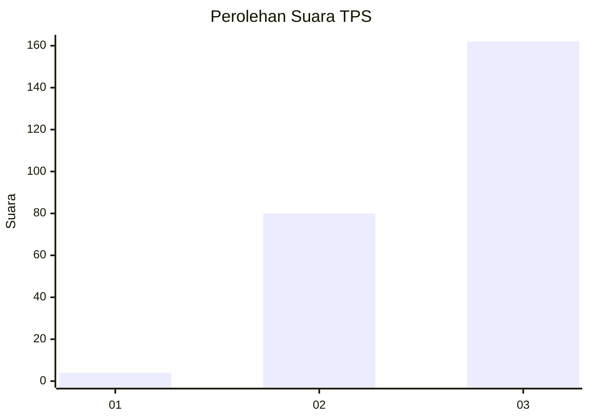
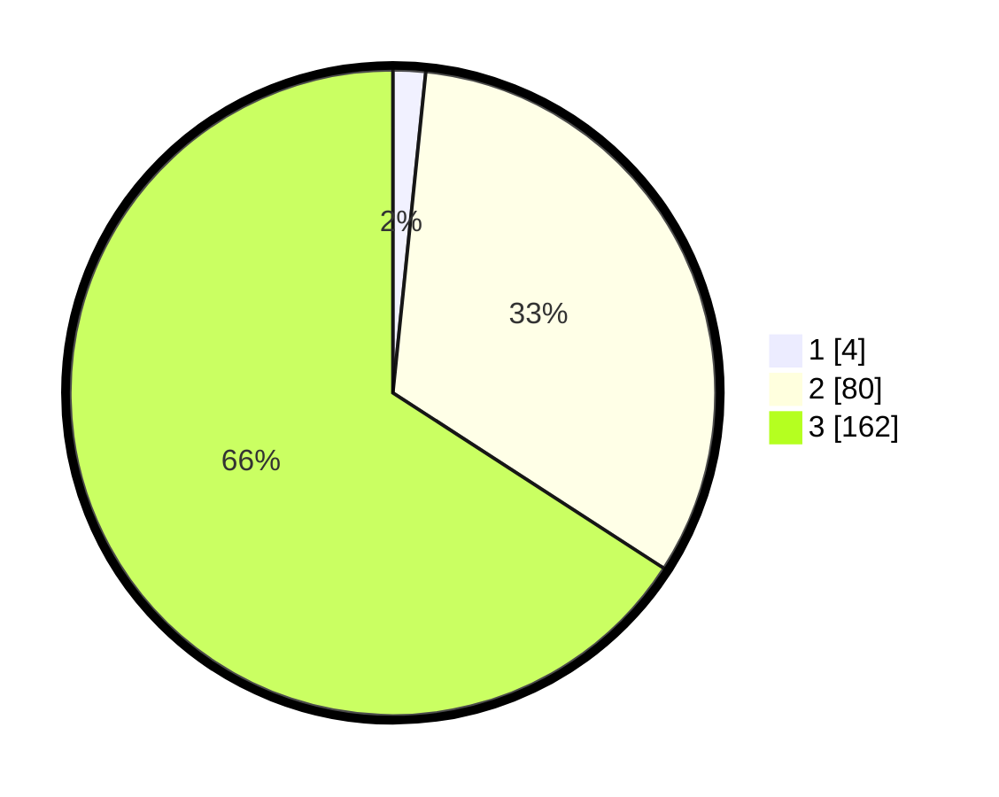

# Hasil

## Grafik

## Tabel

| No. | Nama Paslon    | Suara | Suara (raw) | Persentase |
|:--- |:-------------- | -----:| -----------:| ----------:|
| 1   | ANIES MUHAIMIN | 4     | [4][p-1]    | 1,63       |
| 2   | PRABOWO GIBRAN | 80    | [80][p-2]   | 32,52      |
| 3   | GANJAR MAHFUD  | 162   | [162][p-3]  | 65,85      |

[p-1]: https://github.com/gigit-pemilu/pemilu-2024-51-bali/blob/main/pilpres/hitung-suara/sub/51-bali/sub/04-gianyar/sub/02-blahbatuh/sub/2009-bona/sub/002-tps/sub/paslon-1.txt
[p-2]: https://github.com/gigit-pemilu/pemilu-2024-51-bali/blob/main/pilpres/hitung-suara/sub/51-bali/sub/04-gianyar/sub/02-blahbatuh/sub/2009-bona/sub/002-tps/sub/paslon-2.txt
[p-3]: https://github.com/gigit-pemilu/pemilu-2024-51-bali/blob/main/pilpres/hitung-suara/sub/51-bali/sub/04-gianyar/sub/02-blahbatuh/sub/2009-bona/sub/002-tps/sub/paslon-3.txt

## Foto C Plano

https://sirekap-obj-formc.kpu.go.id/40e0/pemilu/ppwp/51/04/02/20/09/5104022009002-20240214-204505--4c40ac0b-9c96-4113-a6e0-6c7e02ee8a1d.jpg

https://sirekap-obj-formc.kpu.go.id/40e0/pemilu/ppwp/51/04/02/20/09/5104022009002-20240214-204600--14162fd7-8b2b-4918-b7be-bf5fc07960fb.jpg

https://sirekap-obj-formc.kpu.go.id/40e0/pemilu/ppwp/51/04/02/20/09/5104022009002-20240214-204700--c5d283c0-f3df-4a01-a84a-e515328ffd73.jpg

## Metadata

| Key        | Value               |
| ---------- | ------------------- |
| Time Stamp | 2024-02-15 12:00:28 |

