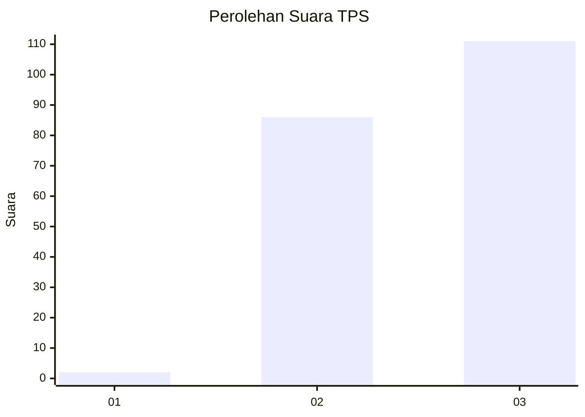
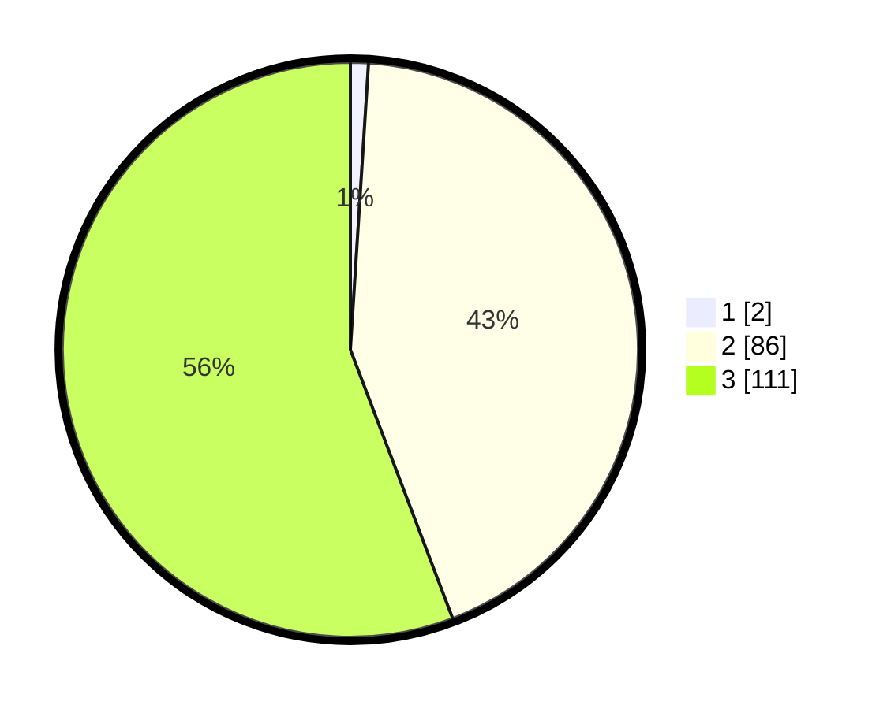

# Hasil

## Grafik

## Tabel

| No. | Nama Paslon    | Suara | Suara (raw) | Persentase |
|:--- |:-------------- | -----:| -----------:| ----------:|
| 1   | ANIES MUHAIMIN | 2     | [2][p-1]    | 1,01       |
| 2   | PRABOWO GIBRAN | 86    | [86][p-2]   | 43,22      |
| 3   | GANJAR MAHFUD  | 111   | [111][p-3]  | 55,78      |

[p-1]: https://github.com/gigit-pemilu/pemilu-2024-51-bali/blob/main/pilpres/hitung-suara/sub/51-bali/sub/04-gianyar/sub/02-blahbatuh/sub/2009-bona/sub/004-tps/sub/paslon-1.txt
[p-2]: https://github.com/gigit-pemilu/pemilu-2024-51-bali/blob/main/pilpres/hitung-suara/sub/51-bali/sub/04-gianyar/sub/02-blahbatuh/sub/2009-bona/sub/004-tps/sub/paslon-2.txt
[p-3]: https://github.com/gigit-pemilu/pemilu-2024-51-bali/blob/main/pilpres/hitung-suara/sub/51-bali/sub/04-gianyar/sub/02-blahbatuh/sub/2009-bona/sub/004-tps/sub/paslon-3.txt

## Foto C Plano

https://sirekap-obj-formc.kpu.go.id/c820/pemilu/ppwp/51/04/02/20/09/5104022009004-20240216-010303--a20724b6-7845-46e3-a128-6bf1930350ef.jpg

https://sirekap-obj-formc.kpu.go.id/c820/pemilu/ppwp/51/04/02/20/09/5104022009004-20240215-203010--273daeec-1048-4677-8130-5fe711de8096.jpg

https://sirekap-obj-formc.kpu.go.id/c820/pemilu/ppwp/51/04/02/20/09/5104022009004-20240215-203007--586707c8-ab9e-4413-8ffc-61bad65247e9.jpg

## Metadata

| Key        | Value               |
| ---------- | ------------------- |
| Time Stamp | 2024-02-16 01:30:27 |

## DATA PEMILIH TETAP

Jumlah pemilih dalam DPT: **218**.
 * L: **112**.
 * P: **106**.

## DATA PENGGUNA HAK PILIH

Jumlah pengguna hak pilih dalam DPT: **202**.
 * L: **108**.
 * P: **94**.

Jumlah pengguna hak pilih dalam DPTb: **0**.
 * L: **0**.
 * P: **0**.

Jumlah pengguna hak pilih dalam DPK: **0**.
 * L: **0**.
 * P: **0**.

Jumlah pengguna hak pilih: **202**.
 * L: **108**.
 * P: **94**.

## JUMLAH SUARA SAH DAN TIDAK SAH

JUMLAH SELURUH SUARA SAH: **199**.

JUMLAH SUARA TIDAK SAH: **3**.

JUMLAH SELURUH SUARA SAH DAN SUARA TIDAK SAH: **202**.

