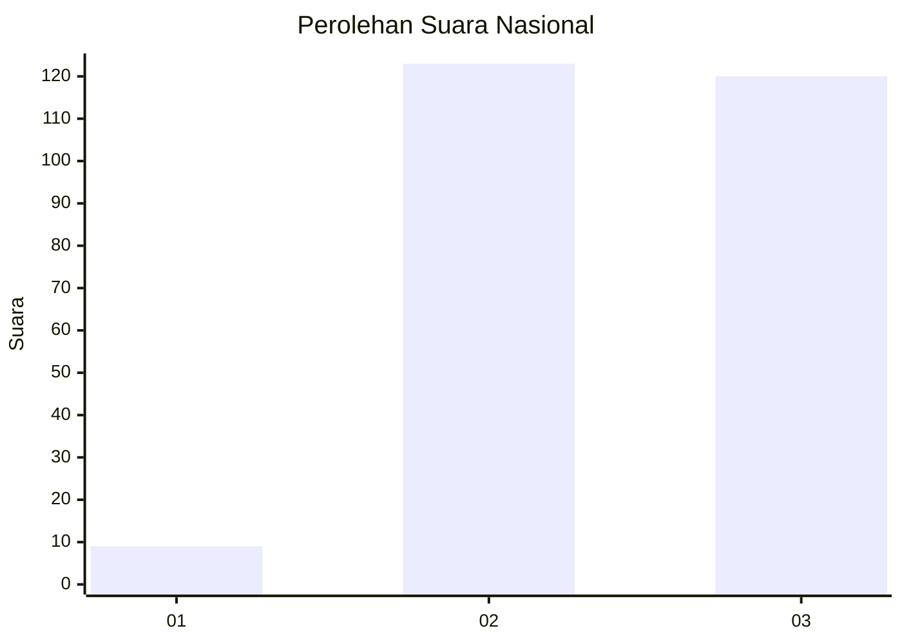
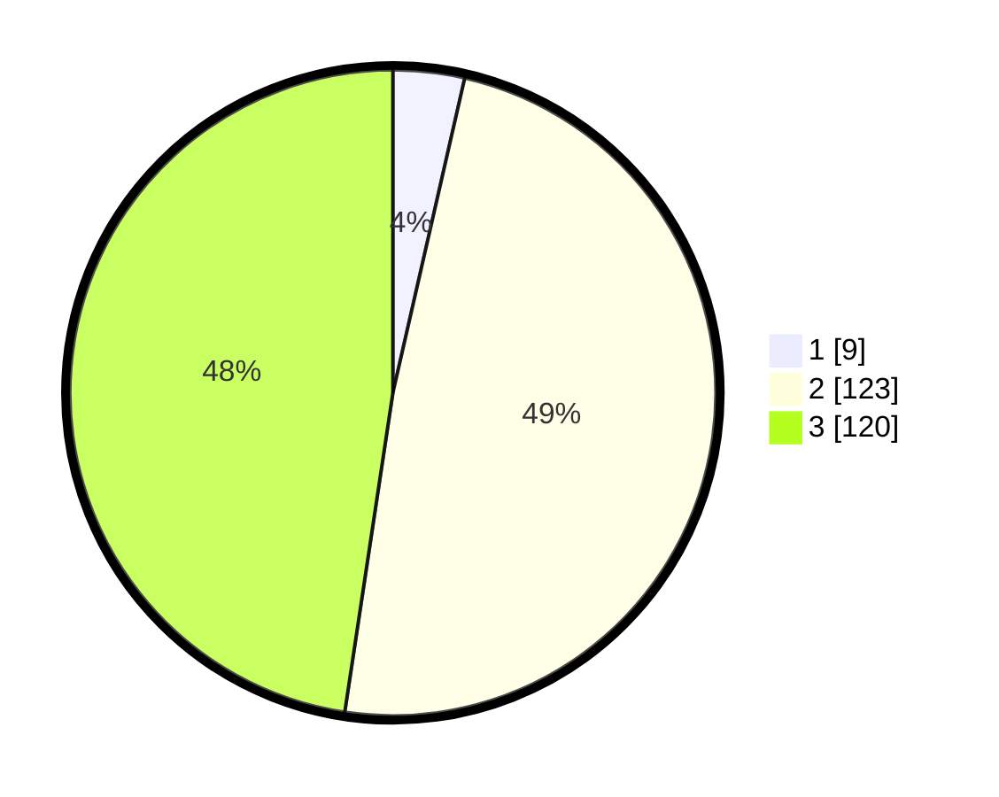

# Hasil

## Grafik

## Tabel

| No. | Nama Paslon    | Suara | Suara (raw) | Persentase |
|:--- |:-------------- | -----:| -----------:| ----------:|
| 1   | ANIES MUHAIMIN | 9     | [9][p-1]    | 3,57       |
| 2   | PRABOWO GIBRAN | 123   | [123][p-2]  | 48,81      |
| 3   | GANJAR MAHFUD  | 120   | [120][p-3]  | 47,62      |

[p-1]: https://github.com/gigit-pemilu/pemilu-2024/blob/main/pilpres/hitung-suara/sub/51-bali/sub/04-gianyar/sub/03-gianyar/sub/1003-samplangan/sub/003-tps/sub/paslon-1.txt
[p-2]: https://github.com/gigit-pemilu/pemilu-2024/blob/main/pilpres/hitung-suara/sub/51-bali/sub/04-gianyar/sub/03-gianyar/sub/1003-samplangan/sub/003-tps/sub/paslon-2.txt
[p-3]: https://github.com/gigit-pemilu/pemilu-2024/blob/main/pilpres/hitung-suara/sub/51-bali/sub/04-gianyar/sub/03-gianyar/sub/1003-samplangan/sub/003-tps/sub/paslon-3.txt

## Foto C Plano

https://sirekap-obj-formc.kpu.go.id/9d6f/pemilu/ppwp/51/04/03/10/03/5104031003003-20240216-145050--a15348cf-075c-4790-a999-09c810e61917.jpg

https://sirekap-obj-formc.kpu.go.id/9d6f/pemilu/ppwp/51/04/03/10/03/5104031003003-20240216-145051--9d9726fb-ffa7-4bbd-9e6f-cd04519cb493.jpg

https://sirekap-obj-formc.kpu.go.id/9d6f/pemilu/ppwp/51/04/03/10/03/5104031003003-20240216-145051--8409fc90-8fe5-42b9-bbca-24ab9711e46d.jpg

## Metadata

| Key        | Value               |
| ---------- | ------------------- |
| Time Stamp | 2024-02-16 16:25:10 |

## DATA PEMILIH TETAP

Jumlah pemilih dalam DPT: **288**.
 * L: **138**.
 * P: **150**.

## DATA PENGGUNA HAK PILIH

Jumlah pengguna hak pilih dalam DPT: **255**.
 * L: **120**.
 * P: **135**.

Jumlah pengguna hak pilih dalam DPTb: **1**.
 * L: **0**.
 * P: **1**.

Jumlah pengguna hak pilih dalam DPK: **0**.
 * L: **0**.
 * P: **0**.

Jumlah pengguna hak pilih: **256**.
 * L: **120**.
 * P: **136**.

## JUMLAH SUARA SAH DAN TIDAK SAH

JUMLAH SELURUH SUARA SAH: **252**.

JUMLAH SUARA TIDAK SAH: **4**.

JUMLAH SELURUH SUARA SAH DAN SUARA TIDAK SAH: **256**.

