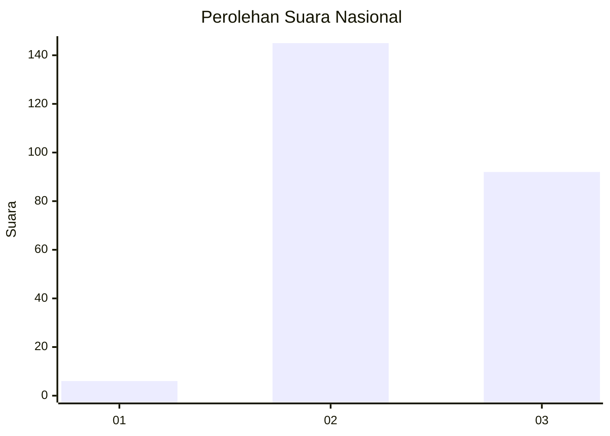
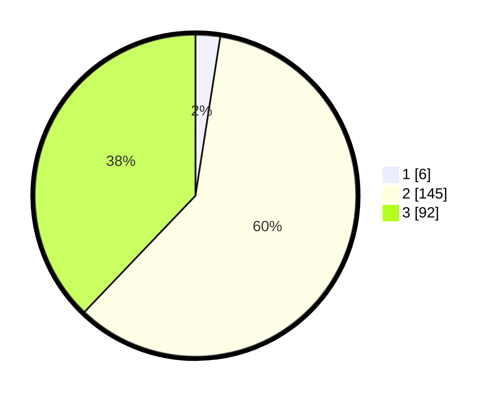

# Hasil

## Grafik

## Tabel

| No. | Nama Paslon    | Suara | Suara (raw) | Persentase |
|:--- |:-------------- | -----:| -----------:| ----------:|
| 1   | ANIES MUHAIMIN | 6     | [6][p-1]    | 2,47       |
| 2   | PRABOWO GIBRAN | 145   | [145][p-2]  | 59,67      |
| 3   | GANJAR MAHFUD  | 92    | [92][p-3]   | 37,86      |

[p-1]: https://github.com/gigit-pemilu/pemilu-2024/blob/main/pilpres/hitung-suara/sub/51-bali/sub/04-gianyar/sub/03-gianyar/sub/1003-samplangan/sub/005-tps/sub/paslon-1.txt
[p-2]: https://github.com/gigit-pemilu/pemilu-2024/blob/main/pilpres/hitung-suara/sub/51-bali/sub/04-gianyar/sub/03-gianyar/sub/1003-samplangan/sub/005-tps/sub/paslon-2.txt
[p-3]: https://github.com/gigit-pemilu/pemilu-2024/blob/main/pilpres/hitung-suara/sub/51-bali/sub/04-gianyar/sub/03-gianyar/sub/1003-samplangan/sub/005-tps/sub/paslon-3.txt

## Foto C Plano

https://sirekap-obj-formc.kpu.go.id/9c99/pemilu/ppwp/51/04/03/10/03/5104031003005-20240216-092857--dac452be-0b07-46d2-aed1-85c184543db0.jpg

https://sirekap-obj-formc.kpu.go.id/9c99/pemilu/ppwp/51/04/03/10/03/5104031003005-20240216-092911--0a788c7e-0c49-47e8-b9a3-bf3fb7fe77c3.jpg

https://sirekap-obj-formc.kpu.go.id/9c99/pemilu/ppwp/51/04/03/10/03/5104031003005-20240216-092238--6086de54-795e-44bf-adae-9eedaa4cffd3.jpg

## Metadata

| Key        | Value               |
| ---------- | ------------------- |
| Time Stamp | 2024-02-16 10:30:29 |

## DATA PEMILIH TETAP

Jumlah pemilih dalam DPT: **287**.
 * L: **138**.
 * P: **149**.

## DATA PENGGUNA HAK PILIH

Jumlah pengguna hak pilih dalam DPT: **241**.
 * L: **116**.
 * P: **125**.

Jumlah pengguna hak pilih dalam DPTb: **1**.
 * L: **0**.
 * P: **1**.

Jumlah pengguna hak pilih dalam DPK: **4**.
 * L: **0**.
 * P: **4**.

Jumlah pengguna hak pilih: **246**.
 * L: **116**.
 * P: **130**.

## JUMLAH SUARA SAH DAN TIDAK SAH

JUMLAH SELURUH SUARA SAH: **243**.

JUMLAH SUARA TIDAK SAH: **3**.

JUMLAH SELURUH SUARA SAH DAN SUARA TIDAK SAH: **246**.

