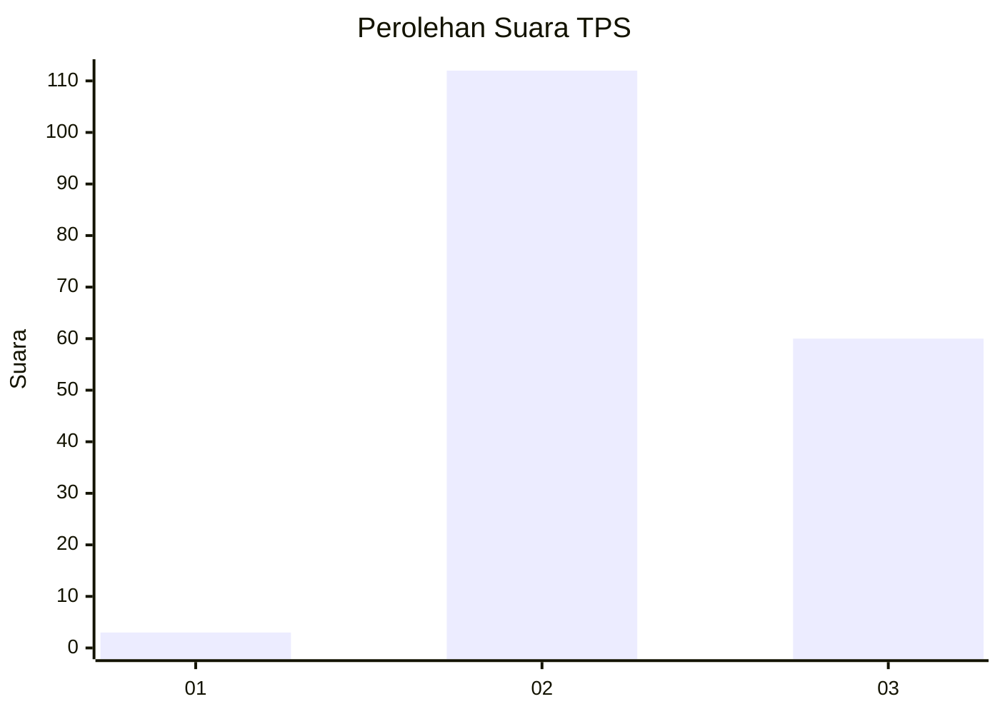
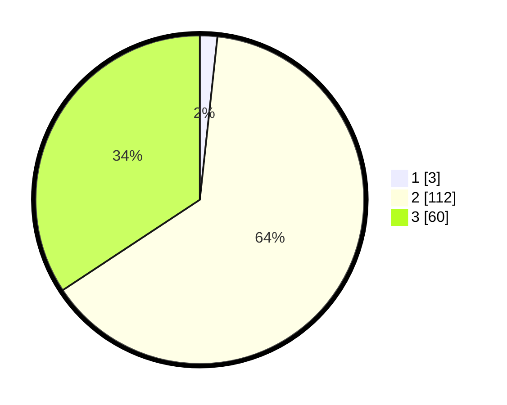

# Hasil

## Grafik

## Tabel

| No. | Nama Paslon    | Suara | Suara (raw) | Persentase |
|:--- |:-------------- | -----:| -----------:| ----------:|
| 1   | ANIES MUHAIMIN | 3     | [3][p-1]    | 1,71       |
| 2   | PRABOWO GIBRAN | 112   | [112][p-2]  | 64,00      |
| 3   | GANJAR MAHFUD  | 60    | [60][p-3]   | 34,29      |

[p-1]: https://github.com/gigit-pemilu/pemilu-2024-51-bali/blob/main/pilpres/hitung-suara/sub/51-bali/sub/04-gianyar/sub/03-gianyar/sub/1003-samplangan/sub/007-tps/sub/paslon-1.txt
[p-2]: https://github.com/gigit-pemilu/pemilu-2024-51-bali/blob/main/pilpres/hitung-suara/sub/51-bali/sub/04-gianyar/sub/03-gianyar/sub/1003-samplangan/sub/007-tps/sub/paslon-2.txt
[p-3]: https://github.com/gigit-pemilu/pemilu-2024-51-bali/blob/main/pilpres/hitung-suara/sub/51-bali/sub/04-gianyar/sub/03-gianyar/sub/1003-samplangan/sub/007-tps/sub/paslon-3.txt

## Foto C Plano

https://sirekap-obj-formc.kpu.go.id/ec14/pemilu/ppwp/51/04/03/10/03/5104031003007-20240214-205440--3ac0e15f-ba26-41be-823e-67d1e662f04f.jpg

https://sirekap-obj-formc.kpu.go.id/ec14/pemilu/ppwp/51/04/03/10/03/5104031003007-20240214-205538--25a6b2f1-e6fd-4091-a950-9af6e81a4632.jpg

https://sirekap-obj-formc.kpu.go.id/ec14/pemilu/ppwp/51/04/03/10/03/5104031003007-20240214-205955--c67a77e1-27bf-4515-be81-ab133ad85eeb.jpg

## Metadata

| Key        | Value               |
| ---------- | ------------------- |
| Time Stamp | 2024-02-15 22:30:27 |

