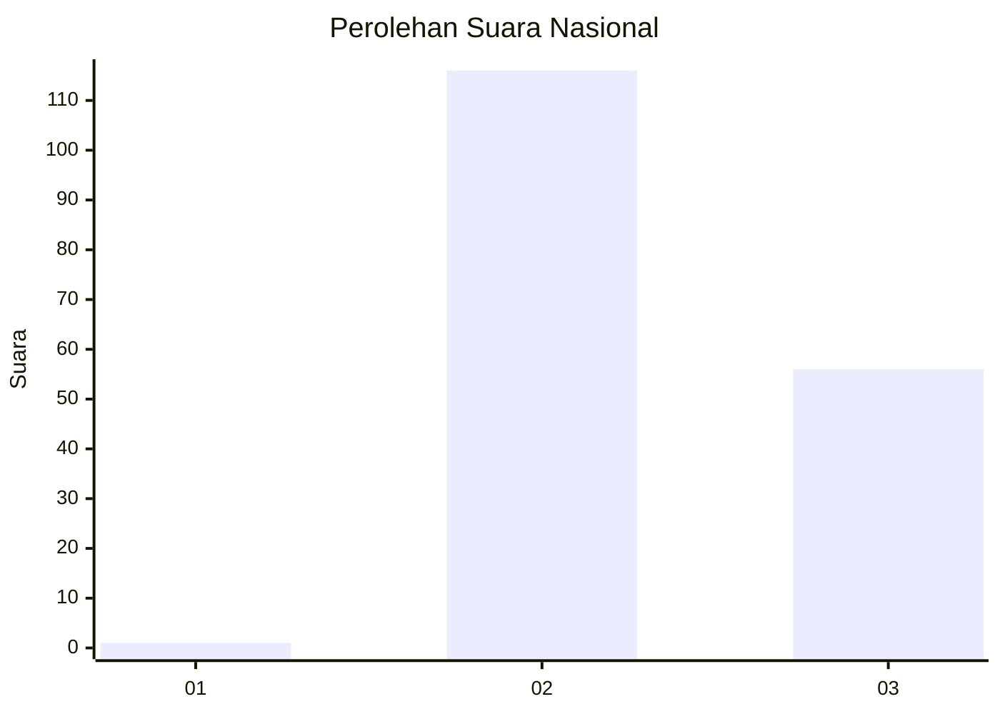
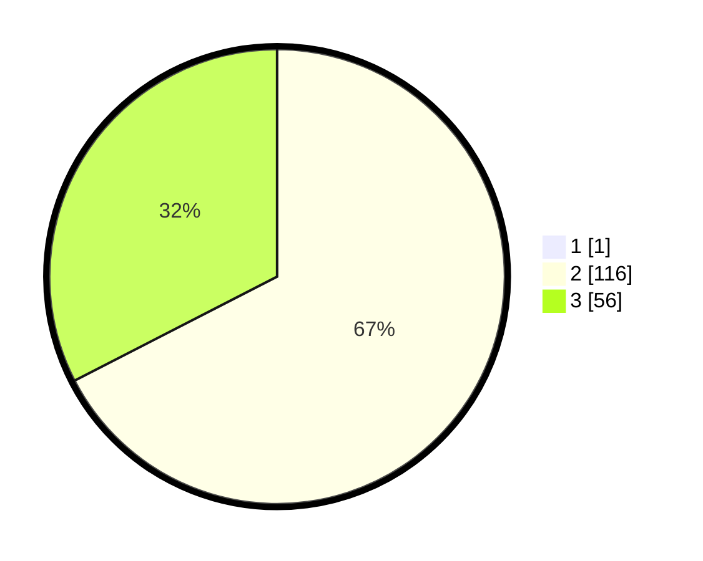

# Hasil

## Grafik

## Tabel

| No. | Nama Paslon    | Suara | Suara (raw) | Persentase |
|:--- |:-------------- | -----:| -----------:| ----------:|
| 1   | ANIES MUHAIMIN | 1     | [1][p-1]    | 0,58       |
| 2   | PRABOWO GIBRAN | 116   | [116][p-2]  | 67,05      |
| 3   | GANJAR MAHFUD  | 56    | [56][p-3]   | 32,37      |

[p-1]: https://github.com/gigit-pemilu/pemilu-2024/blob/main/pilpres/hitung-suara/sub/51-bali/sub/04-gianyar/sub/03-gianyar/sub/1003-samplangan/sub/008-tps/sub/paslon-1.txt
[p-2]: https://github.com/gigit-pemilu/pemilu-2024/blob/main/pilpres/hitung-suara/sub/51-bali/sub/04-gianyar/sub/03-gianyar/sub/1003-samplangan/sub/008-tps/sub/paslon-2.txt
[p-3]: https://github.com/gigit-pemilu/pemilu-2024/blob/main/pilpres/hitung-suara/sub/51-bali/sub/04-gianyar/sub/03-gianyar/sub/1003-samplangan/sub/008-tps/sub/paslon-3.txt

## Foto C Plano

https://sirekap-obj-formc.kpu.go.id/203b/pemilu/ppwp/51/04/03/10/03/5104031003008-20240214-141242--afba5aaa-65c5-4db6-ac8c-b5477501d809.jpg

https://sirekap-obj-formc.kpu.go.id/203b/pemilu/ppwp/51/04/03/10/03/5104031003008-20240214-141322--070810ce-d978-4d33-8ba4-b976a97836b5.jpg

https://sirekap-obj-formc.kpu.go.id/203b/pemilu/ppwp/51/04/03/10/03/5104031003008-20240218-174340--6bb3d6c2-4ffb-478a-9473-be2b1a38001d.jpg

## Metadata

| Key        | Value               |
| ---------- | ------------------- |
| Time Stamp | 2024-02-19 06:16:00 |

