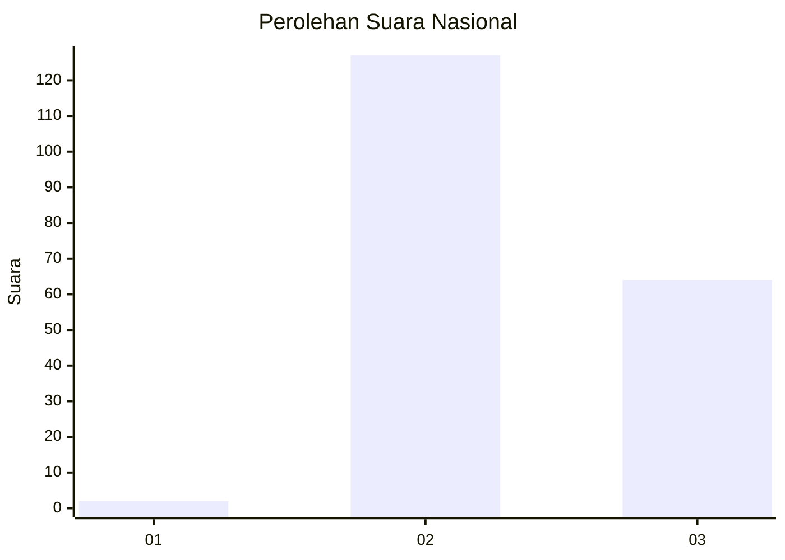
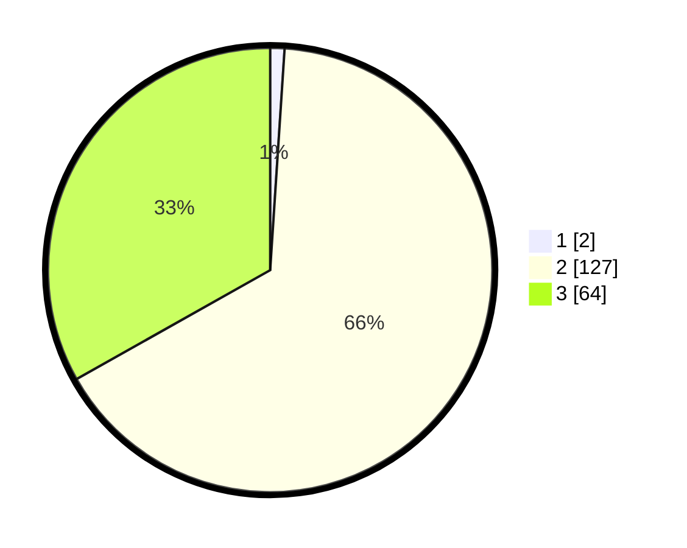

# Hasil

## Grafik

## Tabel

| No. | Nama Paslon    | Suara | Suara (raw) | Persentase |
|:--- |:-------------- | -----:| -----------:| ----------:|
| 1   | ANIES MUHAIMIN | 2     | [2][p-1]    | 1,04       |
| 2   | PRABOWO GIBRAN | 127   | [127][p-2]  | 65,80      |
| 3   | GANJAR MAHFUD  | 64    | [64][p-3]   | 33,16      |

[p-1]: https://github.com/gigit-pemilu/pemilu-2024/blob/main/pilpres/hitung-suara/sub/51-bali/sub/04-gianyar/sub/03-gianyar/sub/1003-samplangan/sub/010-tps/sub/paslon-1.txt
[p-2]: https://github.com/gigit-pemilu/pemilu-2024/blob/main/pilpres/hitung-suara/sub/51-bali/sub/04-gianyar/sub/03-gianyar/sub/1003-samplangan/sub/010-tps/sub/paslon-2.txt
[p-3]: https://github.com/gigit-pemilu/pemilu-2024/blob/main/pilpres/hitung-suara/sub/51-bali/sub/04-gianyar/sub/03-gianyar/sub/1003-samplangan/sub/010-tps/sub/paslon-3.txt

## Foto C Plano

https://sirekap-obj-formc.kpu.go.id/2c51/pemilu/ppwp/51/04/03/10/03/5104031003010-20240216-015800--2963fe1f-2d90-4cd5-8342-3b4c550a5d80.jpg

https://sirekap-obj-formc.kpu.go.id/2c51/pemilu/ppwp/51/04/03/10/03/5104031003010-20240214-200516--870a96f0-b703-43df-85f8-3dcb5764b648.jpg

https://sirekap-obj-formc.kpu.go.id/2c51/pemilu/ppwp/51/04/03/10/03/5104031003010-20240214-200719--0ba5f817-778e-40c4-b1e9-be8025cec7c4.jpg

## Metadata

| Key        | Value               |
| ---------- | ------------------- |
| Time Stamp | 2024-02-16 02:00:27 |

## DATA PEMILIH TETAP

Jumlah pemilih dalam DPT: **225**.
 * L: **112**.
 * P: **113**.

## DATA PENGGUNA HAK PILIH

Jumlah pengguna hak pilih dalam DPT: **198**.
 * L: **101**.
 * P: **97**.

Jumlah pengguna hak pilih dalam DPTb: **0**.
 * L: **0**.
 * P: **0**.

Jumlah pengguna hak pilih dalam DPK: **0**.
 * L: **0**.
 * P: **0**.

Jumlah pengguna hak pilih: **198**.
 * L: **101**.
 * P: **97**.

## JUMLAH SUARA SAH DAN TIDAK SAH

JUMLAH SELURUH SUARA SAH: **193**.

JUMLAH SUARA TIDAK SAH: **5**.

JUMLAH SELURUH SUARA SAH DAN SUARA TIDAK SAH: **198**.

