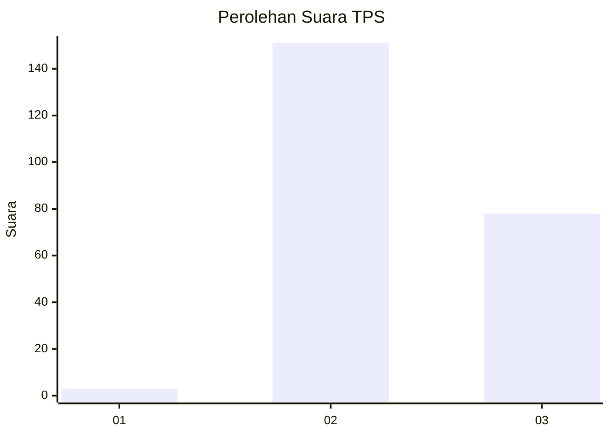
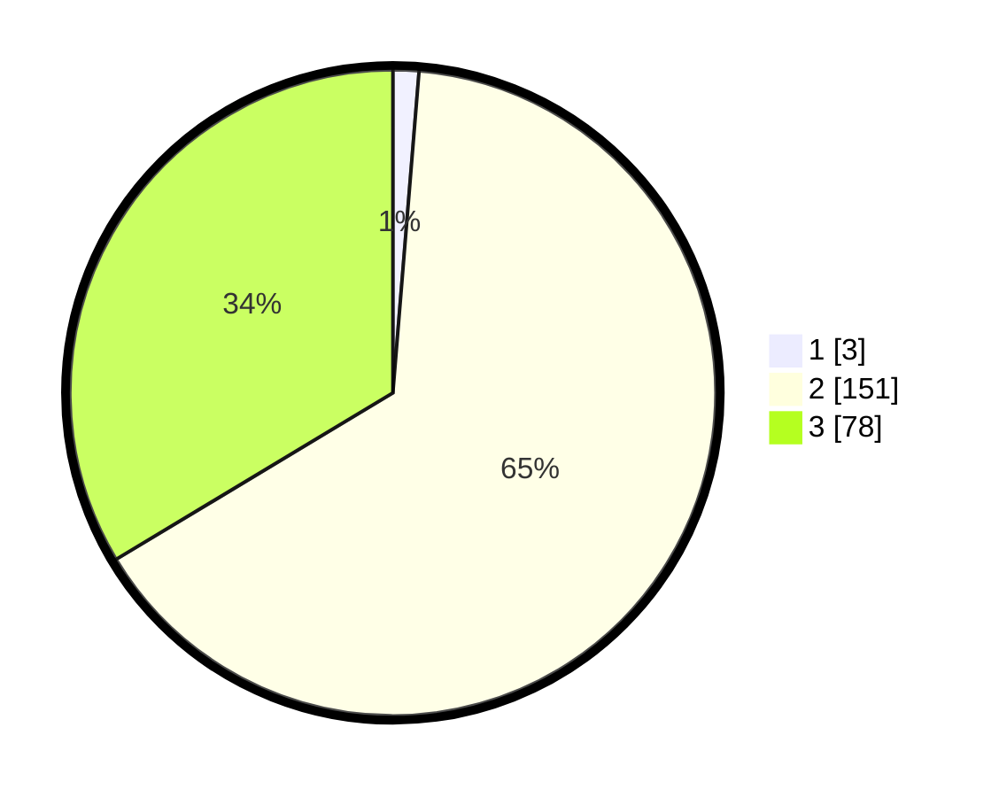

# Hasil

## Grafik

## Tabel

| No. | Nama Paslon    | Suara | Suara (raw) | Persentase |
|:--- |:-------------- | -----:| -----------:| ----------:|
| 1   | ANIES MUHAIMIN | 3     | [3][p-1]    | 1,29       |
| 2   | PRABOWO GIBRAN | 151   | [151][p-2]  | 65,09      |
| 3   | GANJAR MAHFUD  | 78    | [78][p-3]   | 33,62      |

[p-1]: https://github.com/gigit-pemilu/pemilu-2024-51-bali/blob/main/pilpres/hitung-suara/sub/51-bali/sub/04-gianyar/sub/03-gianyar/sub/1003-samplangan/sub/011-tps/sub/paslon-1.txt
[p-2]: https://github.com/gigit-pemilu/pemilu-2024-51-bali/blob/main/pilpres/hitung-suara/sub/51-bali/sub/04-gianyar/sub/03-gianyar/sub/1003-samplangan/sub/011-tps/sub/paslon-2.txt
[p-3]: https://github.com/gigit-pemilu/pemilu-2024-51-bali/blob/main/pilpres/hitung-suara/sub/51-bali/sub/04-gianyar/sub/03-gianyar/sub/1003-samplangan/sub/011-tps/sub/paslon-3.txt

## Foto C Plano

https://sirekap-obj-formc.kpu.go.id/ad37/pemilu/ppwp/51/04/03/10/03/5104031003011-20240215-000648--438d137e-a606-43e9-8899-df32d4e94cb4.jpg

https://sirekap-obj-formc.kpu.go.id/ad37/pemilu/ppwp/51/04/03/10/03/5104031003011-20240215-000845--09558bb6-3a93-4eed-b27f-ed45ce87c6f5.jpg

https://sirekap-obj-formc.kpu.go.id/ad37/pemilu/ppwp/51/04/03/10/03/5104031003011-20240215-103814--13144224-e8f1-4a43-879e-772418076313.jpg

## Metadata

| Key        | Value               |
| ---------- | ------------------- |
| Time Stamp | 2024-02-24 22:31:28 |

