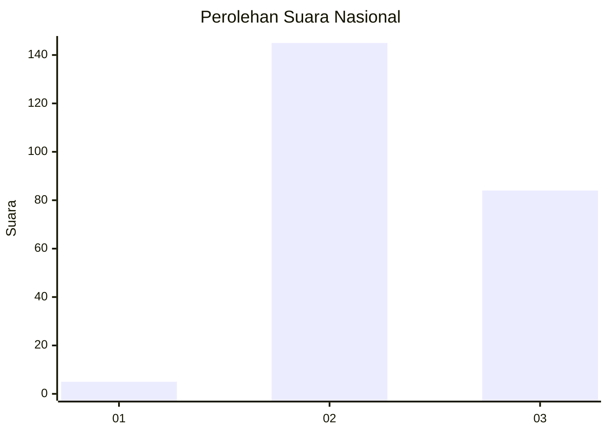
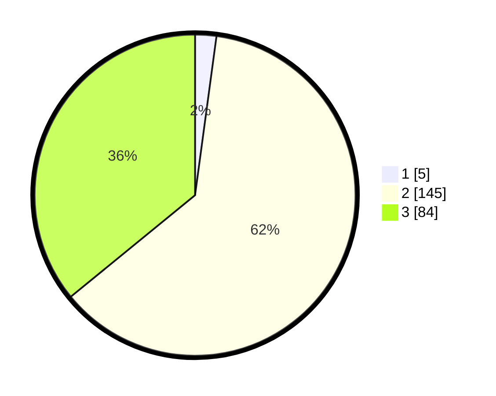

# Hasil

## Grafik

## Tabel

| No. | Nama Paslon    | Suara | Suara (raw) | Persentase |
|:--- |:-------------- | -----:| -----------:| ----------:|
| 1   | ANIES MUHAIMIN | 5     | [5][p-1]    | 2,14       |
| 2   | PRABOWO GIBRAN | 145   | [145][p-2]  | 61,97      |
| 3   | GANJAR MAHFUD  | 84    | [84][p-3]   | 35,90      |

[p-1]: https://github.com/gigit-pemilu/pemilu-2024/blob/main/pilpres/hitung-suara/sub/51-bali/sub/04-gianyar/sub/03-gianyar/sub/1003-samplangan/sub/014-tps/sub/paslon-1.txt
[p-2]: https://github.com/gigit-pemilu/pemilu-2024/blob/main/pilpres/hitung-suara/sub/51-bali/sub/04-gianyar/sub/03-gianyar/sub/1003-samplangan/sub/014-tps/sub/paslon-2.txt
[p-3]: https://github.com/gigit-pemilu/pemilu-2024/blob/main/pilpres/hitung-suara/sub/51-bali/sub/04-gianyar/sub/03-gianyar/sub/1003-samplangan/sub/014-tps/sub/paslon-3.txt

## Foto C Plano

https://sirekap-obj-formc.kpu.go.id/2f2a/pemilu/ppwp/51/04/03/10/03/5104031003014-20240214-141556--6c1dad73-1772-44d3-ba3b-ce98575e880d.jpg

https://sirekap-obj-formc.kpu.go.id/2f2a/pemilu/ppwp/51/04/03/10/03/5104031003014-20240214-141717--6dce12b5-2af3-429c-8ff4-30cc9737caae.jpg

https://sirekap-obj-formc.kpu.go.id/2f2a/pemilu/ppwp/51/04/03/10/03/5104031003014-20240214-141821--f56842b0-906c-442d-a31e-f0625be1f292.jpg

## Metadata

| Key        | Value               |
| ---------- | ------------------- |
| Time Stamp | 2024-02-15 15:30:25 |

