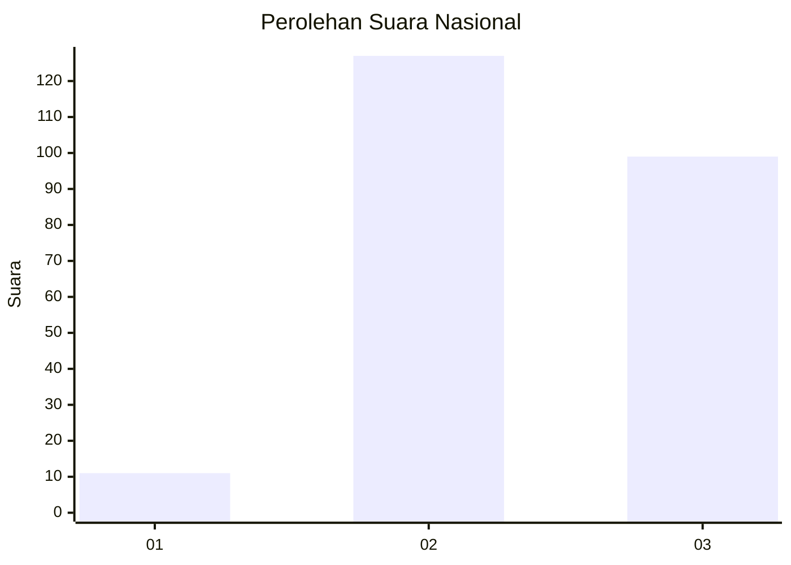
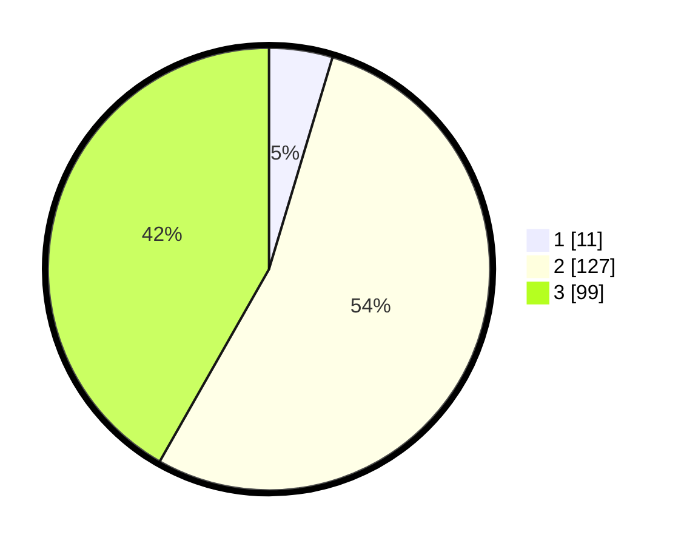

# Hasil

## Grafik

## Tabel

| No. | Nama Paslon    | Suara | Suara (raw) | Persentase |
|:--- |:-------------- | -----:| -----------:| ----------:|
| 1   | ANIES MUHAIMIN | 11    | [11][p-1]   | 4,64       |
| 2   | PRABOWO GIBRAN | 127   | [127][p-2]  | 53,59      |
| 3   | GANJAR MAHFUD  | 99    | [99][p-3]   | 41,77      |

[p-1]: https://github.com/gigit-pemilu/pemilu-2024/blob/main/pilpres/hitung-suara/sub/51-bali/sub/04-gianyar/sub/03-gianyar/sub/1003-samplangan/sub/016-tps/sub/paslon-1.txt
[p-2]: https://github.com/gigit-pemilu/pemilu-2024/blob/main/pilpres/hitung-suara/sub/51-bali/sub/04-gianyar/sub/03-gianyar/sub/1003-samplangan/sub/016-tps/sub/paslon-2.txt
[p-3]: https://github.com/gigit-pemilu/pemilu-2024/blob/main/pilpres/hitung-suara/sub/51-bali/sub/04-gianyar/sub/03-gianyar/sub/1003-samplangan/sub/016-tps/sub/paslon-3.txt

## Foto C Plano

https://sirekap-obj-formc.kpu.go.id/ff76/pemilu/ppwp/51/04/03/10/03/5104031003016-20240214-155817--3c19713c-739f-414d-bc72-bce6b4820b6e.jpg

https://sirekap-obj-formc.kpu.go.id/ff76/pemilu/ppwp/51/04/03/10/03/5104031003016-20240214-155714--2a07cf78-c803-40af-b359-a2ce223fb56f.jpg

https://sirekap-obj-formc.kpu.go.id/ff76/pemilu/ppwp/51/04/03/10/03/5104031003016-20240214-155411--058d7c2d-9a60-41a7-a6e7-516b9d4c0310.jpg

## Metadata

| Key        | Value               |
| ---------- | ------------------- |
| Time Stamp | 2024-02-15 18:30:25 |

