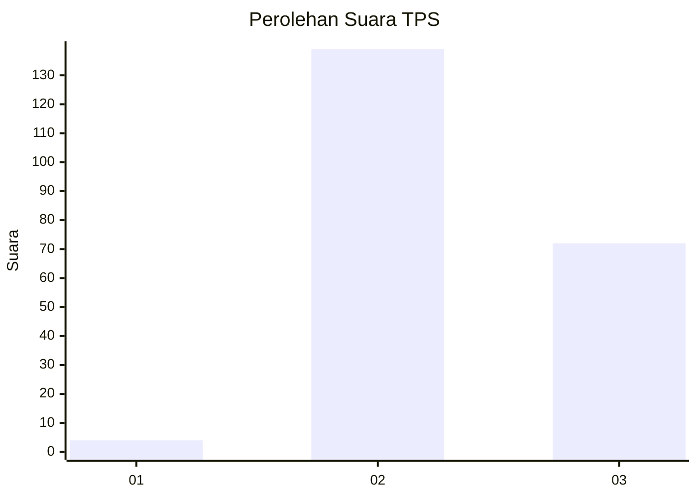
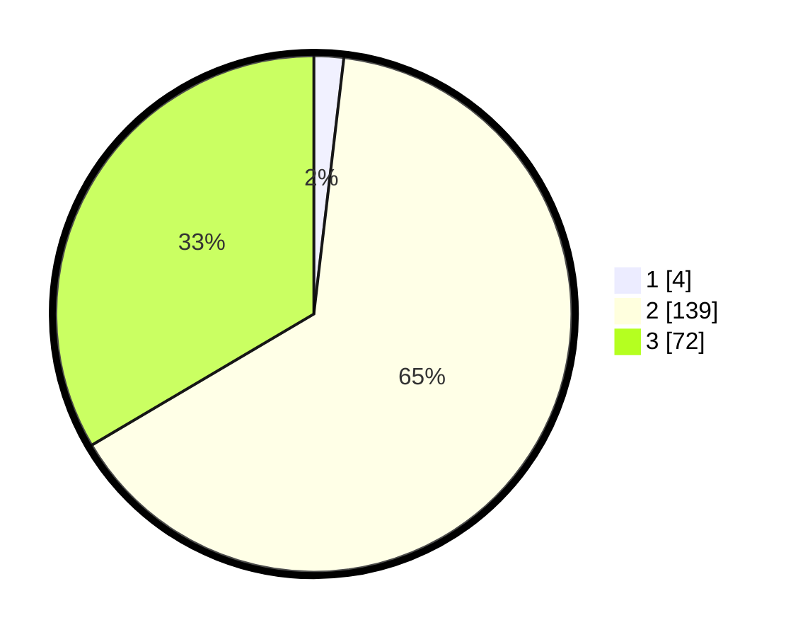

# Hasil

## Grafik

## Tabel

| No. | Nama Paslon    | Suara | Suara (raw) | Persentase |
|:--- |:-------------- | -----:| -----------:| ----------:|
| 1   | ANIES MUHAIMIN | 4     | [4][p-1]    | 1,86       |
| 2   | PRABOWO GIBRAN | 139   | [139][p-2]  | 64,65      |
| 3   | GANJAR MAHFUD  | 72    | [72][p-3]   | 33,49      |

[p-1]: https://github.com/gigit-pemilu/pemilu-2024-51-bali/blob/main/pilpres/hitung-suara/sub/51-bali/sub/04-gianyar/sub/03-gianyar/sub/1005-abianbase/sub/007-tps/sub/paslon-1.txt
[p-2]: https://github.com/gigit-pemilu/pemilu-2024-51-bali/blob/main/pilpres/hitung-suara/sub/51-bali/sub/04-gianyar/sub/03-gianyar/sub/1005-abianbase/sub/007-tps/sub/paslon-2.txt
[p-3]: https://github.com/gigit-pemilu/pemilu-2024-51-bali/blob/main/pilpres/hitung-suara/sub/51-bali/sub/04-gianyar/sub/03-gianyar/sub/1005-abianbase/sub/007-tps/sub/paslon-3.txt

## Foto C Plano

https://sirekap-obj-formc.kpu.go.id/e0e8/pemilu/ppwp/51/04/03/10/05/5104031005007-20240215-083514--0c49c74d-27e8-4242-8da6-c07d20c3e675.jpg

https://sirekap-obj-formc.kpu.go.id/e0e8/pemilu/ppwp/51/04/03/10/05/5104031005007-20240215-083820--3a315545-b05e-4cd5-bece-e31bb5d8b2e4.jpg

https://sirekap-obj-formc.kpu.go.id/e0e8/pemilu/ppwp/51/04/03/10/05/5104031005007-20240215-083825--3fad26ef-be95-4fda-a042-caba67387886.jpg

## Metadata

| Key        | Value               |
| ---------- | ------------------- |
| Time Stamp | 2024-02-15 15:30:25 |

